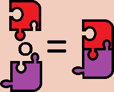
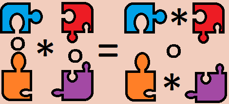
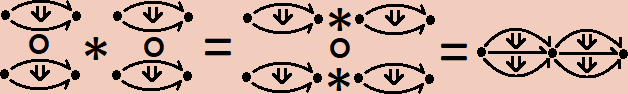
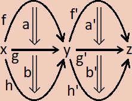
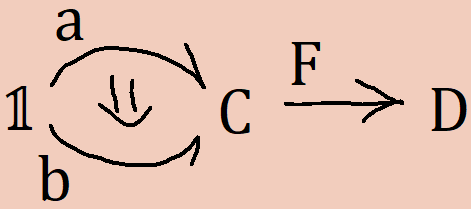
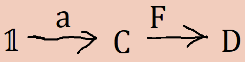
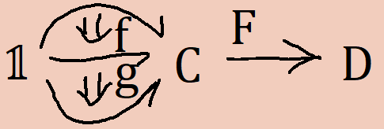
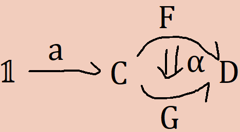
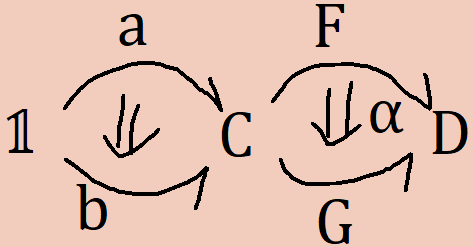

A few years ago, a new proof theory called CaTT was described in the paper
 - [A Type-Theoretical Definition of Weak ω-Categories](https://arxiv.org/abs/1706.02866)

It contains what is, in retrospect, the simplest and easiest to reason about presentation of ω-categories anywhere I'm aware of. ω-categories are a somewhat essoteric concept, infinite dimensional algebraic structures which seems impossible to effectively reason about at first glance. And yet, reasoning up to arbitrarily many dimensions within them can be made, not just simple but trivial.

My goal with this post is not to merely summarize that paper, but to expand on its contents providing intuition and additional exposition. Hopefully, by the end of it, ω-categories will seem extremely simple to you.

The first off, let's get some some basic intuition for reasoning about higher categories. This intuition will drive all later developments. The second part will describe ways of formalizing this intuition into an actual logic.

The basic intuition behind categories is what I call "puzzle piece reasoning". Think about four puzzle pieces being put together.


Given this sort of puzzle, we can imagine defining operations for composing smaller pieces into bigger ones. We can compose horizontally


or vertically. 



We can then come up with equations about these compositions. One of the most obvious is that horizontally composing two peices then vertically composing the results is the same as vertically composing the peices then horizontally composing the results.



We can see this by observing that completing either operation will end up with the same thing. All higher categorical reasoning essentially boils down to this. Given two sequences of operations which compose some higher-dimensional cells together, if both end up with the same thing then the sequences of operations are equivalent. If you want to know if two sequences are the same, just look at what you get as a result. You should think back to this intuition throughout this post. This is the exact same reasoning used to justify that horizontal composition commutes with vertical composition in actual 2-categories.



Before formalizing this intuition, I'd like to talk about monoids. They are a simple algebra with a multiplication, `∘`, a unit, `1`, and the equations;
```
1 ∘ a = a ∘ 1 = a
(a ∘ b) ∘ c = a ∘ (b ∘ c)
```
These equations can then be used to justify other, more sophisticated equations. For example;
```
(a ∘ b) ∘ (c ∘ (d ∘ e)) = a ∘ (b ∘ (c ∘ (d ∘ e)))
```
The presentation I've just given is called a "biased" presentation. This is because I'm prioritizing a single operation and especting all others to be formed out of it. Monoids have an infinite number of n-ary operations which can be defined out of multiplication.
```
prod31(a, b, c)    = (a ∘ b) ∘ c 
prod32(a, b, c)    = a ∘ (b ∘ c)
prod41(a, b, c, d) = prod31(a, b, c) ∘ d
...
```
and an infinite number of coherence equations to go along with them. For example;
```
a ∘ prod32(b, c, d) = prod4(a, b, c, d)
```
A presentation of a monoid in terms of these infinite operators and coherences is said to be "unbiased". While doing this isn't so useful for monoids, it is neccesary for more sophisticated algebras, like ω-categories, where one can't generate all the operations and equations from a small subset. It will be helpful to see how to do this for monoids since its one of the simplest cases.

It will he helpful to look at one of the most important monoids, lists. Given any type `a`, the type of lists of `a`s is a monoid with concatonation as multiplication and the empty list as the unit.
```
([a, b] ++ [c, d, e]) ++ [f] = [a, b] ++ ([c, d, e] ++ [f]) = [a, b, c, d, e, f]
[] ++ [a, b, c] = [a, b, c] ++ [] = [a, b, c]
```
The monoidal nature of lists is readily apearent from the way they are writen. We can conanicalize an expresion involving lists into a unique representation. To see the monad laws, we can simply normalize the lists and see that the results on either side of the equations are the same. This unique, canonical representation allows us to take the monoid laws for granted. This special property actually makes lists important in the theory of monoids; the type of lists of `a`s is the free monoid over `a`.

With this in mind, we can easily define the full, unbiased theory of monoids. We'll use lists as a way to canonically represent any operation so that we can take all expressions for granted.

I'll define our theory of monoids like a type theory. I'll denote the ambient type `*` which will contain all the things within our monoid. Using lists, we can define canonical representations for any operation. These lists will simply be contexts of things pulled from `*`.
```
Monoid context formation rules
              ⊢ Γ ctx     x free in Γ
--------      -----------------------
⊢ [] ctx         ⊢ Γ , (x : *) ctx
```
The reason we want to use contexts rather than simply lists is so that we can substitute into them. A substitution will simply be a list of things pulled from our theory of the correct type;
```
Monoid substitution formation rules
                  Δ ⊢ σ sub Γ     Δ ⊢ a : A[σ/Γ]
-------------     ------------------------------
Δ ⊢ [] sub []         Δ ⊢ σ, a sub Γ, (x : A)
```
Where `A[σ/Γ]` is substitition `σ` applied to every variable in `Γ` within the type `A`. Our current theory only has one type, `*`, so that's all `A` can be. When we look at categories `A` will also be able to be a morphism between two objects. With substitutions in hand, we can define an operation as an appropriate substitution into a context.

```
Monoid operation formation rule
⊢ Γ ctx   Δ ⊢ σ sub Γ
---------------------
   Δ ⊢ op Γ σ : *
```
For example, for any monoid it's theory will have
```
                     ⊢ a : *                ⊢ a : *       ⊢ b : *  
--------------   --------------------   ------------------------------
⊢ op [] [] : *   ⊢ op [x : *] [a] : *   ⊢ op [x : *, y : *] [a, b] : *


⊢ a : *       ⊢ b : *       ⊢ c : *      
----------------------------------------
⊢ op [x : *, y : *, z : *] [a, b, c] : *

...
```
`op [] []` will act as our `1`,  `op [x : *, y : *] [a, b]` will be `a ∘ b`. From here, from here, we can define an function, `coh`, which generates all the coherence equations. `coh` will take a context and a substitution, just like `op`. It will also take an equation who's sides are canonically represented by the context. For example, the sides of
```
(x ∘ y) ∘ z = x ∘ (y ∘ z)
```
have `[x : *, y : *, z : *]` as their canonical representation. The type of `coh` will be an equation with the variables of that equation with the substitution applied. For example
```
coh [x : *, y : *, z : *] [a, b, a] ((x ∘ y) ∘ z = x ∘ (y ∘ z)) : (a ∘ b) ∘ a = a ∘ (b ∘ a)
```
That ability to substitute is the reason we deal with contexts. When I first read the paper, the contexts seemed like they were overcomplicating things. I tried reformulating the theory without them, but you really need to be able to substitute into them in order to even state many basic theorems.
```
Monoid coherence formation rule
        ⊢ Γ ctx    Δ ⊢ σ sub Γ
Γ ⊢ L : *   Γ ⊢ R : *    FV(L) = FV(R) = FV(Γ)
----------------------------------------------
    Δ ⊢ coh Γ σ (L = R) : L[σ/Γ] = R[σ/Γ]
```
where `FV(X)` is simply the set of all free variables in `X`.

That's it. We now have a canonical way to construct any and all infinite equations for all the infinite operations. For example,
```
1               = op [] []
a ∘ b           = op [x : *, y : *] [a, b]

idcanc = coh [x : *] [_] (x ∘ 1 = x)

prod31(a, b, c)    = (a ∘ b) ∘ c 
prod32(a, b, c)    = a ∘ (b ∘ c)
prod41(a, b, c, d) = prod31(a, b, c) ∘ d

example = 
  coh [x : *, y : *, z : *, w : *]
      [_, _, _, _]
      (x ∘ prod32(y, z, w) = prod41(x, y, z, w))
```
The justification for that final rule is super duper simple. Literally all we do is check that the expressions are well formed and that both sides of the equation mention all the variables in the context. This will also be the only thing we need going all the way to ω-categories. Before we get there, let me digress a bit.

Let's make a type theory where every object is a magma. Objects within a magma can only be constructed in one way, via a multiplication operation. This operation satisfies no equations whatsoever. However, in the unbiased theory, there are equations. For example;
```
prod31(a, b, c)    = (a ∘ b) ∘ c 
prod42(a, b, c, d) = (a ∘ b) ∘ (c ∘ d)
```
gives us
```
prod42(a, b, c, d) = prod31(a, b, c ∘ d)
```
Magmas, despite their triviality, do have an equational theory. This comes form the fact that binary trees can be used as a canonical representation of terms in a magma in much the same way lists are for terms in a monoid. If we modify the context formation rules so they are built like trees;
```
Magma context formation rules.
                  ⊢ Γ ctx    ⊢ Δ ctx   FV(Γ)∩FV(Δ) = ∅
-------------     ------------------------------------
⊢ (x : *) ctx                 ⊢ Γ ∘ Δ ctx
```
and similarly modify substitutions
```
Magma substitution formation rules.
    Δ ⊢ t : *       Δ ⊢ σ1 sub Γ1      Δ ⊢ σ2 sub Γ2
-----------------   --------------------------------
Δ ⊢ t sub (x : *)         Δ ⊢ σ1 ∘ σ2 sub Γ1 ∘ Γ2
```
The operation and coherence rules are exactly the same. Using them, we can expose the interesting equational theory of an unbiased magma.
```
a ∘ b        = op ((x : *) ∘ (y : *)) (a ∘ b)
prod31(a, b, c) = op (((x : *) ∘ (y : *)) ∘ (z : *)) ((a ∘ b) ∘ c) 

example =
  coh (((x : *) ∘ (y : *)) ∘ (z : *))
    ((_ ∘ _) ∘ _)
    (prod31(x, y, z) = (x ∘ y) ∘ z)
```
We can summarize the general procedure for getting unbiased theories as follows;

1. Define a notion of context which is constructed using the same procedure as objects within an X, with judgmental equalities coinciding with the equations of X.
2. Define a notion of substitution into these contexts.
3. Assert the existance of operations which allow us to construct terms wherever there are valid substitutions into contexts.
4. Assert a coherence construction allowing equations and other theorems to be deduced wherever there are valid substitutions into contexts where those theorems are well-formed.

There are some caviats to this. This assumes that there are no non-trivial interactions between context formation and the data structure. However, in theories with cancelation laws which may delete a variable, such as with groups, contexts won't be able to express this since contexts require new variables to be fresh. Outside of such structures, this procedure is generically very effective.

Let's go up one level in sophistocation before getting to full ω-categories. Let's talk about the unbiased theory of regular categories. 

Our type theory will now have two types of things;
```
Category type formation rules
           ⊢ a : *    ⊢ b : *
--------   ------------------
⊢ * type      ⊢ a → b type
```
The biased theory of categories has only two operations; morphism composition and identity formation. These correspond to the two operations in a monoid, but with extra formation conditions. We can canonically represent compositions of morphisms in the same way we represented multiplications of objects in a monoid; via lists. These lists are called "pasting schemes". The formation rules are a bit different, though. We need to enforce the source and target conditions of a category. Given;
```
f : a → b
g : b → c
h : c → d
```
we can canonically represent `(f ∘ g) ∘ h` as `[a, f, b, g, c, h, d]`. Or, at least, this is what I'd do if I were defining the fre category inside of some kind of library. We want this to be a context, though.
```
[a : *, f : a → b, b : *]
``` 
is not a valid context since `b` is bound after it's mentioned in `f`. We need to modify the context so that the targets are declared right before the morphisms. With that, our canonical composition will be `[a, b, f, c, g, d, h]`. Using this represention, we can formulate the context formation rules. These are a bit more complicated due to the term shuffling, but they're not hard to implement.
```
Category context formation rules
⊢ Γ ps (x : *)                        ⊢ Γ ps (f : x → y)
--------------  --------------------  ------------------
   ⊢ Γ ctx      ⊢ [x : *] ps (x : *)    ⊢ Γ ps (y : *)

           ⊢ Γ ps (x : *)                      
----------------------------------------
⊢ [Γ, y : *, f : x → y] ps (f : x → y)
```
The `ps` judgement, standing for "pasting scheme", allows us to locate the source of any prospective morphisms we might want to add to our context. I'll give a detailed example of this later on when we talk about full ω-categories which will have almost identical context formation rules.

Substitution is identical to the rule used for monoids;
```
Category substitution formation rules
                  Δ ⊢ σ sub Γ     Δ ⊢ a : A[σ/Γ]
-------------     ------------------------------
Δ ⊢ [] sub []         Δ ⊢ σ, a sub Γ, (x : A)
```
The operation formation rules need to be a bit different. Since the type of a composition will vary, the operation formation rules needs to have a target type the way previous coherence formers did. 
```
Category operation formation rule
⊢ Γ ctx    Δ ⊢ σ sub Γ    FV(tar(Γ)) = FV(Γ)
   Γ ⊢ S → T type      FV(src(Γ)) = FV(S)    
--------------------------------------------
    Δ ⊢ op Γ σ (S → T) : S[σ/Γ] → T[σ/Γ]
```
`tar(Γ)` will be the last thing of type `*` mentioned, while `src(Γ)` will just be the first thing in the list. The only difference between this rule and the one for ω-categories will be how sources and targets of pasting schemes are calculated. 
We'll also need an extra one for identity morphisms;
```
Category identity formation rule
              Δ ⊢ A : *
----------------------------------
Δ ⊢ op [x : *] [A] (x → x) : A → A
```
From here, the coherences nearly the same as they are for monoids. The only difference is that the left and right sides of the equations must have the same types.
```
Category coherence formation rule
        ⊢ Γ ctx    Δ ⊢ σ sub Γ
Γ ⊢ L : A   Γ ⊢ R : A    FV(L) = FV(R) = FV(Γ)
----------------------------------------------
    Δ ⊢ coh Γ σ (L = R) : L[σ/Γ] = R[σ/Γ]
```
Using this, we can derive the unbiased versions of any ordinary conherence of a category.

Like with monoids, we can formulate the infinite many unbiased operations we might define for composing morphisms.

```
id a  = op [x : *] [a] (x → x)
u ∘ v = op [x : *, y : *, f : x → y, z : *, g : y → z] [_, _, u, _, v] (x → z)
(note that this is in compositional order rather than applicative order)

idcancR = 
  coh [x : *, y : *, f : x → y] [...] (f ∘ id y = f)
...
```

Now, we're finally prepared to go for the full ω-categorical case. We now not only have objects and morphisms between them, but higher n-cells between any (n-1)-cells. This means we need to generalize our type formation rules;

```
ω-Category type formation rules
           ⊢ a : A    ⊢ b : A
--------   ------------------
⊢ * type      ⊢ a → b type
```

We are ultimately going to represent the higher compositions as lists with restricted formation rules; just like with regular categories. Consider this diagram of a pasting scheme in a 2-category.



We can give a canonical ordering to each of the cells simply by placing each cell in between its source and target;
```
[x,
   f, 
     a, 
   g,
     b, 
   h, 
 y, 
   f',
      a', 
   g', 
      b', 
   h', 
 z]
```
Like before, if we turn this into a context it will be ill-formed. As such, we need to rearange this list so that its target is stated beforhand.
```
[x : *,
 y : *, f  : x → y, 
        g  : x → y, a  : f → g, 
        h  : x → y, b  : g → h, 
 z : *, f' : y → z, 
        g' : y → z, a' : f' → g', 
        h' : y → z, b' : g' → h']
```
The rules neccessary to parse this context is barely different then that for ordinary categories;
```
ω-Category context formation rules
⊢ Γ ps (x : *)                             ⊢ Γ ps (f : x → y)
--------------✓   ---------------------⋆  -------------------⇓
   ⊢ Γ ctx         ⊢ [x : *] ps (x : *)     ⊢ Γ ps (y : A)

           ⊢ Γ ps (x : A)                      
--------------------------------------⇑
⊢ [Γ, y : A, f : x → y] ps (f : x → y)
```
To construct the above context, we'd do, roughly, the following;
```
------------------⋆
[x : *] ps (x : *)
--------------------------------------⇑
[x : *, y : *, f : x → y] ps f : x → y
------------------------------------------------------------⇑
[x : *, y : *, f : x → y, g : x → y, a : f → g] ps a : f → g
------------------------------------------------------------⇓
[x : *, y : *, f : x → y, g : x → y, a : f → g] ps g : x → y
----------------------------------------------------------------------------------⇑
[x : *, y : *, f : x → y, g : x → y, a : f → g, h : x → y, b : g → h] ps b : g → h

...

..., a' : f' → g'] ps g' : y → z
------------------------------------------------------------⇑
..., a' : f' → g', h' : y → z, b' : g' → h'] ps b' : g' → h'
------------------------------------------------------------⇓
..., a' : f' → g', h' : y → z, b' : g' → h'] ps h' : y → z
----------------------------------------------------------⇓
..., a' : f' → g', h' : y → z, b' : g' → h'] ps z : *
-----------------------------------------------------✓
..., a' : f' → g', h' : y → z, b' : g' → h'] ctx
```
we can write all these proof steps to coincide with the dimension pattern in the scheme itself.
```
⋆x⇑f⇑a⇓g⇑b⇓h⇓y⇑f'⇑a'⇓g'⇑b'⇓h'⇓z✓
```
In practice, this calculation would be run in reverse by a computer, as a form of parsing.

Substitution is, verbatum, identical to that for categories;
```
ω-Category substitution formation rules
                  Δ ⊢ σ sub Γ     Δ ⊢ a : A[σ/Γ]
-------------     ------------------------------
Δ ⊢ [] sub []         Δ ⊢ σ, a sub Γ, (x : A)
```
The operation formation rule is also, nearly, the same.
```
ω-Category operation formation rule
⊢ Γ ctx    Δ ⊢ σ sub Γ    FV(tar(Γ)) = FV(Γ)
   Γ ⊢ S → T type      FV(src(Γ)) = FV(S)    
--------------------------------------------
    Δ ⊢ op Γ σ (S → T) : S[σ/Γ] → T[σ/Γ]
```
However, we need to be clear on how to calculate the source and target of a context. It may help to look at the previous picture of a pasting scheme. The pasting scheme has a dimension, `dim(Γ)`. The pictured example is of dimension 2. All its component cells have a particular dimension. 

The target of the whole scheme consists of all the cells which have dimension `< dim(Γ) - 1` (in this case, that's just the 0 dimensional cells, `x`, `y`, and `z`) and all cells of dimension `dim(Γ) - 1` which *don't* appear as the *source* of any other cells (in this case, that's the two 1 dimensional cells `h` and `h'`).

The source of the whole scheme consists of all the cells which have dimension `< dim(Γ) - 1` (in this case, that's just the 0 dimensional cells, `x`, `y`, and `z`) and all cells of dimension `dim(Γ) - 1` which *don't* appear as the *target* of any other cells (in this case, that's the two 1 dimensional cells `f` and `f'`).

On a computer, calculating the source and target is a simple filtering program.

We don't need a dedicated identity formation rule. In ω-categories, all the equations become equivalences; cells in our category which are invertable. As a consiquence, we only need a single formation rule to cover all the invertable cells; this includes identities.
```
ω-Category coherence formation rule
  ⊢ Γ ctx    Δ ⊢ σ sub Γ
Γ ⊢ A type    FV(A) = FV(Γ)
---------------------------
  Δ ⊢ coh Γ σ A : A[σ/Γ]
```
As you can see, the rule is much simpler than before as we've now generalized and consolidated much of the reasoning which was specialized for ordinary categories.

And that's it! That's the whole definition of an ω-Category. We can now use it to derive all the prinipals we want. Here are the basic ones;
```
id(a) = coh [x : *] [a] (x → x)
u ∘ v = op [x : *, y : *, f : x → y, z : *, g : y → z] [_,_,u,_,v] (x → z)

id-canc-ll = coh [x : *, y : *, f : x → y] [...] (id(x) ∘ f → f)
id-canc-rl = coh [x : *, y : *, f : x → y] [...] (f ∘ id(y) → f)
id-canc-lr = coh [x : *, y : *, f : x → y] [...] (f → id(x) ∘ f)
id-canc-rr = coh [x : *, y : *, f : x → y] [...] (f → f ∘ id(y))
...

assoc-lr =
  coh [x : *,
       y : *, f : x → y,
       z : *, g : y → z,
       w : *, h : z → w]
      [...]
      ((f ∘ g) ∘ h → f ∘ (g ∘ h))

assoc-rl =
  coh [x : *,
       y : *, f : x → y,
       z : *, g : y → z,
       w : *, h : z → w]
      [...]
      (f ∘ (g ∘ h) → (f ∘ g) ∘ h)
...
```
We can go on to define the higher-dimensional compositions
```
vert(al, be) =
  op [x : *,
      y : *, f : x → y,
           , g : x → y, a : f → g
           , h : x → y, b : g → h]
      [_,_,_,_,al,_,be]
      (f → h)
  
horiz(al, be) =
  op [x : *,
      y : *, f : x → y,
           , g : x → y, a : f → g
      z : *, h : y → z, 
             i : y → z, b : h → i]
      [_,_,_,_,al,_,_,_,be]
      (f ∘ g → h ∘ i)
```
and we can finally make use of our original context to prove the exchange law; that horizontal and vertical composition commute
```
exchange =
  coh [x : *,
       y : *, f  : x → y, 
              g  : x → y, a  : f → g, 
              h  : x → y, b  : g → h, 
       z : *, f' : y → z, 
              g' : y → z, a' : f' → g', 
              h' : y → z, b' : g' → h']
  [...]
  (vert(horiz(a, a'), horiz(b, b')) → horiz(vert(a, b), vert(a', b')))
```
And the verification of this is litterally just making sure the context is a valid pasting scheme that shares all its variables with the ouput type. We don't even need to do any geometric reasoning; it's all a trivial syntactic check.

This system is called "CaTT". There are a few implementions of it, the most developed being [this one](https://github.com/ericfinster/catt.io). You will likely find the examples in that repository useful.

At this point, I'd like to end on a few miscilanious thoughts. Firstly, we can keep going. By modifying our notion of pasting scheme futher we can get other mathematical structures. The [periodic table of n-categories](https://ncatlab.org/nlab/show/periodic+table) tells us, among other things, that trivializing the first dimension of our context will turn our categories into monoidial categories. This, in essence, just means cutting our pasting schemes up at their first dimension so our contexts become lists of pasting schemes. With that, we have all the infinite dimensional algebra plus some canonical ways to construct new objects;
```
a ⨂ b =
  op [[x : *], [y : *]]
     [[a], [b]]
     *

1 = op [] [] *

1-cancl = coh [[x : *]] [_] (1 ⨂ x → x)
1-cancr = coh [[x : *]] [_] (x ⨂ 1 → x)
...

⨂-assoc = coh [[x : *], [y : *], [z : *]] [...] ((x ⨂ y) ⨂ z → x ⨂ (y ⨂ z))
...

⨂-func-1 = coh [[x : *, y : *, f : x → y], [z : *]] [...] (x ⨂ z → y ⨂ z)
...
```
This is fully expanded upon in
  - [Monoidal weak ω-categories as models of a type theory](http://www.lix.polytechnique.fr/~tbenjamin/articles/publications/monoidal.pdf)

Further k-tuply monoidal ω-categories could certainly be made by furthering this construction. More speculatively, I do wonder how sophisticated we can make this. If, hypothetically, we could devise a way to construct canonical contexts in the shape of objects in a topos, then it would basically become an unbiased presentation of ordinary intuitionistic type theory with Pi-types, Sigma-types, etc. I don't think that would be possible, but that paper speculates on at least having closed-monoidal ω-categories, which should be structurally very rich. I think something like the following should work; split up the (monoidial) canonical context into a contravarient and coverient part. When calculating the source and target, the target becomes the source and vice versa on the contravarient part. If the contraverient part is denoted with `{`s, we might have;

```
[a, b] =
  op [{x : *}, [y : *]]
     [{a}, [b]]
     *

unit-law =
  coh [[x : *]]
      [...]
      [1, x] → x

bij-1 =
  coh [{x : *}, {y : *}, [z : *]]
      [...]
      [x ⨂ y, z] → [x, [y, z]]
...

hom-func-1 =
  op [{x : *}, [y : *, z : *, f : y → z]]
     [...]
     [x, y] → [x, z]

hom-func-2 =
  op [{x : *, y : *, f : x → y}, [z : *]]
     [...]
     [y, z] → [x, z]
...
```

however, this isn't able to capture the "wiring" which makes internal homs genuenly useful. How would one witness, for instance, the canonical `1 → [x, x]` for any `x`? This would suggest implementing some computational principal which cancels out the contra and covarient instances of repeated free variables in the type, but the calculation would have to be more sophisticated than the simple variable counting method presented thus far. We should not have a canonical map `[x ⨂ y, z] → [y, [x, z]]` since our tensor product isn't symmetric, though we can make it so by making our context a finite set instead of a list. As a consequence, variables shouldn't cancel if they're not in the correct position to do so. We may also extend the context with an extranatural component just to explicitly state this wiring, though, I don't know what that would look like.

The above costruction basically just defines a product that's contravarient in one argument. Such a thing might be useful when defining opposite categories, but it doesn't address the "hom" part of "internal hom".

Incidentally, it is possible to present globular ω-categories in a biased manner. We'd need to define two infinite families of composition and identity operations for every direction in every dimension. This is done, for instance, in 
 - [Steps toward the weak higher category of weak higher categories in the globular setting](http://cgasa.sbu.ac.ir/article_11180_b13cacfd9afe5780932141c269d0add6.pdf)

I suppose I should also state somewhere that, throughout this presentation, I've been using globes as my [fundamental shape](https://ncatlab.org/nlab/show/geometric+shape+for+higher+structures). In most publications on higher categories, simplices are used instead. I do think what I've described here could be done with simplices, though I'm not sure how to define the pasting scheme contexts. Globes are by far the simplest shape, so using anything else makes things fundamentally more complex. However, some operations, particularly those close in geometry to other geometric shapes, are easier to work with using other shapes.

Lastly, I'd like to make a point about free theorems, functors, and natural transformations. After all this higher-category stuff became intuitive, some properties of structure-preserving maps became obvious special cases of cell properties in higher categories. Functors `F : C → D` have the property that, given a morphism between objects `a` and `b` in the category `C`, we have a morphism between `F(a)` and `F(b)`. Functors are just morphisms in `Cat`, the category of categories. Objects are morphisms from the unit category, `𝟙`, to the object `C` in `Cat`. Morphisms in `C` are then 2-cells between maps between `𝟙` and `C`. We can define the functor map as an operation out of the context defined by the pasting scheme



The operation will have type `a ∘ F → b ∘ F`, where `a ∘ F` is the internal cell of `Cat` corresponding to `F(a)`, etc. Hence, the map out of `F` is exactly a right-whiskering by `F`.

The identity `F(id a) = id (F(a))` is derivable as a coherence out of the pasting scheme



The identity `F(f ∘ g) = F(f) ∘ F(g)` is derivable as a coherence out of the pasting scheme



The basic rules for natural transformations come from the same place. Given a natural transformation `α : F → G`, we have a canonical natural map `α(a) : F(a) → G(a)` generated as an operation out of the pasting scheme



So the naturality map is just right-whiskering by the thing we're maping over. The basic naturality property states that
```
F(f) ∘ α(b) = α(a) ∘ G(f)
```
This is a coherence generated by the pasting scheme



It's all quite astonishing to me that these structural principals emerge as mere syntactic properties. I suspect that other structural principals can be defined similarly, though I haven't figured out how to do so. For the moment, I'm thinking about doing this for internal monoid homomorphisms.

...

And that's all I have to say.
