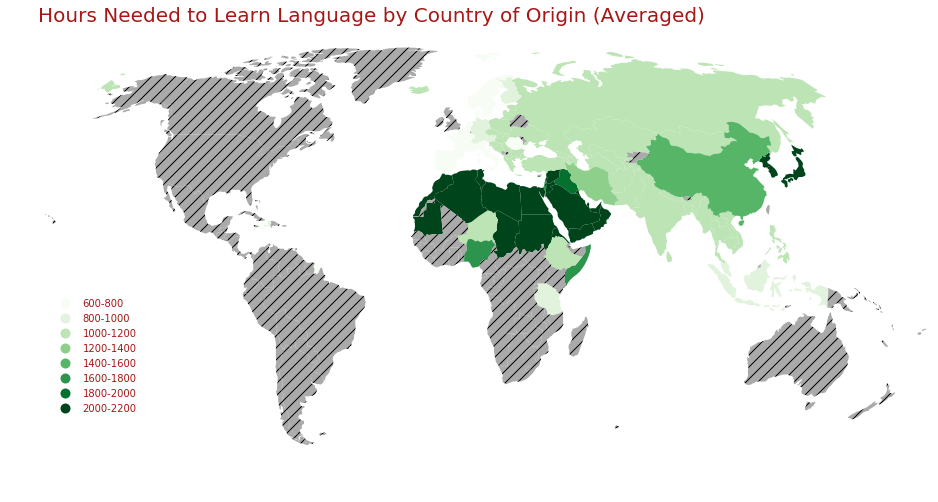
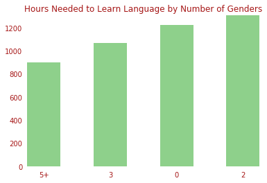
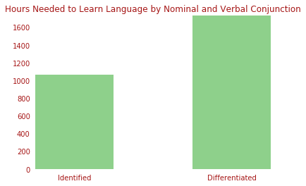
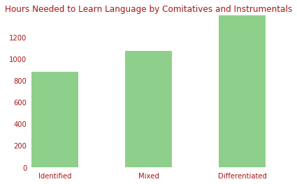
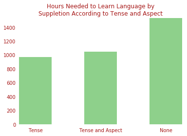

# !!!!!!!!~(DRAFT)~!!!!!!!!

What's the most difficult language to learn? The answer will depend on what languages you know already, but since I'm writing this in English, let's assume that's all you know. In that case, there's a handy database maintained by the [Foreign Service Institute](https://www.atlasandboots.com/foreign-service-institute-language-difficulty/) which tells you how long it takes for an English speaker to learn a variety of languages. It's hardly exhaustive, bit it includes just about every languages that can be considered "major".

The answer to the initial question is Japanese, for the record; restricted to the languages within that database, of course. But, why? There are lots of things we could point to; its morphology, it's grammar, it's semantics. But there are other hard languages as well; Arabic is notoriously hard to learn, and yet it's very different from either Japanese or English. What things, truly, make a language hard to learn? That's what this post is going to explore.

- [Boilerplate](#heading)
- [Seeing The World](#heading-1)
- [Preliminary Examination](#heading-2)
- [Thorough Examination](#heading-3)
- [Goodbye!](#heading-4)

## Boilerplate

Throughout this post, I will be making use of two datasets. Firstly, [this](https://data.world/dataremixed/language-difficulty-ranking) version of the FSI data put into a nice csv file, and secondly, [this](https://wals.info/download) database version of the Atlas of Language Structures. With these, we might be able to draw conclusions about what makes languages more or less difficult to learn.

Firstly, some housekeeping! For reference, I will be using [python](https://www.python.org/), [pandas](https://pandas.pydata.org/), [geopandas](http://geopandas.org/), [matplotlib](https://matplotlib.org/), and [scipy](https://www.scipy.org/) for my analysis here.

```python
import matplotlib.pyplot as plt
import pandas as pd
import geopandas as gpd
import numpy as np
from scipy.stats import ttest_ind, chi2_contingency

```

The two datasets aren't completely compatible, and, as such, some changes need to be made to combine them. I will call the initial difficulty `diffDf`, rename it's language name column, and rename a few entries so that it can be combined with the ALS database.

```python
# Import and clean database of language difficulties.
diffDf = pd.read_csv("3r.csv")
diffDf = diffDf.drop(['category', 'title', 'description'], axis=1).rename(columns={'language':'Name'})
# Fix the two oddly formated entries
diffDf.loc[65,'Name'] = 'Cantonese'
diffDf.loc[66,'Name'] = 'Mandarin'
# Fix languages with different names between databases
diffDf.loc[24,'Name'] = 'Persian' # Was Farsi
# Note: Kyrgyz is on the diff list but not the lang list [37]
diffDf.loc[42,'Name'] = 'Khalkha' # Was Mongolian; Khalkha is the only dialect of Mongolian on the lang list.
diffDf.loc[47,'Name'] = 'Serbian-Croatian' # was 'Serbo-Croatian'
diffDf.loc[50,'Name'] = 'Slovene' # was 'Slovenian'
diffDf.loc[53,'Name'] = 'Tajik' # was 'Tajiki'
diffDf.loc[60,'Name'] = 'Ukrainian' # was 'Ukranian'
```

I will then load the ALS dataset into a dataframe calle `landDf`.

```python
langDf = pd.read_csv("language.csv")
```

The ALS dataset includes many languages; many of which are dialects of other languages. Whenever a language is a dialect of another language, it's denoted "Language (Dialect)". For instance, Egyptian is listed as "Arabic (Egyptian)". The difficulty dataset isn't as granular. I decided to assign each dialect the difficulty of the language proper listed in the FSI dataset.

Now, is it a principaled to assume that every dialect of a language has equal difficulty of learning? No, probably not...

In order to pull off this merge, I wrote a function to detect if a language from the ALS database appears in the FSI database.

```python
# If a language is in the difficulty table, say where
def present(x):
  result = -1
  for i in diffDf.T:
    if x.startswith(diffDf['Name'][i]):
      result = i
  return result
```

I then systematically filter the ALS database, removing languages that don't have difficulties, and adding columns for learning times for everything else.

```python
# Fill in the time, accounting for dialects
for i in langDf.T:
  checkPresence = present(langDf['Name'][i])
  if checkPresence == -1:
    langDf = langDf.drop(i)
  else:
    langDf.loc[i, 'weeks_to_achieve_goal'] = diffDf['weeks_to_achieve_goal'][checkPresence]
    langDf.loc[i, 'class_hours'] = diffDf['class_hours'][checkPresence]

langDf = langDf.reset_index()
```

Note that this also gets rid of English as a column, so before running that, I took out the English row for later reference.

```python
english = langDf[langDf['Name'] == "English"].copy()
```

## Seeing The World

Well, now that we have a dataset, let's do the most obvious thing. Plot the world! The ALS dataset contains country codes for where its languages come from. We can use those to see where the most difficult languages come from. However, they aren't in the right format. Some of the languages list multiply country codes. To fix this, I must create a new dataset with the individual country codes connected to the difficulties.

I start out with a dictionary that I can use to map the country codes to the difficulty of its languages. For each listed language and for each country code listed for each lanugage, if the country isn't already in the dictionary, add it along with its difficulty; if it is then update the mean difficulty using the new refference.

```python
count_dict = {}

for i in langDf.T:
  newKeys = langDf['countrycodes'][i].split()
  newHours = langDf['class_hours'][i]
  for key in newKeys:
    if key in count_dict.keys():
      count_dict[key] = ((count_dict[key][0]*count_dict[key][1]+newHours)/(count_dict[key][1]+1), count_dict[key][1]+1)
    else:
      count_dict[key] = (newHours, 1)
```

Now we convert the dictionary into a new dataframe by first converting it into an array, then casting it.

```python
newDF = [ [key,count_dict[key][0]] for key in count_dict.keys() ]

count_hours = pd.DataFrame(newDF,  columns=['countrycodes','class_hours'])
```

A bit annoying, but not too hard. But now I need to plot this out. I need a shape file for the earth. A good source is [naturalearthdata.com](aturalearthdata.com). In particular, the [100m data](https://www.naturalearthdata.com/downloads/110m-cultural-vectors/) will work fine for my purposes. This data can be loaded using geopandas. This will give us a large database with lots of columns. One of them, the main geometric data, consists of polygons describing the geometry of variosu countries. The other column we're interested in is the `ISO_A2` column, being one of several columns giving country codes. That one contains the ISO alpha-2 country codes, the same codes that the ALS database uses. 


```python
shapefile = 'ne_110m_admin_0_countries.shp'

gdf = gpd.read_file(shapefile)[['ISO_A2', 'geometry']].to_crs('+proj=robin')
```

Also, France and Norway's ISO alpha-2 code is listed as `'-99'` for some reason, so that needs to be fixed.

```python
gdf['ISO_A2'][43]='FR'
gdf['ISO_A2'][21]='NO'
```

We can now merge these together.


```python
merged = gdf.merge(count_hours, left_on='ISO_A2', right_on='countrycodes', how = 'left').drop(159)
```

Row 159 contains Antarctica. Since it just takes up space on our map, I decided to simply drop it.

At this point, we can get on with out plotting. In particular, we'll be plotting two layers. The first layer will plot our data, the second will plot any country who's data is missing.


```python
ax = merged.dropna().plot(column='class_hours', cmap='Reds', figsize=(16, 10), scheme='equal_interval', k=9, legend=True)

merged[merged.isna().any(axis=1)].plot(ax=ax, color='#aaaaaa', hatch='//')

ax.set_title('Hours Needed to Learn Language by Country of Origin (Averaged)', fontdict={'fontsize': 20}, loc='left')

ax.set_axis_off()
ax.set_xlim([-1.5e7, 1.7e7])
ax.get_legend().set_bbox_to_anchor((.12, .4))
ax.get_figure();
```




Shoutout to Ramiro Gómez and his [helpful tutorial](https://ramiro.org/notebook/geopandas-choropleth/). So many choropleth guides overcomplicate things with interactivity and way too many extranious libraries, but I found this one to be just right.

Now that we have this plot, we can notice a few things. The hardest languages are concentrated in two places; firstly in the far east within Japan and Korea, and secondly spread throughout northern Africa and the Middle East. That second area is so dark mostly due to different dialects of Arabic. We can also note that the easiest languages tend to group in europe, close to England. Not surprising, as these are where the languages most similar to English are concentrates.

We can also notice that there's lots of missing data. Few major languages come from the Americas, Australia, or southern Africa, and, as a result, information on the difficulty of languages from there isn't as easy to find. Or, at the very least, the FSI didn't bother to find it. 

## Preliminary Examination

Which structures are most important when it comes to learning a new language? There are a couple of things that come to mind, the sort of thing people complain about when learning a new language; the writing system, conjugation, the vocabulary. These things apear in the guis of various structures within the ALS database. One of the more interesting of these is grammatical gender; let's start with that.

The most obvious thing to start with is simply the number of genders in the language. Some languages have over a dosen, while many have none. One might imagine that the more exotic gender systems are harder to learn. How does 

<div style="text-align:center" TITLE="Hours Needed to Learn Language by Number of Genders"></div>

<!-- 
ax = langDf.pivot_table(values=['class_hours'], index='30A Number of Genders').sort_values('class_hours').plot(kind='bar', color='#56B567');

fontColor = "#a61717"

plt.autoscale(tight=True)

ax.set_frame_on(False)

ax.set_xticklabels(["5+", "3", "0", "2"], rotation=0, color=fontColor)
ax.set_yticklabels(["0", "200", "400", "600", "800", "1000", "1200"], color=fontColor)

plt.tick_params(
    axis='both',
    which='both', 
    bottom=False,
    top=False,
    left=False,
    labelbottom=True)

ax.set_xlabel('')

plt.title("Hours Needed to Learn Language by Number of Genders", color=fontColor);
ax.get_legend().remove()
plt.show()
 -->

Hmm... Interesting. The easiest category is the one with five or more genders. That's quite unexpected. Out of curiosity, I looked at which langauges had five or more genders. As it turns out, there was only one in our list, Swahili, which is apearently fairly easy to learn for english speakers, taking around 900 hours.

Swahili has an interesting system with aroudn 10 genders, depending on how you count them. Some are pretty ordinary, making distinctions between animate and inanimate objects, while some are quite peculiar, such as a gender for artifacts and tools. Interestingly, there aren't equivalents of masculine/feminine gender. If you're interested, [here's](https://en.wikipedia.org/wiki/Swahili_grammar) a rundown:

But, what conclusion should we draw from this? Well, not much, the trend seems to be a cioncidence. There just aren't many major languages with complex gender systems. As a consiquence, data about how hard they are to learn isn't as easy to come by. The singular example makes this pattern likely a cioncidence.

I also think the data at the world atlas might be a bit faulty; it's certainly incomplete besides. English is listed as having three genders; masculine, feminine, and neuter. I don't think many people would recognize this. Nowadays, there are few gendered words (actor vs. actress, dominator vs. dominatrix), and their nature is semantic more than gramatical. There is an argument to be made that, for most of its history (up to around the 1600s), gender was a clear part of english, wherfrome many modern artifacts of gender come.

The only place where gender plays a clear role in english is in pronoun usage. This made me think, what about Japanese? It uses gender in a way that's very similar to english. For the most part, it doesn't really have gender, though it has a few words that are semantically distinguished by sex (海人 (fisherman) and 海女 (fisherwoman), for instance), but such examples are relatively rare. Like english, it also genders some of its pronouns, such as 彼女 (she) and 彼 (he). Unlike english, it even has gendered personal pronouns such as 僕 (I, masculine). On top of that, Japanese does gramatically care about things like animate vs. inanimate nouns, something often implemented via gramatical genders. So I looked up Japanese in the atlas to see how many genders it listed. As it turns out, that spot is simply blank. ¯\\_(ツ)_/¯ Japanese' gendered pronouns, however, are mentioned in a separate column. Graphing that;

<div style="text-align:center" TITLE="Hours Needed to Learn Language by Gender Distinctions in Independent Personal Pronouns"></div>

<!-- 
ax = langDf.pivot_table(values=['class_hours'], index='44A Gender Distinctions in Independent Personal Pronouns').sort_values('class_hours').plot(kind='bar', color='#56B567');

fontColor = "#a61717"

plt.autoscale(tight=True)

ax.set_frame_on(False)

ax.set_xticklabels(["No gender distinctions", "3rd person singular only", "In 3rd person + 1st and/or 2nd person", "3rd person only, but also non-singular"],
                    rotation=10, color=fontColor)
ax.set_yticklabels(["0", "200", "400", "600", "800", "1000", "1200"], color=fontColor)

plt.tick_params(
    axis='both',          # changes apply to the x-axis
    which='both',      # both major and minor ticks are affected
    bottom=False,      # ticks along the bottom edge are off
    top=False,         # ticks along the top edge are off
    left=False,         # ticks along the top edge are off
    labelbottom=True) # labels along the bottom edge are off

ax.set_xlabel('')

plt.title("Hours Needed to Learn Language by\nGender Distinctions in Independent Personal Pronouns", color=fontColor);
ax.get_legend().remove()
plt.show()

-->

Interestingly enough, there isn't much of a difference in class hours between the categories. That highest category does include Japanese, inclusing other languages, such as Polish and Swahili. There doesn't seem to be much sense in which languages which are similar use gender in a similar way, causing few correlations in the end.

But are those correlations significant!?!

```python
c = '44A Gender Distinctions in Independent Personal Pronouns'
ttest_ind(langDf[langDf[c]=='6 No gender distinctions']['class_hours'],
          langDf[langDf[c]=='2 3rd person only, but also non-singular']['class_hours'])
print("t-statistic: ", t.statistic, "\np-value: ", t.pvalue)
```

    t-statistic:  3.226432025596896 
    p-value:  0.002113020067139584

Nope! In fact, I went through a bunch of different attributes, from subject, object, verb order, to negation morphology, and I couldn't find a single significant result. What to do...

## Thorough Examination

Well, let's stop looking manually, and do things automatically! I wrote this code to perform every t-test possible on all values for every collumn. It first prints a graph of the data, then it makes a table of t-tests for each unique value.

```python
for c in langDf.columns:
  if not (c in ['index', 'wals_code', 'iso_code', 'glottocode', 'Name', 'latitude', 'longitude', 'countrycodes']):
    langDf.pivot_table(values=['class_hours'], index=c).sort_values('class_hours').plot(kind='bar');
    plt.title(c)
    plt.show()

    with pd.option_context('display.max_rows', 10, 'display.max_columns', 7):
      print(
        pd.DataFrame(
          [ [ ttest_ind(langDf[langDf[c]==r1]['class_hours'], langDf[langDf[c]==r2]['class_hours']).pvalue
              for r1 in langDf[c].unique()[1:] ]
              for r2 in langDf[c].unique()[1:] ]
          , columns=langDf[c].unique()[1:]) )
```

With this, I can simply look for small p-values! Of course, let's consider the fact that this is doing over 100 t-tests. If we cared about p<.05 results, we would expect there to be several false positives. To be more restrictive, I'll only look for p<.01 results.

The fist thing I find is the relation between languages with differnt words for tea.

<div style="text-align:center" TITLE="Hours Needed to Learn Language by Word for Tea"></div>

<!-- 
ax = langDf.pivot_table(values=['class_hours'], index='138A Tea').sort_values('class_hours').plot(kind='bar', color='#56B567');

fontColor = "#a61717"

plt.autoscale(tight=True)

ax.set_frame_on(False)

ax.set_xticklabels(['From Min Chinese "te"', "Other", 'From Sintic "cha"'], color=fontColor, rotation=0)
ax.set_yticklabels(["0", "200", "400", "600", "800", "1000", "1200"], color=fontColor)

plt.tick_params(
    axis='both',          # changes apply to the x-axis
    which='both',      # both major and minor ticks are affected
    bottom=False,      # ticks along the bottom edge are off
    top=False,         # ticks along the top edge are off
    left=False,         # ticks along the top edge are off
    labelbottom=True) # labels along the bottom edge are off

ax.set_xlabel('')

plt.title("Hours Needed to Learn Language by Word for Tea", color=fontColor);
ax.get_legend().remove()
plt.show()
-->

```python
c = '138A Tea'
ttest_ind(langDf[langDf[c]=='1 Words derived from Sinitic cha']['class_hours'],
          langDf[langDf[c]=='2 Words derived from Min Nan Chinese te']['class_hours'])
```

    Ttest_indResult(statistic=3.226432025596896, pvalue=0.002113020067139584)

I suspect that this has more to do with location than anything. I double having "Cha" as the word for tea makes a laguage harder. To see this, we can run a χ^2 test with this vs language genus, we can see a significant relation

```python
ct = pd.crosstab(langDf['genus'], langDf['138A Tea'])
chi_squared, p_value, dof, expected = chi2_contingency(np.array(ct))
print('Chi-squared: ', chi_squared, '\np-value: ', p_value)
```

    Chi-squared:  78.91874999999999 
    p-value:  0.03526750602855796

It seems most likely that those languages which happen to be hard for English speakers often share a history which is what really determines this category.

Something that seems to genuenly contribute to difficulty is the handling of nominal vs verbal conjunction. In English, they are the same ("The cat *and* the dog played *and* ran"). Some languages use two different words, such as Japanese ("猫*と*犬が遊ん*で*走った").

<div style="text-align:center" TITLE="Hours Needed to Learn Language by Nominal and Verbal Conjunction"></div>

<!-- 
ax = langDf.pivot_table(values=['class_hours'], index='64A Nominal and Verbal Conjunction').sort_values('class_hours').plot(kind='bar', color='#56B567');

fontColor = "#a61717"

plt.autoscale(tight=True)

ax.set_frame_on(False)

ax.set_xticklabels(["Identified", "Differentiated"], color=fontColor, rotation=0)
ax.set_yticklabels(["0", "200", "400", "600", "800", "1000", "1200", "1400", "1600"], color=fontColor)

plt.tick_params(
    axis='both',          # changes apply to the x-axis
    which='both',      # both major and minor ticks are affected
    bottom=False,      # ticks along the bottom edge are off
    top=False,         # ticks along the top edge are off
    left=False,         # ticks along the top edge are off
    labelbottom=True) # labels along the bottom edge are off

ax.set_xlabel('')

plt.title("Hours Needed to Learn Language by Nominal and Verbal Conjunction", color=fontColor);
ax.get_legend().remove()
plt.show()

-->

Langauges with differentiated conjunction tend to be much more difficult, though I doubt this alone would contribute hugely to language difficulty.

Something similar can be observed with comitative and instrumental case. Comitative case ocure when something is accompanied by something else (I went *with* him). Instrumental case occures when something is used as an instrument (I cut *with* a knife). Some lagnuages differentiate between the two with different markings, while English does not. For example, in Japanese ("彼と*一緒*に行きました", "ナイフ*で*切る").

usage of differentiaion vs identity. This appears significatnly in two categories, 'Nominal and Verbal Conjunction' and 'Comitatives and Instrumentals'. 

<div style="text-align:center" TITLE="Hours Needed to Learn Language by Comitatives and Instrumentals"></div>

<!-- 
ax = langDf.pivot_table(values=['class_hours'], index='52A Comitatives and Instrumentals').sort_values('class_hours').plot(kind='bar', color='#56B567');

fontColor = "#a61717"

plt.autoscale(tight=True)

ax.set_frame_on(False)

ax.set_xticklabels(["Identified", "Mixed", "Differentiated"], color=fontColor, rotation=0)
ax.set_yticklabels(["0", "200", "400", "600", "800", "1000", "1200"], color=fontColor)

plt.tick_params(
    axis='both',          # changes apply to the x-axis
    which='both',      # both major and minor ticks are affected
    bottom=False,      # ticks along the bottom edge are off
    top=False,         # ticks along the top edge are off
    left=False,         # ticks along the top edge are off
    labelbottom=True) # labels along the bottom edge are off

ax.set_xlabel('')

plt.title("Hours Needed to Learn Language by Comitatives and Instrumentals", color=fontColor);
ax.get_legend().remove()
plt.show()
-->

While I'd expect this to matter, again, I doubt this alone would contribute hugely to language difficulty.

Another significant result can be seen with suppletion. This is a phenomina whereby two paradigms within a language creates irregularities within the language on their interface. The most accesible example is go vs. went. Both go and the now archaic "wende" (meaning the same thing as go) ended up ocupying the same semantic territory. Nowadays, most of "wende"'s cognates are gone, but "went" remains. It's common for such irregularies to form across tense and aspect lines.

<div style="text-align:center" TITLE="Hours Needed to Learn Language by Suppletion According to Tense and Aspect"></div>

<!-- 
ax = langDf.pivot_table(values=['class_hours'], index='79A Suppletion According to Tense and Aspect').sort_values('class_hours').plot(kind='bar', color='#56B567');

fontColor = "#a61717"

plt.autoscale(tight=True)

ax.set_frame_on(False)

ax.set_xticklabels(["Tense", "Tense and Aspect", "None"], color=fontColor, rotation=0)
ax.set_yticklabels(["0", "200", "400", "600", "800", "1000", "1200", "1400"], color=fontColor)

plt.tick_params(
    axis='both',          # changes apply to the x-axis
    which='both',      # both major and minor ticks are affected
    bottom=False,      # ticks along the bottom edge are off
    top=False,         # ticks along the top edge are off
    left=False,         # ticks along the top edge are off
    labelbottom=True) # labels along the bottom edge are off

ax.set_xlabel('')

plt.title("Hours Needed to Learn Language by\nSuppletion According to Tense and Aspect", color=fontColor);
ax.get_legend().remove()
plt.show()

-->

This seems especially suspect to me. Whouldn't a lack of irregularies make a language easier to learn? Perhapse it does, but those languages which lack irregularies may be unlike English, making them overall harder to learn, regardless. Doing a Chi-squared test on this vs genus we see that, indeed, the existance of suppletion is tied to a langauge's history.

    Chi-squared:  67.30446623093682 
    p-value:  0.034314515156764806

Similar things can be said about the various other significant attributes...

## Goodbye!

I suppose there should be a narrative somewhere here, but there isn't. These languages were not made by thinking gods, and though they manifest through the actions of man, they do not exist by the designs of man. Each is an egregore and such inscrutable entities distain narraration. 

Well, we learned a lot today. Nothing that was definitely true, but a lot, regardless.

... Bye!
