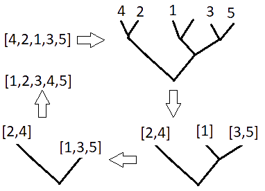
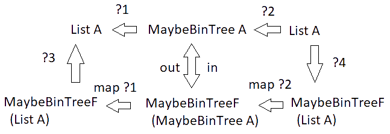
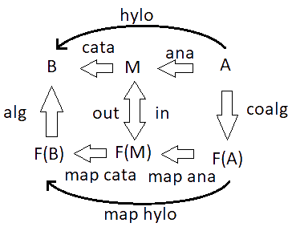
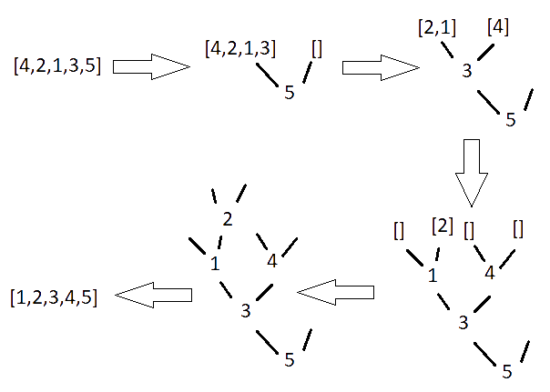

In this post, I will show a nice, clean, organized, schematic, and theoretically well-justified approach to sorting. I'll implement it in Python because of my target audience, but there's no significance to the choice beyond that. I'm going to describe and implement mergesort and quicksort via hylomorphisms. That may sound intimidating, but, trust me, it's way simpler than the usual implementation. This will allow for a semi-direct comparison between the algorithms while simultaneously demonstrating some techniques which might be considered esoteric to the Pythonic mind.

First, let's look at mergesort since it's a very common example of using hylomorphism. We will use the specification of Merge Sort to motivate our implementation of hylo. For a start, I'll simply describe merge sort in an abstract way.

Mergesort starts by splitting a list into a binary tree, with approximately half of its components on one side and the other half on the other. Theses branches are then merged into lists, ensuring that the lists remain sorted at each merging. Here's a diagram depicting the process.



We can note a few things. Firstly, the list passes through a data structure; a tree that stores data at its nodes, but the nodes may be empty. It has three constructors,
* `Branch(a, b)`, which takes two trees, `a` and `b`.
* `Leaf(a)`, which holds a piece of data; in the example above `a` would be an integer.
* `EmptyLeaf()`, which holds nothing.

The tree in the example diagram would be denoted

```
Branch(
  Branch(
    Leaf(4), 
    Leaf(2)),
  Branch(
    Branch(
      Leaf(1), 
      EmptyLeaf()),
    Branch(
      Leaf(3),
      Leaf(5))))
```
Let's implement this.

```python
from typing import TypeVar, Generic
A = TypeVar('A')

class MaybeBinTree(Generic[A]):
    pass

class Branch(MaybeBinTree[A]):
    def __init__(self, a: MaybeBinTree[A], b: MaybeBinTree[A]) -> None:
        self.a = a
        self.b = b
        
    def __str__(self):
        return "Branch(" + str(self.a) + ", " + str(self.b) + ")"

class Leaf(MaybeBinTree[A]):
    def __init__(self, a: A) -> None:
        self.a = a
        
    def __str__(self):
        return "Leaf(" + str(self.a) + ")"

class EmptyLeaf(MaybeBinTree[A]):
    def __init__(self) -> None:
        pass
        
    def __str__(self):
        return "EmptyLeaf()"
```

I decided to call the tree `MaybeBinTree` since it's a binary tree whose leaves maybe store data. You'll notice that each type constructor inherits from MaybeBinTree, even though MaybeBinTree doesn't have any data. This allows us to do some basic type checking; for instance;


```python
isinstance(Leaf(2), MaybeBinTree)
```

```
Out: True
```

Though, it's mostly for schematic completeness.

Now that we have our data structure, we want to consider a few things. In the diagram I gave, the program passes through the `MaybeBinTree` type. Given some `A`s to sort, we have a function going from `List A` to `MaybeBinTree A`. We then compose this with a function from `MaybeBinTree A` to `List A` to complete the sorting.


We won't be targeted either of those functions; instead, we're going to go around them.

First, consider that both `List` and `MaybeBinTree` are inductive datatypes. This means, among other things, that they're the initial algebra of some endofunctor. It's well-known that the endofunctor which produces `List A` is `ListF A := X ↦ 1 + A × X`, where the `1` corresponds to the empty list, and the `A × X` corresponds to the case where an `A` is appended onto a list, called the "cons" case.

We can define this functor as follows;

```python
L = TypeVar('L')

class ListF(Generic[A, L]):
    pass

class ConsF(ListF[A, L]):
    def __init__(self, a: L, b: A) -> None:
        self.a = a
        self.b = b
        
    def __str__(self):
        return "ConsF(" + str(self.a) + ", " + str(self.b) + ")"

class NilF(ListF[A, L]):
    def __init__(self) -> None:
        pass
        
    def __str__(self):
        return "NilF()"
```

This endofunctor allows us to define `List` as:

`List A := ListF A (List A)`

The canonical function from any `F A` to `A`, where `A` is the initial algebra, is called `in`, while the other direction is called `out`. We can define these for the list as follows;

```python
from typing import List

def list_in(lF : ListF[A, List[A]]) -> List[A]:
    if isinstance(lF, ConsF):
        r = lF.a.copy()
        r.append(lF.b)
        return r
    elif isinstance(lF, NilF):
        return []

def list_out(l : List[A]) -> ListF[A, List[A]]:
    if l == []:
        return NilF()
    else:
        l2 = l.copy()
        r = l2.pop()
        return ConsF(l2, r)
```

You can note that all these do is deconstruct and reconstruct one recurse within a list;

```python
y = [1,2,3,4,5]
x = list_out(y)

print(x)
print(list_in(x))
```

```
Out[1]: ConsF([1, 2, 3, 4], 5)
Out[2]: [1, 2, 3, 4, 5]
```

We'll make use of these later on. We'll also need the ones for `MaybeBinTree`. The endofunctor generating this datatype is `MaybeBinTreeF A := X ↦ 1 + A + X × X`, corresponsing to the empty leaf, leaf, and branch cases. We can construct this functor as a type;

```python
M = TypeVar('M')

class MaybeBinTreeF(Generic[A, M]):
    pass

class BranchF(MaybeBinTreeF[A, M]):
    def __init__(self, a: M, b: M) -> None:
        self.a = a
        self.b = b
        
    def __str__(self):
        return "BranchF(" + str(self.a) + ", " + str(self.b) + ")"

class LeafF(MaybeBinTreeF[A, M]):
    def __init__(self, a: A) -> None:
        self.a = a
        
    def __str__(self):
        return "LeafF(" + str(self.a) + ")"

class EmptyLeafF(MaybeBinTreeF[A, M]):
    def __init__(self) -> None:
        pass
        
    def __str__(self):
        return "EmptyLeafF()"
```

We can define `in` and `out` for `MaybeBinTree` as follows;

```python
def maybeBinTree_in(mF : MaybeBinTreeF[A, List[A]]) -> MaybeBinTree[A]:
    if isinstance(mF, BranchF):
        return Branch(mF.a, mF.b)
    elif isinstance(mF, LeafF):
        return Leaf(mF.a)
    elif isinstance(mF, EmptyLeafF):
        return EmptyLeaf()

def maybeBinTree_out(m : MaybeBinTree[A]) -> MaybeBinTreeF[A, MaybeBinTree[A]]:
    if isinstance(m, Branch):
        return BranchF(m.a, m.b)
    elif isinstance(m, Leaf):
        return LeafF(m.a)
    elif isinstance(m, EmptyLeaf):
        return EmptyLeafF()
```

We can observe that this also just constructs/deconstructs one recursion down.

```python
m = Branch(
      Leaf(2),
      Branch(
        Leaf(1),
        Branch(
          Leaf(3),
          Leaf(5))))

m = maybeBinTree_out(m)

print(m)
print(maybeBinTree_in(m))
```

```
Out[1]: BranchF(Leaf(2), Branch(Leaf(1), Branch(Leaf(3), Leaf(5))))
Out[2]: Branch(Leaf(2), Branch(Leaf(1), Branch(Leaf(3), Leaf(5))))
```

This is more obvious here than with the case of `List`; we can replace all the constructors of `MaybeBinTree` with those of `MaybeBinTreeF` and we won't lose any information.

```
BranchF(
  BranchF(
    LeafF(4), 
    LeafF(2)),
  BranchF(
    BranchF(
      LeafF(1), 
      EmptyLeafF()),
    BranchF(
      LeafF(3),
      LeafF(5))))
```

Hence the possible definition, `MaybeBinTree A := MaybeBinTreeF A (MaybeBinTree A)`.

The `in` and `out` functions are nice, but they aren't as important as the fact that `MaybeBinTreeF` is, in fact, a functor. This means that, given a function from `X` to `Y` for any types `X` and `Y`, there's a canonical function from `MaybeBinTreeF A X` to `MaybeBinTreeF A Y`. Since `MaybeBinTreeF` is just a shaped container, this function, called `map`, just applies that function to each of the parts containing an `X`.

```python
from typing import Callable

X = TypeVar('X')
Y = TypeVar('Y')

def maybeBinTreeF_map(f: Callable[[X], Y], mF: MaybeBinTreeF[A, X]) -> MaybeBinTreeF[A, Y]:
    if isinstance(mF, BranchF):
        return BranchF(f(mF.a), f(mF.b))
    elif isinstance(mF, LeafF):
        return LeafF(mF.a)
    elif isinstance(mF, EmptyLeafF):
        return EmptyLeafF()

ex1 = BranchF(2, 3)
ex2 = LeafF(2)
exf = lambda x: str(x * 5) + "!"

print( maybeBinTreeF_map(exf, ex1) )
print( maybeBinTreeF_map(exf, ex2) )
```

```
Out[1]: BranchF(10!, 15!)
Out[2]: LeafF(2)
```

```python
def listF_map(f: Callable[[X], Y], lF: ListF[A, X]) -> ListF[A, Y]:
    if isinstance(lF, ConsF):
        return ConsF(f(lF.a), lF.b)
    elif isinstance(lF, NilF):
        return NilF()

ex3 = ConsF(3, 3)

print( listF_map(exf, ex3) )
```

```
Out: ConsF(15!, 3)
```

Neat! At this point, we can fill in a few details. 



It's at this point which we notice the possibility of a solution. If we had a function pointing from our input lists to our output lists (what we were looking for in the first place), then we could map it over our lists within our `maybeBinTreeF` container.


If you think about this for a second, you may realize that, being under a map, `???`, at the bottom, is operating one recursion step deeper then the `???` at the top is operating. This means it's one step closer to the base case, and it should eventually terminate as a valid recursion. `???` is usually called `hylo` (short for `hylomorphism`), while `?3` is called the algebra and `?4` is called the coalgebra. Using them as inputs, we can define `hylo` in general. By composing `?4` with `map hylo` and then `?3`. The most general typing becomes clear when I clean up the above picture into something less busy;



Also, by the same reasoning as with `hylo`, we can derive `?1` and `?2`, which are usually called `ana` and `cata`.


```python
# Unfortunately, this is the point where Python's type system fails to capture the full generallity of our program.
# We want our `F` a variable, but Python won't have it. It's type should be;
# def hylo(mapF: ..., alg: Callable[[F[B]], B], coalg: Callable[[A], F[A]], a: A) -> B:

def ana(mapF, inF, coalg, a):
    return inF(mapF(lambda x: ana(mapF, inF, coalg, x), coalg(a)))

def cata(mapF, alg, outF, a):
    return alg(mapF(lambda x: cata(mapF, alg, outF, x), outF(a)))

def hylo(mapF, alg, coalg, a):
    return alg(mapF(lambda x: hylo(mapF, alg, coalg, x), coalg(a)))
```

Great! But now we need `?3` and `?4`. `?4` isn't a recursive function; it just splits up the list into our `maybeBinTreeF` container. It will take a list and split it between the branches. I'll call it `branch_split`.

```python
def branch_split(l: List[A]) -> MaybeBinTreeF[A, List[A]]:
    if l == []:
        return EmptyLeafF()
    elif len(l) == 1:
        return LeafF(l[0])
    else:
        s = len(l)//2
        return BranchF(l[0:s], l[s:])

print(branch_split([4,2,1,3,5]))
```

```
Out: BranchF([4, 2], [1, 3, 5])
```

Notice that `branch_split` also stores an item within a leaf if it's the only item in the list. Also notice that if we apply `branch_split` to smaller and smaller terms, an empty list is never actually produced. That `EmptyLeafF` case seems a bit pointless, but it ensures our program won't, for example, crash if we're asked to sort an empty list.

`?3` will be a function that takes a pair of lists within a branch, and merges them. I'll call it `branch_merge`. But, uhh... it's recursive too. Damn. Alright, let's back up. If we take the merging operation as a problem just like merge sort itself, then it starts with a pair of lists and fuses them into a single list. If we take `List` to be our `M` and `List × List` to be our `A` in the previous diagram, then we can get our merging function if we give a coalgebra. This has to be a function that takes a pair of lists and returns an element paired with a pair of lists. This element will simply be whichever of the two elements at the beginning of the pair is biggest.

```python
from typing import Tuple

def merging_coalg(l: Tuple[List[A], List[A]]) -> ListF[A, Tuple[List[A], List[A]]]:
    l1, l2 = l
    l1 = l1.copy()
    l2 = l2.copy()
    
    if l1 == [] and l2 == []:
        return NilF()
    elif l1 == []:
        r = l2.pop()
        return ConsF(([], l2), r)
    elif l2 == []:
        r = l1.pop()
        return ConsF((l1, []), r)
    elif l1[-1] >= l2[-1]:
        r = l1.pop()
        return ConsF((l1, l2), r)
    elif l1[-1] < l2[-1]:
        r = l2.pop()
        return ConsF((l1, l2), r)

print(merging_coalg(([1,3,5],[2,4])))
```

```
Out: ConsF(([1, 3], [2, 4]), 5)
```

And the full merging function is the anamorphism derived from this coalgebra.

```python
def merge(p: Tuple[List[A], List[A]]) -> List[A]:
    return ana(listF_map, list_in, merging_coalg, p)
    
print(merge(([1,3,5],[2,4])))
```

```
Out: [1, 2, 3, 4, 5]
```

Great! Now we can define `branch_merge`. All it does is merge the lists placed at the branches of the tree.

```python
def branch_merge(mF: MaybeBinTreeF[A, List[A]]) -> List[A]:
    if isinstance(mF, BranchF):
        return merge((mF.a, mF.b))
    elif isinstance(mF, LeafF):
        return [mF.a]
    elif isinstance(mF, EmptyLeafF):
        return []

print(branch_merge(BranchF([2,4], [1,3,5])))
```

```
Out: [1, 2, 3, 4, 5]
```

And, with all that, we can finally define mergesort.

```python
def merg_sort(l: List[A]) -> List[A]:
    return hylo(maybeBinTreeF_map, branch_merge, branch_split, l)

print(merg_sort([9,4,5,3,8,0,1,2,6,7]))
```

```
Out: [0, 1, 2, 3, 4, 5, 6, 7, 8, 9]
```

And it's as simple as that!

Let's move on to quicksort. This algorithm does something quite different. It starts by splitting the list into pairs of lists which are, respectively, all less than and all greater than the head element. In the end, the tree is simply flattened. Here's a diagram showing the process.



This, like merge sort, requires its own data structure. This is something I call a `NodeTree`, a tree that stores data at its nodes. This has this simple endofunctor `X ↦ 1 + X × A × X`. We don't need the full datatype, so I'll only define the functor.

```python
N = TypeVar('N')

class NodeTreeF(Generic[A, N]):
    pass

class NodeBranchF(NodeTreeF[A, N]):
    def __init__(self, b1: N, a: A, b2: N) -> None:
        self.a = a
        self.b1 = b1
        self.b2 = b2
        
    def __str__(self):
        return "NodeBranchF(" + str(self.b1) + ", " + str(self.a) + ", " + str(self.b2) + ")"

class NodeLeafF(NodeTreeF[A, N]):
    def __init__(self) -> None:
        pass
        
    def __str__(self):
        return "NodeLeafF()"

def nodeTree_map(f: Callable[[X], Y], nF: NodeTreeF[A, X]) -> NodeTreeF[A, Y]:
    if isinstance(nF, NodeLeafF):
        return NodeLeafF()
    elif isinstance(nF, NodeBranchF):
        return NodeBranchF(f(nF.b1), nF.a, f(nF.b2))
```

Before we can get to the appropriate (co)algebras, we need to define the function which splits the lists in the way quicksort requires. I'll call this function `duel_filter`. This function will be recursive, taking a list as input and outputting a triple consisting of an element of an `A` and two lists of `A`s. Ultimately, we're trying to recurse over the list; so that's our recursive structure. `duel_filter` can then be defined via a catamorphism who's algebra takes `a` and `b` of type `A` and two lists; placing `b` in the first list if it's less than or equal to `a`, and in the second list otherwise.

```python
def duel_filter_alg(lF: ListF[A, NodeTreeF[A, List[A]]]) -> NodeTreeF[A, List[A]]:
    if isinstance(lF, ConsF):
        if isinstance(lF.a, NodeLeafF):
            return NodeBranchF([], lF.b, [])
        elif isinstance(lF.a, NodeBranchF):
            a = lF.a.a
            l1 = lF.a.b1
            l2 = lF.a.b2
            if lF.b <= a:
                l1p = l1.copy()
                l1p.append(lF.b)
                return NodeBranchF(l1p, a, l2)
            elif lF.b > a:
                l2p = l2.copy()
                l2p.append(lF.b)
                return NodeBranchF(l1, a, l2p)
    elif isinstance(lF, NilF):
        return NodeLeafF()

print( duel_filter_alg(ConsF(NodeBranchF([1], 3, [5,4]), 2)) )
```

```
Out: NodeBranchF([1, 2], 3, [5, 4])
```

```python
def duel_filter(l: List[A]) -> NodeTreeF[A, List[A]]:
    return cata(listF_map, duel_filter_alg, list_out, l)

print(duel_filter([4,2,1,5,3]))
```

```
Out: NodeBranchF([2, 1, 3], 4, [5])
```

That will act as the coalgebra for our quicksort hylomorphism. The algebra simply sandwiches the element at a node of our tree between the lists on its sides.

```python
def nodeTree_flatten(nF: NodeTreeF[A, List[A]]) -> List[A]:
    if isinstance(nF, NodeLeafF):
        return []
    elif isinstance(nF, NodeBranchF):
        return nF.b1 + [nF.a] + nF.b2
```

And, finally, we have quicksort!

```python
def quicksort(l: List[A]) -> List[A]:
    return hylo(nodeTree_map, nodeTree_flatten, duel_filter, l)

print(quicksort([9,4,5,3,8,0,1,2,6,7]))
```

```
Out: [0, 1, 2, 3, 4, 5, 6, 7, 8, 9]
```

Well, it doesn't sort the elements in place. This implementation leaves some things to be desired, as far as efficiency is concerned. IMO, this is mostly a compiler issue. Some modern languages (e.g. Formality and Idris 2) can check linearity, that data isn't copied, only manipulated or deleted, allowing the final, compiled program to manipulate data on such calls in-place. But there's probably a way to get this working more efficiently in Python, but I don't care enough to do so.

So, you may be asking yourself, "I this *really* the easy way to sort lists recursively? This all seems abstract and confusing." I would say there's a tradeoff one has to make when it comes to making things simple. Most tasks that programmers to are special cases of very generic activities. Everything arises out of an adjunction, or a fibration, etc. We can make things very simple by climbing the tower of abstraction, but the tradeoff is that our most commonly used functions will become ever more abstruse. For my money, I think the cost is worth it. The other direction is to stay grounded at the bottom of the tower of abstraction; forever dwelling on miscellaneous details, even when they could be ignored.

As a practical demonstration, all the code written in this post ran the first time, without any modification. Well, that's not quite true. `duel_filter_alg` didn't work at first because of an indentation error, but that was genuinely it. Compared to usual Python development; that's quite spectacular. This general approach, called "Recursion Schemes", is a very, very good organizational principle for recursive programs. If you want to learn more, [this presentation](https://www.youtube.com/watch?v=_1XXFJgA6fs) is a very nice starting point which points to further resources.