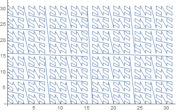


I've been researching methods for generating data the past few months and, as part of that, I looked into Godel encodings. In my wildest dreams, I dreamt of being able to simply count through all examples of some complex class and remove the need for ordinary search. That dream has yet to come, but what I did find is an exceptionally simple and elegant theory that allows one to create bijections between natural numbers and arbitrary inductive datatypes.

Much of this work was done by Paul Tarau in
 - [Isomorphic Data Encodings in Haskell and their Generalization to Hylomorphisms on Hereditarily Finite Data Types](https://arxiv.org/pdf/0808.2953.pdf)
 - [Bijective Size-proportionate Gödel Numberings for Term Algebras](https://www.semanticscholar.org/paper/Bijective-Size-proportionate-G%C3%B6del-Numberings-for-Tarau/fab5dab6933f576a3d609cef03f7a5ac07ae6ba6?p2df)

However, the organization he uses is quite convoluted and unnatural, and some of his encodings are overly complicated. I hope to present the idea in a much more streamlined fashion. Note that this post is written using Mathematica as a programming language.

Our end goal will be to encode arbitrary initial algebras over polynomial functors. To that end, we need a way to encode polynomial functors; tuples and sums of natural numbers with or without finite sets.

The standard method for encoding tuples with natural numbers is "Cantor tupling". However, the general n-tuple case is quite involved and inefficient. How to do (inverse) Cantor tupling efficiently is still a research topic to this day.
 - ["Deriving a Fast Inverse of the Generalized Cantor N-tupling Bijection" by Paul Tarau](https://drops.dagstuhl.de/opus/volltexte/2012/3632/pdf/30.pdf)

Instead, a much simpler solution is to use a binary digit interleaving function. Essentially, we just riffle the (padded) binary expansions of the two numbers to get a new number. By riffling, we guarantee that either the most or second most significant digit is a 1. If the most is a 0, it will go missing when we convert back from a number to the binary expansion, but we can detect this since we'll only have an odd number of digits when we should have an even number after riffling two same-length sequences.
```mathematica
NatTimesNatToNat[{0, 0}] := 0
NatTimesNatToNat[{x1_, x2_}] :=
 Block[{l, b1, b2},
  l = Floor@Log[2, Max[x1, x2]] + 1;
  b1 = IntegerDigits[x1, 2, l];
  b2 = IntegerDigits[x2, 2, l];
  
  FromDigits[Riffle[b1, b2], 2]
  ]
```
By taking the even odd placed binary numbers from the binary expansion of a number, we can retrieve the original two numbers.
```mathematica
NatToNatTimesNat[x_] :=
 Block[{b, n1, n2},
  b = IntegerDigits[x, 2];
  
  If[OddQ@Length@b, PrependTo[b, 0]];
  
  n1 = FromDigits[b[[1 ;; All ;; 2]], 2];
  n2 = FromDigits[b[[2 ;; All ;; 2]], 2];
  
  {n1, n2}
  ]
```


```mathematica
In[1] := NatToNatTimesNat@2008
In[2] := NatTimesNatToNat@%
```

```mathematica
Out[1] := {26, 60}
Out[2] := 2008
```


```mathematica
In[1] := Array[NatToNatTimesNat, {20}, 0]
In[2] := NatTimesNatToNat /@ %
```

```mathematica
Out[1] := {{0, 0}, {0, 1}, {1, 0}, {1, 1}, {0, 2}, {0, 3}, {1, 2}, {1, 3}, {2, 0}, {2, 1}}
Out[2] := {0, 1, 2, 3, 4, 5, 6, 7, 8, 9}
```

By plotting these points, we can see that the algorithm corresponds to a quite nice space-filling curve.

```mathematica
ListLinePlot@Array[NatToNatTimesNat, {1024}, 0]
```



In general, we only need the 2-tuple case to encode everything as we may see higher tuples `{a, b, c}` as `{a, {b, c}}`; though this may be considered less efficient from various perspectives. At the very least, such an encoding would pack `a` tighter than `b` or `c`, so a more fair encoding may be desirable. This trick can be generalized to arbitrary n by padding based on the modulus of the binary length of the encoded number by the length of the tuple.

```mathematica
NatTuplesToNat[x_] /; AllTrue[x, # == 0 &] := 0
NatTuplesToNat[x_] :=
 Block[{n, l, b},
  n = Length@x;
  l = Floor@Log[2, Max[x]] + 1;
  b = IntegerDigits[#, 2, l] & /@ x;
  
  FromDigits[Flatten@Thread@b, 2]
  ]
NatToNatTuples[n_][x_] :=
 Block[{l, b, n1, n2},
  b = IntegerDigits[x, 2];
  
  l = Length@b;
  b = PadLeft[b, l + n - Mod[l, n]];
  
  Table[FromDigits[b[[k ;; All ;; n]], 2], {k, n}]
  ]
```

```mathematica
In[1] := Array[NatToNatTimesNat, {8}, 0]
In[2] := NatTimesNatToNat /@ %
```

```mathematica
Out[1] := {{0, 0, 0}, {0, 0, 1}, {0, 1, 0}, {0, 1, 1},
           {1, 0, 0}, {1, 0, 1}, {1, 1, 0}, {1, 1, 1}}
Out[2] := {0, 1, 2, 3, 4, 5, 6, 7}
```

This construction can be viewed as encoding functions out of finite sets and into the natural numbers.

As part of composing isomorphisms to get larger and larger polynomial functors, we need a function that can thread isomorphisms between pairs so we can get one between `X × Y` and `A × B` whenever we have an isomorphism between `X` and `A` and between `Y` and `B`.

```mathematica
XTuplesToYTuples[XsToYs_][xs_] := MapThread[#1[#2] &, {XsToYs, xs}]
```

We can encode `N × ℕ` for finite `N` using a variation of a method used to encode coproducts. `ℕ + ℕ` can be encoded into `ℕ` by multiplying by 2 in the first case and multiplying by 2  and subtracting 1 in the second case. The other direction inverts those operations; the first in the even case and the second in the odd case. We can view `ℕ + ℕ` as being essentially like `2 × ℕ`. By generalizing the construction of that isomorphism, we can obtain an isomorphism into `N × ℕ` for general `N`.

```mathematica
NatToNTimesNat[n_][x_] := {Mod[x, n], Quotient[x, n]}
NTimesNatToNat[n_][{k_, x_}] := n x + k
```

```mathematica
NatToNatTimesN[n_][x_] := {Quotient[x, n], Mod[x, n]}
NatTimesNToNat[n_][{x_, k_}] := n x + k
```

```mathematica
In[1] := Array[NatToNTimesNat[2], {10}, 0]
In[2] := NTimesNatToNat[2] /@ %
```

```mathematica
Out[1] := {{0, 0}, {1, 0}, {0, 1}, {1, 1}, {0, 2},
           {1, 2}, {0, 3}, {1, 3}, {0, 4}, {1, 4}}
Out[2] := {0, 1, 2, 3, 4, 5, 6, 7, 8, 9}
```

Using this as a uniform representation of coproducts, we can obtain a generic method to thread isomorphisms between sums.

```mathematica
XSumsToYSums[XsToYs_][{n_Integer, x_}] /; n < Length@XsToYs :=
  {n, XsToYs[[n + 1]][x]}
```

We may now want to consider adding finite types to natural numbers. This is a fairly simple procedure as we just add the needed amount to our natural numbers to make room for the finite types.

```mathematica
NatToNPlusNat[n_][x_] := If[x < n, {0, x}, {1, x - n}]
NPlusNatToNat[n_][{0, x_}] := x
NPlusNatToNat[n_][{1, x_}] := n + x
```

```mathematica
NatToNatPlusN[n_][x_] := If[x < n, {1, x}, {0, x - n}]
NatPlusNToNat[n_][{1, x_}] := x
NatPlusNToNat[n_][{0, x_}] := n + x
```

```mathematica
In[1] := Array[NatToNPlusNat[3], {10}, 0]
In[2] := NTimesNatToNat[2] /@ %
```

```mathematica
Out[1] := {{0, 0}, {0, 1}, {0, 2}, {1, 0}, {1, 1},
           {1, 2}, {1, 3}, {1, 4}, {1, 5}, {1, 6}}
Out[2] := {0, 1, 2, 3, 4, 5, 6, 7, 8, 9}
```

Given an algebra `f : ℕ → F[ℕ]` and a coalgebra `g : F[ℕ] → ℕ`, such that `f` and `g` form an isomorphism, then any initial/final algebra over `F` is isomorphic to `ℕ`. To see this, we need to define the recursion schemes

```mathematica
ana[mapF_, coalg_][x_] := mapF[ana[mapF, coalg], coalg[x]]
cata[mapF_, alg_][x_] := alg[mapF[cata[mapF, alg], x]]
```

These functions can be used to generically structure any (co) recursion over inductive datatypes. Cata is short for "catamorphism" and ana is short for "anamorphism"; kinds of recursion schemes that can make structuring (co)recursive programs very simple. I'll give some examples involving lists later on.

The most important thing to note is that if f and g are isomorphisms then `ana[mapF, f]` and `cata[mapF, g]` will be as well. For the sake of simplicity, I'll leave out the mapF from the subsequent calculation. Also, I'll denote `mapF[f, e]` as `f /@ e` since it will be a generalization of the built-in map for general functors.

In the first case we have;

```mathematica
ana[f][cata[g][X]]
  == ana[f][g[cata[g] /@ X]]
  == ana[f] /@ f[g[cata[g] /@ X]]
    by f[g[x]] == x; f and g form an isomorphism
  == ana[f] /@ cata[g] /@ X
  == ana[f]@*cata[g] /@ X
    by the inductive hypothesis, that ana[f] and cata[g] form
    an isomorphism after one evaluation step.
  == # & /@ X
  == X
```

In the other direction we have

```mathematica
cata[g][ana[f][X]]
  == cata[g][ana[f] /@ f[X]]
  == g[cata[g] /@ ana[f] /@ f[X]]
  == g[cata[g]@*ana[f] /@ f[X]]
    by the inductive hypothesis, that ana[f] and cata[g] form
    an isomorphism after one evaluation step.
  == g[# & /@ f[X]]
  == g[f[X]]
    by g[f[x]] == x; f and g form an isomorphism
  == X
```

With that in mind, let's give some examples. I'll use lists as a running example. Lists of `A`s are the initial algebra over the endofunctor that sends `X` to `1 + A×X`. As an example, the list
```
{1, 2, 3}
```
would become
```
{1, {1, {1, {2, {1, {3, {0, 0}}}}}}}
```
in the uniform notation we've been building up. Note that each subsequent `{0, _}` and `{1, _}` are tags for the coproduct cases. Be replacing them with `inl` and `inr` it would become
```
inr[{1, inr[{2, inr[{3, inl[0]}]}]}]
```
which is, hopefully, clearer to the reader.

We can easily convert these to native datatypes

```mathematica
MListToList[{}] := {0, 0}
MListToList[{a_, l___}] := {1, {a, MListToList[{l}]}}

ListToMList[{0, 0}] := {}
ListToMList[{1, {a_, l_}}] := Flatten[{a, ListToMList@l}]
```

```mathematica
In[1] := MListToList@{1, 2, 3}
In[2] := ListToMList@%
```

```mathematica
Out[1] := {1, {1, {1, {2, {1, {3, {0, 0}}}}}}}
Out[2] := {1, 2, 3}
```

The map for lists is just the map instance for the functor which it's initial over. We just send a function to the only hole where we have a recursive case; the `X` in the previous description.

```mathematica
listFMap[f_, {0, 0}] := {0, 0}
listFMap[f_, {1, {n_, l_}}] := {1, {n, f[l]}}
```

Using this, we can give some example functions. Here's an example of using cata to get the length of a list. First, we define the algebra which states what to do at each recursive case. There are two options; either we have an empty list or we have a cons with an element on one side and the result of the previous recursion on the other. In the first, we return 0, in the second, we add one to the recursive case.

```mathematica
lenAlg[{0, 0}] := 0
lenAlg[{1, {_, r_}}] := 1 + r

len := cata[listFMap, lenAlg]
```

```mathematica
In[1]  := len@MListToList@{0, 1, 2, 3, 4}
Out[1] := 5
```

Using a similar procedure, we can add all the elements of a list.

```mathematica
sumAlg[{0, 0}] := 0
sumAlg[{1, {e_, r_}}] := e + r

sum := cata[listFMap, sumAlg]
```

```mathematica
In[1]  := sum@MListToList@{1, 2, 3, 4, 5}
Out[1] := 15
```

In the other direction, we can use ana to structure a corecursion that constructs a list. I'll construct the list `{1, 2, 3, 4, 5}`. To do so, we need the coalgebra to do something at each step of the corecursion. It has a seed, and it needs to use it to decide what to construct. In the recursive position of the functor, it will place its next seed. At each corecursion, the seed will simply be incremented so that it can be added to a position.

```mathematica
sequenceCoAlg[{0, val_}] := {0, 0}
sequenceCoAlg[{len_, val_}] := {1, {val, {len - 1, val + 1}}}

sequenceGen := ana[listFMap, sequenceCoAlg]
```

```mathematica
In[1]  := ListToMList@sequenceGen[{5, 1}]
Out[1] := {1, 2, 3, 4, 5}
```

We can generate some elements of `1 + ℕ×ℕ` for some examples of the intermediate encodings used as part of the list encoding. 

```mathematica
In[1]  := Array[XSumsToYSums[{# &, NatToNatTuples[2]}]@*NatToNPlusNat[1], {5}, 0]
Out[1] := {{0, 0}, {1, {0, 0}}, {1, {0, 1}}, {1, {1, 0}}, {1, {1, 1}}}
```

We can shove the above encoding of `1 + ℕ×ℕ` into cata and ana to get encodings of full lists of natural numbers.

```mathematica
NatToNatList :=
  ana[listFMap, XSumsToYSums[{# &, NatToNatTuples[2]}]@*NatToNPlusNat[1]]
NatListToNat :=
  cata[listFMap,  NPlusNatToNat[1]@*XSumsToYSums[{# &, NatTuplesToNat}]]
```

```mathematica
In[1]  := Array[ListToMList@*NatToNatList, {10}, 0]
Out[1] := {{}, {0}, {0, 0}, {1}, {1, 0}, {0, 0, 0}, {0, 1}, {1, 0, 0}, {1, 1}, {2}}
```

```mathematica
In[1]  := NatToNatList[3142452345234] // ListToMList
In[2]  := NatListToNat@MListToList@%
```

```mathematica
Out[1] := {1828968, 552, 18, 1, 0, 1}
Out[2] := 3142452345234
```

At this point, we're in a position to automatically generate isomorphisms for initial algebras over arbitrary polynomial functors over natural numbers. We'll denote polynomial functors using the following constructors
 
- Numbers for finite types
- `nat` for the naturals
- `coproduct[A, B, C, ...]` for coproducts of `A`, `B`, `C`, etc
- `product[A, B, C, ...]` for products of `A`, `B`, `C`, etc
- `$X` for the recursive position
 
As an example, the signature for lists of natural numbers is `coproduct[1, product[nat, $X]]`.

We need three generating functions. The first is the map of the functor.

```mathematica
fmapOf[n_Integer][f_, e_] := e
fmapOf[nat][f_, e_] := e
fmapOf[coproduct[T__]][f_, {n_Integer, e_}] /; n < Length@{T} :=
  {n, fmapOf[{T}[[n + 1]]][f, e]}
fmapOf[product[T__]][f_, es_List] /; Length@es == Length@{T} :=
  MapThread[fmapOf[#1][f, #2] &, {{T}, es}]
fmapOf[$X][f_, e_] := f[e]
```

As an example, we can repeat the previous construction automatically now with
```mathematica
listFMap := fmapOf[coproduct[1, product[nat, $X]]]
```

```mathematica
In[1]  := ListToMList[NatToNatList[25346]]
In[2]  := MListToList@%
In[3]  := NatListToNat[%]
```

```mathematica
Out[1] := {80, 8, 1, 0}
Out[2] := {1, {80, {1, {8, {1, {1, {1, {0, {0, 0}}}}}}}}}
Out[3] := 25346
```

A helpful auxiliary function will measure the size of a type after recursion. This will allow us to detect finite cases in the type so we don't try making an isomorphism between ℕ and the booleans, for instance.  

```mathematica
typeSize[coproduct[T__]] := Total@(typeSize /@ {T})
typeSize[product[T__]] := Times @@ (typeSize /@ {T})
typeSize[nat] := ∞
typeSize[$X] := ∞
typeSize[n_Integer] := n
```

In the case of finite types, we need to automatically generate maps into the appropriate finite set. These definitions automatically generate isomorphisms between some finite set of size n and a type like `coproduct[5, product[2, 3]]`, which is isomorphic to a finite set of size 11.

```mathematica
fromFiniteSet[coproduct[A_, B_]][n_] := 
  With[{sa = typeSize[A]},
       If[n < sa, fromFiniteSet[A][n], fromFiniteSet[B][n - sa]]]
(*Question; How to generalize to larger products?*)
fromFiniteSet[product[A_, B_]][n_] := 
  With[{sb = typeSize[B]},
       {fromFiniteSet[A]@Quotient[n, sb], fromFiniteSet[B]@Mod[n, sb]}]
fromFiniteSet[n_Integer] := # &

toFiniteSet[coproduct[A_, B_]][{0, e_}] := toFiniteSet[A][e]
toFiniteSet[coproduct[A_, B_]][{1, e_}] := typeSize[A] + toFiniteSet[B][e]
toFiniteSet[coproduct[T__]][{n_Integer, e_}] /; n < Length@{T} := 
  Total[typeSize /@ {T}[[1 ;; n + 1]]] + toFiniteSet[T[[n + 1]]][e]
toFiniteSet[product[A_, B_]][{e1_, e2_}] :=
  {typeSize[B], 1}.{toFiniteSet[A][e1], toFiniteSet[B][e2]}
toFiniteSet[n_Integer] := # &
```

The last two things we need are the final functions that generate isomorphisms between `ℕ` and `F[ℕ]`. It all comes together rather nicely.

```mathematica
fromNat[coproduct[A_, B_]] :=
  With[{sa = typeSize[A], sb = typeSize[B]},
    Which[
      sa < ∞ == sb, 
      XSumsToYSums[{fromFiniteSet[A], fromNat[B]}]@*NatToNPlusNat[sa],
      sb < ∞ == sa, 
      XSumsToYSums[{fromNat[A], fromFiniteSet[B]}]@*NatToNatPlusN[sb],
      sa == ∞ == sb, 
      XSumsToYSums[{fromNat[A], fromNat[B]}]@*NatToNTimesNat[2]
    ]
  ]
fromNat[coproduct[T__]] /; AllTrue[{T}, typeSize@# == ∞ &] :=
  XSumsToYSums[fromNat /@ {T}]@*NatToNTimesNat[Length@{T}]
fromNat[product[A_, B_]] :=
  With[{sa = typeSize[A], sb = typeSize[B]},
    Which[
      sa < ∞ == sb, 
      XTuplesToYTuples[{fromFiniteSet[A], fromNat[B]}]@*NatToNTimesNat[sa],
      sb < ∞ == sa, 
      XTuplesToYTuples[{fromNat[A], fromFiniteSet[B]}]@*NatToNatTimesN[sb],
      sa == ∞ == sb, 
      XTuplesToYTuples[{fromNat[A], fromNat[B]}]@*NatToNatTuples[2]
    ]
  ]
fromNat[product[T__]] /; AllTrue[{T}, typeSize@# == ∞ &] := 
  XTuplesToYTuples[fromNat /@ {T}]@*NatToNatTuples[Length@{T}]
fromNat[nat] := # &
fromNat[$X] := # &
```

```mathematica
toNat[coproduct[A_, B_]] :=
  With[{sa = typeSize[A], sb = typeSize[B]},
    Which[
      sa < ∞ == sb, 
      NPlusNatToNat[sa]@*XSumsToYSums[{toFiniteSet[A], toNat[B]}],
      sb < ∞ == sa, 
      NatPlusNToNat[sb]@*XSumsToYSums[{toNat[A], toFiniteSet[B]}],
      sa == ∞ == sb, 
      NTimesNatToNat[2]@*XSumsToYSums[{toNat[A], toNat[B]}]
    ]
  ]
toNat[coproduct[T__]] /; AllTrue[{T}, typeSize@# == ∞ &] := 
  NTimesNatToNat[Length@{T}]@*XSumsToYSums[toNat /@ {T}]
toNat[product[A_, B_]] :=
  With[{sa = typeSize[A], sb = typeSize[B]},
    Which[
      sa < ∞ == sb, 
      NTimesNatToNat[sa]@*XTuplesToYTuples[{toFiniteSet[A], toNat[B]}],
      sb < ∞ == sa, 
      NatTimesNToNat[sb]@*XTuplesToYTuples[{toNat[A], toFiniteSet[B]}],
      sa == ∞ == sb, 
      NatTuplesToNat@*XTuplesToYTuples[{toNat[A], toNat[B]}]
    ]
  ]
toNat[product[T__]] /; AllTrue[{T}, typeSize@# == ∞ &] := 
  NatTuplesToNat@*XTuplesToYTuples[toNat /@ {T}]
toNat[nat] := # &
toNat[$X] := # &
```

Finally, we can put these pieces together to get an encoding for an arbitrary initial algebra over an endofunctor.

```mathematica
NatToF[F_] := ana[fmapOf[F], fromNat[F]]
FToNat[F_] := cata[fmapOf[F], toNat[F]]
```

We can repeat our previous list construction. Here, for lists of booleans.
 
```mathematica
In[1]  := ListToMList[NatToF[coproduct[1, product[2, $X]]][25346]]
In[2]  := FToNat[coproduct[1, product[2, $X]]]@MListToList@%
```

```mathematica
Out[1] := {1, 1, 0, 0, 0, 0, 0, 0, 1, 1, 0, 0, 0, 1}
Out[2] := 25346
```

```mathematica
In[1]  := Array[NatToF[coproduct[1, product[2, $X]]], {10}, 0];
In[2]  := FToNat[coproduct[1, product[2, $X]]] /@ %
In[3]  := ListToMList /@ %%
```

```mathematica
Out[2] := {0, 1, 2, 3, 4, 5, 6, 7, 8, 9}
Out[3] := {{}, {0}, {1}, {0, 0}, {1, 0}, {0, 1},
           {1, 1}, {0, 0, 0}, {1, 0, 0}, {0, 1, 0}}
```

We can also do new things. For example, we could get encodings of binary trees.

```mathematica
treeAlg[{0, 0}] := "*"
treeAlg[{1, {t1_, t2_}}] := "*"[t1, t2]
toGenericTree := cata[fmapOf[coproduct[1, product[$X, $X]]], treeAlg]
```

```mathematica
In[1] := TreeForm@toGenericTree@NatToF[coproduct[1, product[$X, $X]]]@214
```


For the case of arbitrary term algebras, we only need to generate an appropriate endofunctor and a translation that renames between the terms and the uniform type representation. Term algebras are split between three things; a list of variables, a list of constants, and a list of constructors. As a running example, take the following signature;

```mathematica
vars = {"x", "y", "z"};
consts = {0, 1};
funs = {{"~", 1}, {"*", 2}, {"+", 2}, {if, 3}};
```

We can translate this into an endofunctor with the type `5 + X + X×X + X×X + X×X×X`.

```mathematica
termSignitureToType[v_, c_, f_] :=
  coproduct[Length@v + Length@c, coproduct @@ (termFunsToType /@ f)]
termFunsToType[{_, n_Integer}] /; n > 0 := product @@ Table[$X, {n}]
```

```mathematica
In[1]  := termSignitureToType[vars, consts, funs]
Out[1] := coproduct[5, coproduct[product[$X], product[$X, $X],
                                 product[$X, $X], product[$X, $X, $X]]]
```

We can further generate the translations to and from the term signature

```mathematica
termToUniform[v_, c_, f_][e_] /; MemberQ[v, e] := {0, Position[v, e][[1, 1]] - 1}
termToUniform[v_, c_, f_][e_] /; MemberQ[c, e] :=
  {0, Length@v + Position[c, e][[1, 1]] - 1}
termToUniform[v_, c_, f_][g_[e__]] :=
  {1, {Position[f, {g, Length@{e}}][[1, 1]] - 1, termToUniform[v, c, f] /@ {e}}}

uniformToTerm[v_, c_, f_][{0, n_Integer}] :=
  If[n >= Length@v, c[[n - Length@v + 1]], v[[n + 1]]]
uniformToTerm[v_, c_, f_][{1, {n_Integer, e_}}] :=
  f[[n + 1, 1]] @@ (uniformToTerm[v, c, f] /@ e)
```

```mathematica
In[1]  := if["x", "+"[1, "y"], "*"["z", 0]]
In[2]  := uniformToTerm[vars, consts, funs]@termToUniform[vars, consts, funs]@%
```

```mathematica
Out[1] := if["x", "+"[1, "y"], "*"["z", 0]]
Out[2] := if["x", "+"[1, "y"], "*"["z", 0]]
```

From here, we can now give Godel encodings for arbitrary term algebras

```mathematica
NatToTermAlg[v_, c_, f_] :=
  uniformToTerm[v, c, f]@*NatToF[termSignitureToType[v, c, f]]
TermAlgToNat[v_, c_, f_] :=
  FToNat[termSignitureToType[v, c, f]]@*termToUniform[v, c, f]
```

```mathematica
In[1]  := Array[NatToTermAlg[vars, consts, funs], {10}, 0]
In[2]  := TermAlgToNat[vars, consts, funs] /@ %
```

```mathematica
Out[1] := {"x", "y", "z", 0, 1, "~"["x"], "*"["x", "x"],
           "+"["x", "x"], if["x", "x", "x"], "~"["y"]}
Out[2] := {0, 1, 2, 3, 4, 5, 6, 7, 8, 9}
```

And that's the end of the construction. I will wrap this up with some misc. notes on potential future directions.

There are a few interesting tricks that can be used to encode other things. For example, there's a simple bijection between lists, multisets, and sets. Multisets of natural numbers will be canonically described as ordered lists of natural numbers. Starting with a list of natural numbers, a multiset of nats can be obtained by accumulating each number to get an increasing sequence

```mathematica
NatListToNatMultiset[x_] := FoldList[Plus, x]
```

Furthermore, the difference between subsequent elements of a multiset gets us a list of naturals.

```mathematica
NatMultisetToNatList[{}] := {}
NatMultisetToNatList[x_] :=
  Prepend[MapThread[Subtract, {Drop[x, 1], Drop[x, -1]}], x[[1]]]
```

By composing this with the encoding of lists, we get an encoding of multisets/sorted lists.

```mathematica
NatToNatMultiset := NatListToNatMultiset@*ListToMList@*NatToNatList
NatMultisetToNat := NatListToNat@*MListToList@*NatMultisetToNatList
```

```mathematica
In[1]  := Array[NatToNatMultiset, {10}, 0]
In[2]  := NatMultisetToNat /@ %
```

```mathematica
Out[1] := {{}, {0}, {0, 0}, {1}, {1, 1}, {0, 0, 0},
           {0, 1}, {1, 1, 1}, {1, 2}, {2}}
Out[2] := {0, 1, 2, 3, 4, 5, 6, 7, 8, 9}
```

This function, since it preserves length, can be used to convert tuples into unordered tuples/combinations.

```mathematica
NatToNatComb[n_] := NatListToNatMultiset@*NatToNatTuples[n]
NatCombToNat := NatTuplesToNat@*NatMultisetToNatList
```

```mathematica
In[1]  := Array[NatToNatComb[3], {10}, 0]
In[2]  := NatCombToNat /@ %
```

```mathematica
Out[1] := {{0, 0, 0}, {0, 0, 1}, {0, 1, 1}, {0, 1, 2}, {1, 1, 1}, {1, 1, 2}, {1, 2, 2}, {1, 2, 3}, {0, 0, 2}, {0, 0, 3}}
Out[2] := {0, 1, 2, 3, 4, 5, 6, 7, 8, 9}
```

A variation of the construction gets us an encoding of sets. We simply treat each number as if it's one larger than itself so that `0` doesn't stand for a lack of change.

```mathematica
NatListToNatSet[x_] := FoldList[#1 + #2 + 1 &, x]
NatSetToNatList[{}] := {}
NatSetToNatList[x_] :=
  Prepend[MapThread[#1 - #2 &, {Drop[x, 1], Drop[x, -1]}] - 1, x[[1]]]

NatToNatSet := NatListToNatSet@*ListToMList@*NatToNatList
NatSetToNat := NatListToNat@*MListToList@*NatSetToNatList
```

```mathematica
In[1]  := Array[NatToNatSet, {10}, 0]
In[2]  := NatSetToNat /@ %
```

```mathematica
Out[1] := {{}, {0}, {0, 1}, {1}, {1, 2}, {0, 1, 2}, {0, 2}, {1, 2, 3}, {1, 3}, {2}}
Out[2] := {0, 1, 2, 3, 4, 5, 6, 7, 8, 9}
```

By replacing the list/tuple isomorphisms in some of the existing constructions, we can get commutative and/or idempotent variations. For example, we may notice that the initial algebra of the endofunctor `X ↦ A + X × X`, in addition to encoding binary trees with `A`s at the leaves, also encodes the free magma over `A`. If we observe the isomorphisms generated by our program;

```mathematica
In[1]  := NatToF[coproduct[nat, product[$X, $X]]]
In[2]  := FToNat[coproduct[nat, product[$X, $X]]]
```

```mathematica
Out[1] :=
  ana[fmapOf[coproduct[nat, product[$X, $X]]],
      XSumsToYSums[{#1 &, XTuplesToYTuples[{#1 &, #1 &}]
        @*NatToNatTuples[2]}]@*NatToNTimesNat[2]
     ]
Out[2] := 
  cata[fmapOf[coproduct[nat, product[$X, $X]]],
       NTimesNatToNat[2]
         @*XSumsToYSums[{#1 &, NatTuplesToNat@*XTuplesToYTuples[{#1 &, #1 &}]}]]
```

we may notice that the `NatToNatTuples` etc. could be replaced with `NatToNatCombs` etc. to get an encoding of the free *commutative* magma over `A` since it will canonically order any multiplication.

Tarau's work puts a lot of emphasis on hereditarily finite datatypes. These are initial algebras of `X ↦ List[X]`. While such a type falls out of the scope of my functions, it can be expressed rather simply in this framework.

```mathematica
unrank := ana[Map, ListToMList@*NatToNatList]
rank := cata[Map, NatListToNat@*MListToList]
```

```mathematica
In[1]  := Array[unrank, {10}, 0]
In[2]  := rank /@ %
```

```mathematica
Out[1] := {{}, {{}}, {{}, {}}, {{{}}}, {{{}}, {}}, {{}, {}, {}},
           {{}, {{}}}, {{{}}, {}, {}}, {{{}}, {{}}}, {{{}, {}}} }
Out[2] := {0, 1, 2, 3, 4, 5, 6, 7, 8, 9}
```

This forms an encoding of what Tarau calls "hereditarily finite functions". Tarau suggests using this type and some variations of it as an intrinsically compressed data representation. Broadly, the size of the encoded HFF will be proportional to the entropy of the binary string representation of the data if one chooses the correct isomorphism from `ℕ` to `List[ℕ]`. Specifically, if one chooses the following encoding;

```mathematica
NatSetToNat2[x_] := 2^# & /@ x // Total
NatToNatSet2[x_] := Flatten[Position[Reverse@IntegerDigits[x, 2], 1]] - 1

NatListToNat2 := NatSetToNat2@*NatListToNatSet
NatToNatList2 := NatSetToNatList@*NatToNatSet2

unrankC := ana[Map, NatToNatList2]
rankC := cata[Map, NatListToNat2]
```

then we can observe that many absurdly large but simple numbers have very small representations.

```mathematica
In[1]  := unrankC[2^2352432]
Out[1] := {{{{{{}}}}, {}, {{{}}}, {{}}, {{{}}}, {}, {}, {}, {}, {{}, {}}}}
```

Tarau also makes a significant point about encodings of hereditarily finite sets. By modifying the hereditarily finite function construction in a similar way to that suggested for magmas;

```mathematica
unrankSet := ana[Map, NatToNatSet]
rankSet := cata[Map, NatSetToNat]
```

```mathematica
In[1]  := Array[unrank, {10}, 0]
In[2]  := rank /@ %
```

```mathematica
Out[1] := {{}, {{}}, {{}, {{}}}, {{{}}}, {{{}}, {{}, {{}}}},
           {{}, {{}}, {{}, {{}}}}, {{}, {{}, {{}}}}}
Out[2] := {0, 1, 2, 3, 4, 5, 6}
```

This type encodes "hereditarily finite sets", which includes things like the ordinal numbers `{}`, `{{}}`, `{{}, {{}}}`, etc. for instance.

With these constructs in mind, Tarau presented a few interesting encodings of different kinds of finite graphs.

- digraphs are exactly sets of pairs
- directed multigraphs are exactly multisets of pairs
- directed hypergraphs are exactly sets of lists
- (undirected) graphs are exactly sets of unordered pairs
- (undirected) multigraphs are exactly multisets of unordered pairs
- undirected hypergraphs are exactly sets of multisets

In one of his presentations, Tarau mentioned the open problem of encoding structures with transitivity. In particular, how would one encode finite preorders, lattices, topologies, or categories? To my knowledge, this problem remains open.

One of the more obvious missing pieces of our construction is the absence of binders which would be necessary for encoding things like lambda expressions or formulas with quantifiers. Intuitively, If our full type is `A`, then, upon recursing into a position with `n` bound variables, we are effectively dealing with the type `n + A`, with new terms coding for references to the bound arguments. Something like this trick is implemented in

  - [Generating Bijections between HOAS and the Natural Numbers by John Boyland](https://arxiv.org/pdf/1009.2790.pdf)

However, the general trick requires the arguments to `fmapOf` and `to/fromNat` in the definitions of `NatToF` and `FToNat` to change as `cata` and `ana` recurse. This requires a more general recursion scheme than what I used here, but I'm not sure what's needed.

Lastly, I'll wrap back to my dream at the beginning of this post. What would it take to Godel encode dependently typed data? In a [previous blog post](http://anthonylorenhart.com/2020-08-31-Datatypes-as-Dialgebras/) I talked about the formulation of dependent types as initial/final dialgebras. Presumably, we can take an isomorphic dialgebra to get isomorphic constructors/eliminators for dependent types. For example, vectors are the initial dialgebra between;

```
F(X) = (1,   λ n . A × X n)
G(X) = (X 0, λ n . X (n + 1))
```

Since we want to target ℕ, we should pick an `X` family with a close relation to `ℕ`. We already know how to translate n-tuples of `ℕ`s to `ℕ`, so let's pick that;

```
X 0 = 1
X (n + 1) = ℕ × X n
```

With this, an isomorphism between `F(X)` and `G(X)` doesn't seem too hard. It will be a pair of isomorphisms, one between `1` and `X 0 = 1`, which is trivial, and the other between `λ n . A × X n` and `λ n . ℕ × X n`. The latter would be a family of isomorphisms, one for each `n`. Such a family seems straightforward to define if `A` is isomorphic to `ℕ`. In the end, we'd have an isomorphism between `Vect A k` and `X k` for all `k`. In the special case of `k = 0`, we obviously wouldn't be able to get back to `ℕ`, but for all larger `k`, we'd just compose with the encoding for n-tuples we gave earlier to get an isomorphism back to `ℕ`, thus getting our Godel encoding.

I imagine finding the right `X` for an arbitrary dependent type could end up being highly nontrivial. I feel like my choice of Mathematica may be limiting me at this point. Without a nice type system to aid in correctness, I have nothing but the elegance of my code to guide me. Unfortunately, that seems to have only gotten me so far.

