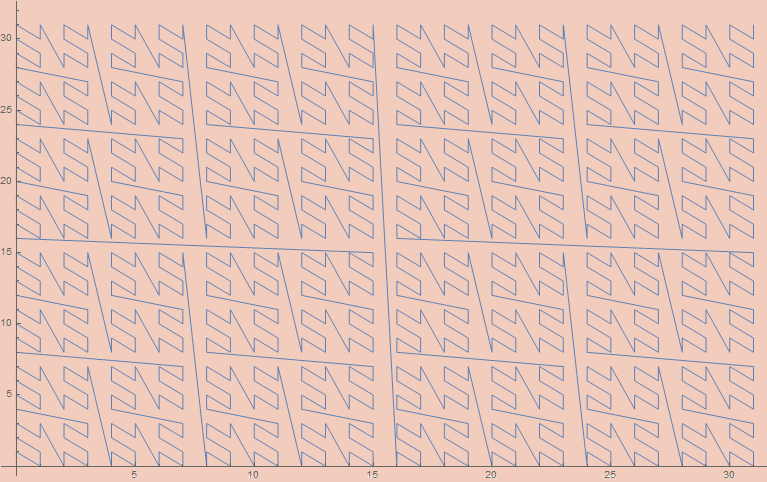
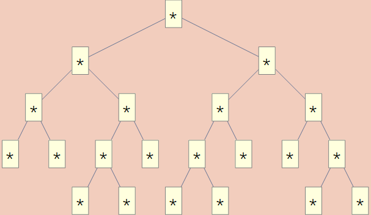
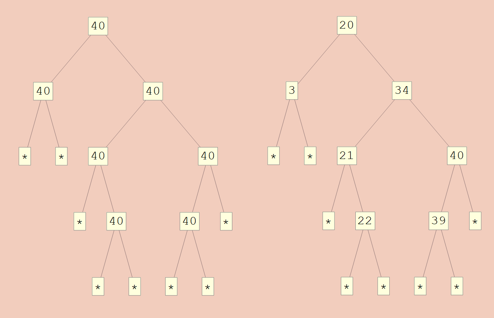


- [ℕ ≅ ℕ × ℕ](#headingTimes)
- [ℕ ≅ ℕ + ℕ](#headingPlus)
- [Initial Algebras](#headingInitial)
- [Lambda Expressions](#headingLambda)
- [Peano Expressions](#headingPeano)
- [Sorted Trees](#headingSorted)
- [Trees of Bounded Height](#headingHeight)
- [Final Thoughts](#headingFinal)


I've been researching methods for generating data the past few months and, as part of that, I looked into Godel encodings. In my wildest dreams, I dreamt of being able to simply count through all examples of some complex class and remove the need for ordinary search. That dream has yet to come, but what I did find is an exceptionally simple and elegant theory that allows one to create bijections between natural numbers and arbitrary inductive datatypes.

Much of this work was done by Paul Tarau in
 - [Isomorphic Data Encodings in Haskell and their Generalization to Hylomorphisms on Hereditarily Finite Data Types](https://arxiv.org/pdf/0808.2953.pdf)
 - [Bijective Size-proportionate Gödel Numberings for Term Algebras](https://www.semanticscholar.org/paper/Bijective-Size-proportionate-G%C3%B6del-Numberings-for-Tarau/fab5dab6933f576a3d609cef03f7a5ac07ae6ba6?p2df)

However, the organization he uses is quite convoluted and unnatural, and some of his encodings are overly complicated. I hope to present the idea in a much more streamlined fashion. Note that this post is written using Mathematica as a programming language.

Our end goal will be to encode arbitrary initial algebras over polynomial functors. To that end, we need a way to encode polynomial functors; tuples and sums of natural numbers with or without finite sets.

<a name="headingTimes"></a>

The standard method for encoding tuples with natural numbers is "Cantor tupling". However, the general n-tuple case is quite involved and inefficient. How to do (inverse) Cantor tupling efficiently is still a research topic to this day.
 - ["Deriving a Fast Inverse of the Generalized Cantor N-tupling Bijection" by Paul Tarau](https://drops.dagstuhl.de/opus/volltexte/2012/3632/pdf/30.pdf)

Instead, a much simpler solution is to use a binary digit interleaving function. Essentially, we just riffle the (padded) binary expansions of the two numbers to get a new number. By riffling, we guarantee that either the most or second most significant digit is a 1. If the most is a 0, it will go missing when we convert back from a number to the binary expansion, but we can detect this since we'll only have an odd number of digits when we should have an even number after riffling two same-length sequences.
```mathematica
NatTimesNatToNat[{0, 0}] := 0
NatTimesNatToNat[{x1_, x2_}] :=
 Block[{l, b1, b2},
  l = Floor@Log[2, Max[x1, x2]] + 1;
  b1 = IntegerDigits[x1, 2, l];
  b2 = IntegerDigits[x2, 2, l];
  
  FromDigits[Riffle[b1, b2], 2]
  ]
```
By taking the even/odd placed binary numbers from the binary expansion of a number, we can retrieve the original two numbers.
```mathematica
NatToNatTimesNat[x_] :=
 Block[{b, n1, n2},
  b = IntegerDigits[x, 2];
  
  If[OddQ@Length@b, PrependTo[b, 0]];
  
  n1 = FromDigits[b[[1 ;; All ;; 2]], 2];
  n2 = FromDigits[b[[2 ;; All ;; 2]], 2];
  
  {n1, n2}
  ]
```


```mathematica
In[1] := NatToNatTimesNat@2008
In[2] := NatTimesNatToNat@%
```

```mathematica
Out[1] := {26, 60}
Out[2] := 2008
```


```mathematica
In[1] := Array[NatToNatTimesNat, {20}, 0]
In[2] := NatTimesNatToNat /@ %
```

```mathematica
Out[1] := {{0, 0}, {0, 1}, {1, 0}, {1, 1}, {0, 2},
           {0, 3}, {1, 2}, {1, 3}, {2, 0}, {2, 1}}
Out[2] := {0, 1, 2, 3, 4, 5, 6, 7, 8, 9}
```

By plotting these points, we can see that the algorithm corresponds to a quite nice space-filling curve.

```mathematica
ListLinePlot@Array[NatToNatTimesNat, {1024}, 0]
```



In general, we only need the 2-tuple case to encode everything as we may see higher tuples `{a, b, c}` as `{a, {b, c}}`; though this may be considered less efficient from various perspectives. At the very least, such an encoding would pack `a` tighter than `b` or `c`, so a more fair encoding may be desirable. This trick can be generalized to arbitrary n by padding based on the modulus of the binary length of the encoded number by the length of the tuple.

```mathematica
NatTuplesToNat[x_] /; AllTrue[x, # == 0 &] := 0
NatTuplesToNat[x_] :=
 Block[{n, l, b},
  n = Length@x;
  l = IntegerLength[Max@x, 2];
  b = IntegerDigits[#, 2, l] & /@ x;
  
  FromDigits[Flatten@Thread@b, 2]
  ]
NatToNatTuples[n_][x_] :=
 Block[{l, b, n1, n2},
  b = IntegerDigits[x, 2];
  
  l = Length@b;
  b = PadLeft[b, l + n - Mod[l, n]];
  
  Table[FromDigits[b[[k ;; All ;; n]], 2], {k, n}]
  ]
```

```mathematica
In[1] := Array[NatToNatTimesNat, {8}, 0]
In[2] := NatTimesNatToNat /@ %
```

```mathematica
Out[1] := {{0, 0, 0}, {0, 0, 1}, {0, 1, 0}, {0, 1, 1},
           {1, 0, 0}, {1, 0, 1}, {1, 1, 0}, {1, 1, 1}}
Out[2] := {0, 1, 2, 3, 4, 5, 6, 7}
```

This construction can be viewed as encoding functions out of finite sets and into the natural numbers.

As part of composing isomorphisms to get larger and larger polynomial functors, we need a function that can thread isomorphisms between pairs so we can get one between `X × Y` and `A × B` whenever we have an isomorphism between `X` and `A` and between `Y` and `B`.

```mathematica
XTuplesToYTuples[XsToYs_][xs_] := MapThread[#1[#2] &, {XsToYs, xs}]
```

<a name="headingPlus"></a>

We can encode `n × ℕ` for finite `n` using a variation of a method used to encode coproducts. `ℕ + ℕ` can be encoded into `ℕ` by multiplying by 2 in the first case and multiplying by 2  and subtracting 1 in the second case. The other direction inverts those operations; the first in the even case and the second in the odd case. We can view `ℕ + ℕ` as being essentially like `2 × ℕ`. By generalizing the construction of that isomorphism, we can obtain an isomorphism into `n × ℕ` for general `n`.

```mathematica
NatToNTimesNat[n_][x_] := {Mod[x, n], Quotient[x, n]}
NTimesNatToNat[n_][{k_, x_}] := n x + k
```

```mathematica
NatToNatTimesN[n_][x_] := {Quotient[x, n], Mod[x, n]}
NatTimesNToNat[n_][{x_, k_}] := n x + k
```

```mathematica
In[1] := Array[NatToNTimesNat[2], {10}, 0]
In[2] := NTimesNatToNat[2] /@ %
```

```mathematica
Out[1] := {{0, 0}, {1, 0}, {0, 1}, {1, 1}, {0, 2},
           {1, 2}, {0, 3}, {1, 3}, {0, 4}, {1, 4}}
Out[2] := {0, 1, 2, 3, 4, 5, 6, 7, 8, 9}
```

Using this as a uniform representation of coproducts, we can obtain a generic method to thread isomorphisms between sums.

```mathematica
XSumsToYSums[XsToYs_][{n_Integer, x_}] /; n < Length@XsToYs :=
  {n, XsToYs[[n + 1]][x]}
```

We may now want to consider adding finite types to natural numbers. This is a fairly simple procedure as we just add the needed amount to our natural numbers to make room for the finite types.

```mathematica
NatToNPlusNat[n_][x_] := If[x < n, {0, x}, {1, x - n}]
NPlusNatToNat[n_][{0, x_}] := x
NPlusNatToNat[n_][{1, x_}] := n + x
```

```mathematica
NatToNatPlusN[n_][x_] := If[x < n, {1, x}, {0, x - n}]
NatPlusNToNat[n_][{1, x_}] := x
NatPlusNToNat[n_][{0, x_}] := n + x
```

```mathematica
In[1] := Array[NatToNPlusNat[3], {10}, 0]
In[2] := NPlusNatToNat[2] /@ %
```

```mathematica
Out[1] := {{0, 0}, {0, 1}, {0, 2}, {1, 0}, {1, 1},
           {1, 2}, {1, 3}, {1, 4}, {1, 5}, {1, 6}}
Out[2] := {0, 1, 2, 3, 4, 5, 6, 7, 8, 9}
```

<a name="headingInitial"></a>

Ordinary inductive datatypes such as lists and trees can be described as initial algebras of particular endofunctors.

- [Recursive types for free!](homepages.inf.ed.ac.uk/wadler/papers/free-rectypes/free-rectypes.txt)

A standard example is the list type over As, which is initial over `X ↦ 1 + A × X`. Broadly, this means we can view lists of As as the fixed point

```
List A := 1 + A × List A 
        = 1 + A × (1 + A × List A)  
        = 1 + A × (1 + A × (1 + A × List A ))
        = ...
```

For an arbitrary endofunctor F, (co)recursion over the initial algebra can be formulated via recursion schemes.

- [Functional programming with bananas, lenses, envelopes and barbed wire"](https://dl.acm.org/doi/10.1145/1671970.1671972)

Given an algebra `alg : F[A] → A`, over F, we can define a canonical function from the fixed-point of F to A as

```mathematica
cata[map_, alg_][x_] := alg[map[cata[map, alg], x]]
```

where map is the canonical functorial map for F which turns a function of type `A → B` to a function of type `F[A] → F[B]`. At each step of the recursion, the algebra is applied to remove a single F layer. In the limit, all Fs will be removed.

Given a coalgebra `coalg : A → F[A]` over F, we can define a canonical function from A to the fixed-point of F as

```mathematica
ana[map_, coalg_][x_] := map[ana[map, coalg], coalg[x]]
```

At each step of the corecursion, the coalgebra will build up a single F layer. These functions can be used to generically structure any (co)recursion over inductive datatypes. Cata is short for catamorphism and ana is short for anamorphism; the most basic kinds of recursion schemes. The next subsection will be dedicated to giving examples of their usage.

If `f` and `g` are isomorphisms then `ana[map,f]` and `cata[map,f]` will be as well. They will be the isomorphisms for the initial algebra. For the sake of simplicity, I'll leave out the map from `ana[map,f]` and `cata[map,f]` the subsequent calculation. I'll also denote `map[f,e]` as `f/@e` since it will be a variation of the built-in map for general functors instead of just the list functor.

In the first direction we have;

```
ana[f][cata[g][X]]
  == ana[f][g[cata[g] /@ X]]
  == ana[f] /@ f[g[cata[g] /@ X]]     
  == ana[f] /@ cata[g] /@ X
    by f[g[x]] == x
  == ana[f]@*cata[g] /@ X    
  == # & /@ X 
    by the inductive hypothesis
  == X
```

In the other direction we have

```
cata[g][ana[f][X]]
  == cata[g][ana[f] /@ f[X]]
  == g[cata[g] /@ ana[f] /@ f[X]]
  == g[cata[g]@*ana[f] /@ f[X]] 
  == g[# & /@ f[X]]
    by the inductive hypothesis
  == g[f[X]]
  == X
    by g[f[x]] == x
```

With that in mind, let's give some examples. I'll use lists as a running example. Lists of `A`s are the initial algebra over the endofunctor that sends `X` to `1 + A×X`.  Using the previous encodings, we can transform this into a uniform representation based on the encodings given before. As an example, the list

```
{1, 2, 3}
``` 

would become

```
{1, {1, {1, {2, {1, {3, {0, 0}}}}}}}
```

in the uniform notation we've been building up. Note that each subsequent `{0,_}` and `{1,_}` are tags for the coproduct cases. By replacing them with nil and cons it would become 

```
cons[{1,cons[{2,cons[{3,nil[0]}]}]}]
```

which is, hopefully, clearer to the reader.

We can easily convert these to native datatypes

```mathematica
MListToList[{}] := {0, 0}
MListToList[{a_, l___}] := {1, {a, MListToList[{l}]}}

ListToMList[{0, 0}] := {}
ListToMList[{1, {a_, l_}}] := Flatten[{a, ListToMList@l}]
```

```mathematica
In[1] := MListToList@{1, 2, 3}
In[2] := ListToMList@%
```

```mathematica
Out[1] := {1, {1, {1, {2, {1, {3, {0, 0}}}}}}}
Out[2] := {1, 2, 3}
```

The map for lists is just the map instance for the functor which it's initial over. We just send a function to the only hole where we have a recursive case; the `X` in the previous description.

```mathematica
listFMap[f_, {0, 0}] := {0, 0}
listFMap[f_, {1, {n_, l_}}] := {1, {n, f[l]}}
```

Using this, we can give some example functions. Here's an example of using cata to get the length of a list. First, we define the algebra which states what to do at each recursive case. There are two options; either we have an empty list or we have a cons with an element on one side and the result of the previous recursion on the other. In the first, we return 0, in the second, we add one to the recursive case.

```mathematica
lenAlg[{0, 0}] := 0
lenAlg[{1, {_, r_}}] := 1 + r

len := cata[listFMap, lenAlg]
```

```mathematica
In[1]  := len@MListToList@{0, 1, 2, 3, 4}
Out[1] := 5
```

Using a similar procedure, we can add all the elements of a list.

```mathematica
sumAlg[{0, 0}] := 0
sumAlg[{1, {e_, r_}}] := e + r

sum := cata[listFMap, sumAlg]
```

```mathematica
In[1]  := sum@MListToList@{1, 2, 3, 4, 5}
Out[1] := 15
```

In the other direction, we can use ana to structure a corecursion that constructs a list. I'll construct the list `{1, 2, 3, 4, 5}`. To do so, we need the coalgebra to do something at each step of the corecursion. It has a seed, and it needs to use it to decide what to construct. In the recursive position of the functor, it will place its next seed. At each corecursion, the seed will simply be incremented so that it can be added to a position.

```mathematica
sequenceCoAlg[{0, val_}] := {0, 0}
sequenceCoAlg[{len_, val_}] := {1, {val, {len - 1, val + 1}}}

sequenceGen := ana[listFMap, sequenceCoAlg]
```

```mathematica
In[1]  := ListToMList@sequenceGen[{5, 1}]
Out[1] := {1, 2, 3, 4, 5}
```

We can generate some elements of `1 + ℕ×ℕ` for some examples of the intermediate encodings used as part of the list encoding. 

```mathematica
In[1]  := Array[XSumsToYSums[{# &, NatToNatTuples[2]}]@*NatToNPlusNat[1], {5}, 0]
Out[1] := {{0, 0}, {1, {0, 0}}, {1, {0, 1}}, {1, {1, 0}}, {1, {1, 1}}}
```

We can shove the above encoding of `1 + ℕ×ℕ` into cata and ana to get encodings of full lists of natural numbers.

```mathematica
NatToNatList :=
  ana[listFMap, XSumsToYSums[{# &, NatToNatTuples[2]}]@*NatToNPlusNat[1]]
NatListToNat :=
  cata[listFMap, NPlusNatToNat[1]@*XSumsToYSums[{# &, NatTuplesToNat}]]
```

```mathematica
In[1] := Array[ListToMList@*NatToNatList, {10}, 0]
In[2] := NatListToNat@*MListToList/@%
```

```
Out[1] := {{}, {0}, {0, 0}, {1}, {1, 0}, {0, 0, 0}, {0, 1}, {1, 0, 0}, {1, 1}, {2}}
Out[2] := {0, 1, 2, 3, 4, 5, 6, 7, 8, 9}
```

```mathematica
In[1]  := NatToNatList[3142452345234] // ListToMList
In[2]  := NatListToNat@MListToList@%
```

```mathematica
Out[1] := {1828968, 552, 18, 1, 0, 1}
Out[2] := 3142452345234
```

At this point, we're in a position to automatically generate isomorphisms for initial algebras over arbitrary polynomial functors over natural numbers. We'll denote polynomial functors using the following constructors
 
- Numbers for finite types
- `nat` for the naturals
- `coproduct[A, B, C, ...]` for coproducts of `A`, `B`, `C`, etc
- `product[A, B, C, ...]` for products of `A`, `B`, `C`, etc
- `$X` for the recursive position
 
As an example, the signature for lists of natural numbers is `coproduct[1, product[nat, $X]]`.

We need three generating functions. The first is the map of the functor.

```mathematica
fmapOf[n_Integer][f_, e_] := e
fmapOf[nat][f_, e_] := e
fmapOf[coproduct[T__]][f_, {n_Integer, e_}] /; n < Length@{T} :=
  {n, fmapOf[{T}[[n + 1]]][f, e]}
fmapOf[product[T__]][f_, es_List] /; Length@es == Length@{T} :=
  MapThread[fmapOf[#1][f, #2] &, {{T}, es}]
fmapOf[$X][f_, e_] := f[e]
```

As an example, we can repeat the previous construction automatically now with
```mathematica
listFMap := fmapOf[coproduct[1, product[nat, $X]]]
```

```mathematica
In[1]  := ListToMList[NatToNatList[25346]]
In[2]  := MListToList@%
In[3]  := NatListToNat[%]
```

```mathematica
Out[1] := {80, 8, 1, 0}
Out[2] := {1, {80, {1, {8, {1, {1, {1, {0, {0, 0}}}}}}}}}
Out[3] := 25346
```

A helpful auxiliary function will measure the size of a type after recursion. This will allow us to detect finite cases in the type so we don't try making an isomorphism between ℕ and the booleans, for instance.  

```mathematica
typeSize[coproduct[T__]] := Total@(typeSize /@ {T})
typeSize[product[T__]] := Times @@ (typeSize /@ {T})
typeSize[nat] := ∞
typeSize[$X] := ∞
typeSize[n_Integer] := n
```

In the case of finite types, we need to automatically generate maps into the appropriate finite set. These definitions automatically generate isomorphisms between some finite set of size n and a type like `coproduct[5, product[2, 3]]`, which is isomorphic to a finite set of size 11.

```mathematica
fromFiniteSet[coproduct[A_, T___]][n_] := 
  With[{sa = typeSize[A]},
    If[n < sa, {0, fromFiniteSet[A][n]},
               {1, 0} + fromFiniteSet[coproduct[T]][n - sa]]]
fromFiniteSet[product[A_]][n_] := 
  With[{sa = typeSize[A]}, {fromFiniteSet[A]@Mod[n, sa]}]
fromFiniteSet[product[A_, T__]][n_] := 
  With[{sa = typeSize[A]},
    Prepend[fromFiniteSet[product[T]][Quotient[n, sa]],
            fromFiniteSet[A][Mod[n, sa]]]]
fromFiniteSet[n_Integer] := # &

toFiniteSet[coproduct[T__]][{n_Integer, e_}] /; n < Length@{T} :=
  Total[typeSize /@ {T}[[1 ;; n]]] + toFiniteSet[{T}[[n+1]]][e]
toFiniteSet[product[A_]][{a_}] := toFiniteSet[A][a]
toFiniteSet[product[A_, B_]][{e1_, e2_}] :=
  {1, typeSize[A]}.{toFiniteSet[A][e1], toFiniteSet[B][e2]}
toFiniteSet[product[A_, T__]][{e1_, e2__}] :=
  {1, typeSize[A]}.{toFiniteSet[A][e1], toFiniteSet[product[T]][{e2}]}
toFiniteSet[n_Integer] := # &
```

We are now in a position to define the function generating the isomorphism between ℕ and F ℕ for arbitrary polynomial F. This is the most complex part of the construction, but mostly because there are so many cases to consider. Each individual case is in fact very simple, largely being compositions and/or mappings of previously defined functions.

```mathematica
NatToFixFNat[coproduct[A_, B_]] :=
  With[{sa = typeSize[A], sb = typeSize[B]},
    Which[
      sa < ∞ == sb, 
      XSumsToYSums[{fromFiniteSet[A], NatToFixFNat[B]}]@*NatToNPlusNat[sa],
      sb < ∞ == sa, 
      XSumsToYSums[{NatToFixFNat[A], fromFiniteSet[B]}]@*NatToNatPlusN[sb],
      sa == ∞ == sb, 
      XSumsToYSums[{NatToFixFNat[A], NatToFixFNat[B]}]@*NatToNTimesNat[2]
    ]
  ]
NatToFixFNat[coproduct[T__]] /; AllTrue[{T}, typeSize@# == ∞ &] := XSumsToYSums[NatToFixFNat /@ {T}]@*NatToNTimesNat[Length@{T}]
NatToFixFNat[product[A_, B_]] :=
  With[{sa = typeSize[A], sb = typeSize[B]},
    Which[
      sa < ∞ == sb, 
      XTuplesToYTuples[{fromFiniteSet[A], NatToFixFNat[B]}]@*NatToNTimesNat[sa],
      sb < ∞ == sa, 
      XTuplesToYTuples[{NatToFixFNat[A], fromFiniteSet[B]}]@*NatToNatTimesN[sb],
      sa == ∞ == sb, 
      XTuplesToYTuples[{NatToFixFNat[A], NatToFixFNat[B]}]@*NatToNatTuples[2]
    ]
  ]
NatToFixFNat[product[T__]] /; AllTrue[{T}, typeSize@# == ∞ &] :=
  XTuplesToYTuples[NatToFixFNat /@ {T}]@*NatToNatTuples[Length@{T}]
NatToFixFNat[nat] := # &
NatToFixFNat[$X] := # &
```

```mathematica
FNatToNat[coproduct[A_, B_]] :=
  With[{sa = typeSize[A], sb = typeSize[B]},
    Which[
      sa < ∞ == sb, 
      NPlusNatToNat[sa]@*XSumsToYSums[{toFiniteSet[A], FNatToNat[B]}],
      sb < ∞ == sa, 
      NatPlusNToNat[sb]@*XSumsToYSums[{FNatToNat[A], toFiniteSet[B]}],
      sa == ∞ == sb, 
      NTimesNatToNat[2]@*XSumsToYSums[{FNatToNat[A], FNatToNat[B]}]
    ]
  ]
FNatToNat[coproduct[T__]] /; AllTrue[{T}, typeSize@# == ∞ &] := NTimesNatToNat[Length@{T}]@*XSumsToYSums[FNatToNat /@ {T}]
FNatToNat[product[A_, B_]] :=
  With[{sa = typeSize[A], sb = typeSize[B]},
    Which[
      sa < ∞ == sb, 
      NTimesNatToNat[sa]@*XTuplesToYTuples[{toFiniteSet[A], FNatToNat[B]}],
      sb < ∞ == sa, 
      NatTimesNToNat[sb]@*XTuplesToYTuples[{FNatToNat[A], toFiniteSet[B]}],
      sa == ∞ == sb, 
      NatTuplesToNat@*XTuplesToYTuples[{FNatToNat[A], FNatToNat[B]}]
    ]
  ]
FNatToNat[product[T__]] /; AllTrue[{T}, typeSize@# == ∞ &] := 
  NatTuplesToNat@*XTuplesToYTuples[FNatToNat /@ {T}]
FNatToNat[nat] := # &
FNatToNat[$X] := # &
```

Finally, we can put these pieces together to get an encoding for an arbitrary initial algebra over an endofunctor.

```mathematica
NatToFixF[F_] := ana[fmapOf[F], fromNat[F]]
FixFToNat[F_] := cata[fmapOf[F], toNat[F]]
```

We can repeat our previous list construction. Here, for lists of booleans.
 
```mathematica
In[1] := ListToMList[NatToFixF[coproduct[1, product[2, $X]]][25346]]
In[2] := FixFToNat[coproduct[1, product[2, $X]]]@MListToList@%
```

```mathematica
Out[1] := {1, 1, 0, 0, 0, 0, 0, 0, 1, 1, 0, 0, 0, 1}
Out[2] := 25346
```

```mathematica
In[1]  := Array[NatToFixF[coproduct[1, product[2, $X]]], {10}, 0];
In[2]  := FixFToNat[coproduct[1, product[2, $X]]] /@ %
In[3]  := ListToMList /@ %%
```

```mathematica
Out[2] := {0, 1, 2, 3, 4, 5, 6, 7, 8, 9}
Out[3] := {{}, {0}, {1}, {0, 0}, {1, 0}, {0, 1},
           {1, 1}, {0, 0, 0}, {1, 0, 0}, {0, 1, 0}}
```

We can also do new things. For example, we could get encodings of binary trees.

```mathematica
treeAlg[{0, 0}] := "*"
treeAlg[{1, {t1_, t2_}}] := "*"[t1, t2]
toGenericTree := cata[fmapOf[coproduct[1, product[$X, $X]]], treeAlg]
```

```mathematica
In[1] := TreeForm@toGenericTree@NatToFixF[coproduct[1, product[$X, $X]]]@214
```



For the case of arbitrary term algebras, we only need to generate an appropriate endofunctor and a translation that renames between the terms and the uniform type representation. Term algebras are split between three things; a list of variables, a list of constants, and a list of constructors. As a running example, take the following signature;

```mathematica
vars = {"x", "y", "z"};
consts = {0, 1};
funs = {{"~", 1}, {"*", 2}, {"+", 2}, {if, 3}};
```

We can translate this into an endofunctor with the type `5 + X + X×X + X×X + X×X×X`.

```mathematica
termSignitureToType[v_, c_, f_] :=
  coproduct[Length@v + Length@c, coproduct @@ (termFunsToType /@ f)]
termFunsToType[{_, n_Integer}] /; n > 0 := product @@ Table[$X, {n}]
```

```mathematica
In[1]  := termSignitureToType[vars, consts, funs]
Out[1] := coproduct[5, coproduct[product[$X], product[$X, $X],
                                 product[$X, $X], product[$X, $X, $X]]]
```

We can further generate the translations to and from the term signature

```mathematica
termToUniform[v_, c_, f_][e_] /; MemberQ[v, e] := {0, Position[v, e][[1, 1]] - 1}
termToUniform[v_, c_, f_][e_] /; MemberQ[c, e] :=
  {0, Length@v + Position[c, e][[1, 1]] - 1}
termToUniform[v_, c_, f_][g_[e__]] :=
  {1, {Position[f, {g, Length@{e}}][[1, 1]] - 1, termToUniform[v, c, f] /@ {e}}}

uniformToTerm[v_, c_, f_][{0, n_Integer}] :=
  If[n >= Length@v, c[[n - Length@v + 1]], v[[n + 1]]]
uniformToTerm[v_, c_, f_][{1, {n_Integer, e_}}] :=
  f[[n + 1, 1]] @@ (uniformToTerm[v, c, f] /@ e)
```

```mathematica
In[1]  := if["x", "+"[1, "y"], "*"["z", 0]]
In[2]  := uniformToTerm[vars, consts, funs]@termToUniform[vars, consts, funs]@%
```

```mathematica
Out[1] := if["x", "+"[1, "y"], "*"["z", 0]]
Out[2] := if["x", "+"[1, "y"], "*"["z", 0]]
```

From here, we can now give Godel encodings for arbitrary term algebras

```mathematica
NatToTermAlg[v_, c_, f_] :=
  uniformToTerm[v, c, f]@*NatToFixF[termSignitureToType[v, c, f]]
TermAlgToNat[v_, c_, f_] :=
  FixFToNat[termSignitureToType[v, c, f]]@*termToUniform[v, c, f]
```

```mathematica
In[1]  := Array[NatToTermAlg[vars, consts, funs], {10}, 0]
In[2]  := TermAlgToNat[vars, consts, funs] /@ %
```

```mathematica
Out[1] := {"x", "y", "z", 0, 1, "~"["x"], "*"["x", "x"],
           "+"["x", "x"], if["x", "x", "x"], "~"["y"]}
Out[2] := {0, 1, 2, 3, 4, 5, 6, 7, 8, 9}
```

And that's the end of the construction. I will wrap this up with some misc. notes on potential future directions.

There are a few interesting tricks that can be used to encode other things. For example, there's a simple bijection between lists, multisets, and sets. Multisets of natural numbers will be canonically described as ordered lists of natural numbers. Starting with a list of natural numbers, a multiset of nats can be obtained by accumulating each number to get an increasing sequence

```mathematica
NatListToNatMultiset[x_] := FoldList[Plus, x]
```

Furthermore, the difference between subsequent elements of a multiset gets us a list of naturals.

```mathematica
NatMultisetToNatList[{}] := {}
NatMultisetToNatList[x_] :=
  Prepend[MapThread[Subtract, {Drop[x, 1], Drop[x, -1]}], x[[1]]]
```

By composing this with the encoding of lists, we get an encoding of multisets/sorted lists.

```mathematica
NatToNatMultiset := NatListToNatMultiset@*ListToMList@*NatToNatList
NatMultisetToNat := NatListToNat@*MListToList@*NatMultisetToNatList
```

```mathematica
In[1]  := Array[NatToNatMultiset, {10}, 0]
In[2]  := NatMultisetToNat /@ %
```

```mathematica
Out[1] := {{}, {0}, {0, 0}, {1}, {1, 1}, {0, 0, 0},
           {0, 1}, {1, 1, 1}, {1, 2}, {2}}
Out[2] := {0, 1, 2, 3, 4, 5, 6, 7, 8, 9}
```

This function, since it preserves length, can be used to convert tuples into unordered tuples/combinations.

```mathematica
NatToNatComb[n_] := NatListToNatMultiset@*NatToNatTuples[n]
NatCombToNat := NatTuplesToNat@*NatMultisetToNatList
```

```mathematica
In[1]  := Array[NatToNatComb[3], {10}, 0]
In[2]  := NatCombToNat /@ %
```

```mathematica
Out[1] := {{0, 0, 0}, {0, 0, 1}, {0, 1, 1}, {0, 1, 2}, {1, 1, 1},
           {1, 1, 2}, {1, 2, 2}, {1, 2, 3}, {0, 0, 2}, {0, 0, 3}}
Out[2] := {0, 1, 2, 3, 4, 5, 6, 7, 8, 9}
```

A variation of the construction gets us an encoding of sets. We simply treat each number as if it's one larger than itself so that `0` doesn't stand for a lack of change.

```mathematica
NatListToNatSet[x_] := FoldList[#1 + #2 + 1 &, x]
NatSetToNatList[{}] := {}
NatSetToNatList[x_] :=
  Prepend[MapThread[#1 - #2 &, {Drop[x, 1], Drop[x, -1]}] - 1, x[[1]]]

NatToNatSet := NatListToNatSet@*ListToMList@*NatToNatList
NatSetToNat := NatListToNat@*MListToList@*NatSetToNatList
```

```mathematica
In[1]  := Array[NatToNatSet, {10}, 0]
In[2]  := NatSetToNat /@ %
```

```mathematica
Out[1] := {{}, {0}, {0, 1}, {1}, {1, 2}, {0, 1, 2}, {0, 2}, {1, 2, 3}, {1, 3}, {2}}
Out[2] := {0, 1, 2, 3, 4, 5, 6, 7, 8, 9}
```

By replacing the list/tuple isomorphisms in some of the existing constructions, we can get commutative and/or idempotent variations. For example, we may notice that the initial algebra of the endofunctor `X ↦ A + X × X`, in addition to encoding binary trees with `A`s at the leaves, also encodes the free magma over `A`. If we observe the isomorphisms generated by our program;

```mathematica
In[1]  := NatToFixF[coproduct[nat, product[$X, $X]]]
In[2]  := FixFToNat[coproduct[nat, product[$X, $X]]]
```

```mathematica
Out[1] :=
  ana[fmapOf[coproduct[nat, product[$X, $X]]],
      XSumsToYSums[{#1 &, XTuplesToYTuples[{#1 &, #1 &}]@*
        NatToNatTuples[2]}]@*NatToNTimesNat[2]
     ]
Out[2] := 
  cata[fmapOf[coproduct[nat, product[$X, $X]]],
       NTimesNatToNat[2]@*
         XSumsToYSums[{#1 &, NatTuplesToNat@*XTuplesToYTuples[{#1 &, #1 &}]}]
      ]
```

we may notice that the `NatToNatTuples` etc. could be replaced with `NatToNatCombs` etc. to get an encoding of the free *commutative* magma over `A` since it will canonically order any multiplication.

Tarau's work puts a lot of emphasis on hereditarily finite datatypes. These are initial algebras of `X ↦ List[X]`. While such a type falls out of the scope of my functions, it can be expressed rather simply in this framework.

```mathematica
unrank := ana[Map, ListToMList@*NatToNatList]
rank := cata[Map, NatListToNat@*MListToList]
```

```mathematica
In[1]  := Array[unrank, {10}, 0]
In[2]  := rank /@ %
```

```mathematica
Out[1] := {{}, {{}}, {{}, {}}, {{{}}}, {{{}}, {}}, {{}, {}, {}},
           {{}, {{}}}, {{{}}, {}, {}}, {{{}}, {{}}}, {{{}, {}}} }
Out[2] := {0, 1, 2, 3, 4, 5, 6, 7, 8, 9}
```

This forms an encoding of what Tarau calls "hereditarily finite functions". Tarau suggests using this type and some variations of it as an intrinsically compressed data representation. Broadly, the size of the encoded HFF will be proportional to the entropy of the binary string representation of the data if one chooses the correct isomorphism from `ℕ` to `List[ℕ]`. Specifically, if one chooses the following encoding;

```mathematica
NatSetToNat2[x_] := 2^# & /@ x // Total
NatToNatSet2[x_] := Flatten[Position[Reverse@IntegerDigits[x, 2], 1]] - 1

NatListToNat2 := NatSetToNat2@*NatListToNatSet
NatToNatList2 := NatSetToNatList@*NatToNatSet2

unrankC := ana[Map, NatToNatList2]
rankC := cata[Map, NatListToNat2]
```

then we can observe that many absurdly large but simple numbers have very small representations.

```mathematica
In[1]  := unrankC[2^2352432]
Out[1] := {{{{{{}}}}, {}, {{{}}}, {{}}, {{{}}}, {}, {}, {}, {}, {{}, {}}}}
```

Tarau also makes a significant point about encodings of hereditarily finite sets. By modifying the hereditarily finite function construction in a similar way to that suggested for magmas;

```mathematica
unrankSet := ana[Map, NatToNatSet]
rankSet := cata[Map, NatSetToNat]
```

```mathematica
In[1]  := Array[unrankSet, {10}, 0]
In[2]  := rankSet /@ %
```

```mathematica
Out[1] := {{}, {{}}, {{}, {{}}}, {{{}}}, {{{}}, {{}, {{}}}},
           {{}, {{}}, {{}, {{}}}}, {{}, {{}, {{}}}}}
Out[2] := {0, 1, 2, 3, 4, 5, 6}
```

This type encodes "hereditarily finite sets", which includes things like the ordinal numbers `{}`, `{{}}`, `{{}, {{}}}`, etc. for instance.

With these constructs in mind, Tarau presented a few interesting encodings of different kinds of finite graphs.

- digraphs are exactly sets of pairs
- directed multigraphs are exactly multisets of pairs
- directed hypergraphs are exactly sets of lists
- undirected graphs are exactly sets of unordered pairs
- undirected multigraphs are exactly multisets of unordered pairs
- undirected hypergraphs are exactly sets of multisets

In one of his presentations, Tarau mentioned the open problem of encoding structures with transitivity. In particular, how would one encode finite preorders, lattices, topologies, or categories? To my knowledge, all these problems remain open.

<a name="headingLambda"></a>

One of the more obvious missing pieces of our construction is the absence of binders which would be necessary for encoding things like lambda expressions or formulas with quantifiers. Intuitively, If our full type is `A`, then, upon recursing into a position with `n` bound variables, we are effectively dealing with the type `n + A`, with new terms coding for references to the bound arguments. Something like this trick is implemented in

  - [Generating Bijections between HOAS and the Natural Numbers by John Boyland](https://arxiv.org/pdf/1009.2790.pdf)

However, the general trick requires the arguments to `fmapOf` and `to/fromNat` in the definitions of `NatToFixF` and `FixFToNat` to change as `cata` and `ana` recurse. This requires a more general recursion scheme than what I used here. To clearify that, I'll wrap back to my dream at the beginning of this post. What would it take to Godel encode dependently typed data? In a [previous blog post](http://anthonylorenhart.com/2020-08-31-Datatypes-as-Dialgebras/) I talked about the formulation of dependent types as initial/final dialgebras. Presumably, we can take an isomorphic dialgebra to get isomorphic constructors/eliminators for dependent types. For example, vectors are the initial dialgebra between;

```
F(X) = (1,   λ n . A × X n)
G(X) = (X 0, λ n . X (n + 1))
```

Since we want to target `ℕ`, we should pick an `X` family with a close relation to `ℕ`. We already know how to translate n-tuples of `ℕ`s to `ℕ`, so let's pick that;

```
X 0 = 1
X (n + 1) = ℕ × X n
```

With this, an isomorphism between `F(X)` and `G(X)` doesn't seem too hard. It will be a pair of isomorphisms, one between `1` and `X 0 = 1`, which is trivial, and the other between `λ n . A × X n` and `λ n . ℕ × X n`. The latter would be a family of isomorphisms, one for each `n`. Such a family seems straightforward to define if `A` is isomorphic to `ℕ`. In the end, we'd have an isomorphism between `Vect A k` and `X k` for all `k`. In the special case of `k = 0`, we obviously wouldn't be able to get back to `ℕ`, but for all larger `k`, we'd just compose with the encoding for n-tuples we gave earlier to get an isomorphism back to `ℕ`, thus getting our Godel encoding.

I imagine finding the right `X` for an arbitrary dependent type could end up being highly nontrivial. To see a fuller example, let's use this knowledge to devise an encoding for lambda expressions. We can give our type of formulas as;

```
AbstractSyntax (n : Nat) : Type where
  var : Fin n → AbstractSyntax n
  lam : AbstractSyntax (n + 1) → AbstractSyntax n
  app : AbstractSyntax n → AbstractSyntax n → AbstractSyntax n
```

We can then conclude that these formulas are the initial dialgebra over

```
F(X) = (Fin n, X (n + 1), X n × X n)
G(X) = (X n,   X n,       X n)
```

It's pretty obvious that we'll need to do something more clever than make three isomorphisms since that first case would require an isomorphism between `Fin n` and `X n`, which could be `ℕ`. We may notice that this type may be impredicatively encoded as

```
AbstractSyntax n
≅ ∀ X : ℕ → * .
  (∀ k : ℕ . Fin k → X k) →
  (∀ k : ℕ . X (k + 1) → X k) →
  (∀ k : ℕ . X k → X k → X k) →
  X n
```

which is isomorphic to

```
≅ ∀ X : ℕ → * .
  (∀ k : ℕ . Fin k + X (k + 1) + (X k × X k) → X k) →
  X n
```

To work with this data type, we'll need to have a custom fmap that keeps track of `k`.

```mathematica
ASMap[k_][f_][{0, n_}] := {0, n}
ASMap[k_][f_][{1, {0, e_}}] := {1, {0, f[k + 1][e]}}
ASMap[k_][f_][{1, {1, {e1_, e2_}}}] := {1, {1, {f[k][e1], f[k][e2]}}}
```

Notice that I'm associating the datatype to the right, `Fin k + (X (k + 1) + (X k × X k))`, and that `ASMap` increments `k` on the lambda argument. From here, we can generalize ana and cata to keep track of the fiber we're working under.

```mathematica
fcata[fmap_][f_][k_][x_] := f[k][fmap[k][fcata[fmap][f]][x]]
fana[fmap_][f_][k_][x_] := fmap[k][fana[fmap][f]][f[k][x]]
```

Incidentally, I have no idea what these schemes could be called. They don't appear in any list of recursion schemes I could find, so I'll name them "fibered catamorphisms" and "fibered anamorphisms", in case they don't already have names.

We can define an appropriate algebra and coalgebra to get a more reasonable looking syntax;

```mathematica
ASAlg[k_][{0, n_}] /; n < k := var[n]
ASAlg[k_][{1, {0, e_}}] := lam[e]
ASAlg[k_][{1, {1, {e1_, e2_}}}] := app[e1, e2]

ASCoalg[k_][var[n_]] /; n < k := {0, n}
ASCoalg[k_][lam[e_]] := {1, {0, e}}
ASCoalg[k_][app[e1_, e2_]] := {1, {1, {e1, e2}}}

AStoASU[k_] := fana[ASMap][ASCoalg][k]
ASUtoAS[k_] := fcata[ASMap][ASAlg][k]
```

```mathematica
In[1]  := AStoASU[0]@lam[var[0]]
In[2]  := ASUtoAS[0]@%
```

```mathematica
Out[1] := {1, {0, {0, 0}}}
Out[2] := lam[var[0]]
```

```mathematica
In[1]  := AStoASU[0]@lam[app[lam[var[1]], var[0]]]
In[2]  := ASUtoAS[0]@%
```

```mathematica
Out[1] := {1, {0, {1, {1, {{1, {0, {0, 1}}}, {0, 0}}}}}}
Out[2] := lam[app[lam[var[1]], var[0]]]
```

From here, we need the intermediate encodings, proving that `Fin k + (ℕ + (ℕ × ℕ))` is isomorphic to `ℕ`.

```mathematica
(*Nat → Fin k + (ℕ + (ℕ × ℕ))*)
NatToASF[k_] := 
 XSumsToYSums[{# &, 
    XSumsToYSums[{# &, NatToNatTuples[2]}]@*NatToNTimesNat[2]}]@*
  NatToNPlusNat[k]

(*Fin k + (ℕ + (ℕ × ℕ)) → ℕ*)
ASFixFToNat[k_] := 
 NPlusNatToNat[k]@*
  XSumsToYSums[{# &, 
    NTimesNatToNat[2]@*XSumsToYSums[{# &, NatTuplesToNat}]}]
```

In this case, I'm setting `X k` to `ℕ` for all `k`. That seemed better than being cleaver about it, and I suspect something like this may be possible for a large class of dependent types. From here, we can just shove these into `fcata` and `fana` to get our godel encodings.

```mathematica
NatToAS[k_] := ASUtoAS[k]@*fana[ASMap][NatToASF][k]
ASToNat[k_] := fcata[ASMap][ASFixFToNat][k]@*AStoASU[k]
```

```mathematica
In[1]  := Array[NatToAS[0], {10}, 0]
In[2]  := ASToNat[0] /@ %
```

```mathematica
Out[1] :={
  lam[var[0]],
  app[lam[var[0]], lam[var[0]]],
  lam[lam[var[0]]], 
  app[lam[var[0]], app[lam[var[0]], lam[var[0]]]], 
  lam[app[var[0], var[0]]], 
  app[app[lam[var[0]], lam[var[0]]], lam[var[0]]],
  lam[lam[var[1]]], 
  app[app[lam[var[0]], lam[var[0]]], app[lam[var[0]], lam[var[0]]]], 
  lam[app[var[0], lam[var[0]]]],
  app[lam[var[0]], lam[lam[var[0]]]]}
Out[2] := {0, 1, 2, 3, 4, 5, 6, 7, 8, 9}
```

For various purposed, it can be useful to enumerate only the normalized lambda expressions. This is important for viewing the lambda calculus as some kind of universal function over binary strings. Unlike strings for Turing machines, lambda expressions cannot in general be the output of a program if they aren't normalized. Creating a dedicated bijective encoding for normalized terms is then necessary to see all possible strings as being in the codomain of the universal function defined by the lambda calculus. Data is also often encoded using normalized terms making an encoding specialized to normalized terms better suited for encoding lambda-encoded data.

Normalized expressions differ from non-normalized forms in that they have a lambda binding applied to an argument. By stratifying the type to prevent such an occurrence we only have normalized forms.

```
NLambdaExp : ℕ → Type
	dum : ∀ n ∈ ℕ . NLambdaApp n → LambdaExp n
	lam : ∀ n ∈ ℕ . LambdaExp (n+1) → LambdaExp n

NLambdaApp : ℕ → Type
	var: ∀ n ∈ ℕ. Fin n → NLambdaApp n
	app: ∀ n ∈ ℕ. NLambdaApp n → LambdaExp n → NLambdaApp n
```

This inductive-inductive datatype, while theoretically more complicated, does not impose any substantial difficulty on our encoding. It does force us to thread mutual recursive calls across our implementations, often referencing functions before they are defined. However, the conceptual nature of our code is not so complicated despite this.

```mathematica
NLamMap[k_][f_][{0, e_}] := {0, e}
NLamMap[k_][f_][{1, e_}] := {1, f[k + 1][e]}

NLamAMap[k_][f_][{0, n_}] := {0, n}
NLamAMap[k_][f_][{1, {e1_, e2_}}] := {1, {f[k][e1], e2}}
```

The conversion between the uniform and a nicer notation demonstrates the aforementioned mutual recursion.

```mathematica
NLamAlg[k_][{0, e_}] := NLamAUToNLamA[k][e]
NLamAlg[k_][{1, e_}] := lam[e]

NLamCoalg[k_][lam[e_]] := {1, e}
NLamCoalg[k_][e_] := {0, NLamAToNLamAU[k][e]}

NLamAAlg[k_][{0, n_}] /; n < k := var[n]
NLamAAlg[k_][{1, {e1_, e2_}}] := app[e1, NLamUToNLam[k][e2]]

NLamACoalg[k_][var[n_]] /; n < k := {0, n}
NLamACoalg[k_][app[e1_, e2_]] := {1, {e1, NLamToNLamU[k][e2]}}

NLamToNLamU[k_] := fana[NLamMap, NLamCoalg][k]
NLamUToNLam[k_] := fcata[NLamMap, NLamAlg][k]

NLamAToNLamAU[k_] := fana[NLamAMap, NLamACoalg][k]
NLamAUToNLamA[k_] := fcata[NLamAMap, NLamAAlg][k]
```

```mathematica
In[1] := NLamToNLamU[0]@lam[lam[app[app[var[0],lam[var[0]]],var[1]]]]
In[2] := NLamUToNLam[0]@%
```

```mathematica
Out[1] :=
  {1, {1, {0, {1, {{1, {{0, 0}, {1, {0, {0, 0}}}}}, {0, {0, 1}}}}}}}
Out[2] := lam[lam[app[app[var[0], lam[var[0]]], var[1]]]]
```

Future functions will need to be implemented in a similar way.

In the case of natural number encodings, we need to be careful about our fiber. If it is 0, we cannot form a normalized expression with an application. This is because the only things which can appear as the function being applied are either a variable or another application. If our fiber is 0, there won't be any variables available and we will only be able to form an infinite tower of applications. To avoid this, we only allow recursive calls when our fiber is greater than 0.

```mathematica
NatToNLamUF[k_] := XSumsToYSums[{NatToNLamAU[k],#&}]@*NatToNTimesNat[2]
NLamUFixFToNat[k_] := NTimesNatToNat[2]@*XSumsToYSums[{NLamAUToNat[k],#&}]

NatToNLamAUF[k_] := 
  XSumsToYSums[{# &,
    XTuplesToYTuples[{#&, NatToNLamU[k]}]@*
      NatToNatTuples[2]}]
  @*NatToNPlusNat[k]
NLamAUFixFToNat[k_] :=
  NPlusNatToNat[k]
  @*XSumsToYSums[{# &,
    NatTuplesToNat@*XTuplesToYTuples[{#&, NLamUToNat[k]}]}]

NatToNLamU[k_] /; k > 0  := fana[NLamMap, NatToNLamUF][k]
NLamUToNat[k_] /; k > 0  := fcata[NLamMap, NLamUFixFToNat][k]

NatToNLamAU[k_] /; k > 0  := fana[NLamAMap, NatToNLamAUF][k]
NLamAUToNat[k_] /; k > 0  := fcata[NLamAMap, NLamAUFixFToNat][k]
```

All normalized expressions begin with a lambda binder since, as stated before, applications without variables cannot be completed and there are no variables to reference.

```mathematica
NLamToNat[lam[x_]] := NLamUToNat[1][NLamToNLamU[1][x]]
NatToNLam[x_] := lam[NLamUToNLam[1][NatToNLamU[1][x]]]
```

```mathematica
In[1] := Array[NatToNLam, {10}, 0]
In[2] := NLamToNat/@%
```

```mathematica
Out[1] := {
  lam[var[0]], 
  lam[lam[var[0]]], 
  lam[app[var[0], var[0]]],
  lam[lam[lam[var[0]]]], 
  lam[app[var[0], lam[var[0]]]], 
  lam[lam[var[1]]], 
  lam[app[app[var[0], var[0]], var[0]]], 
  lam[lam[lam[lam[var[0]]]]], 
  lam[app[app[var[0], var[0]], lam[var[0]]]], 
  lam[lam[app[var[0], var[0]]]]}
Out[2] := {0, 1, 2, 3, 4, 5, 6, 7, 8, 9}
```

<a name="headingPeano"></a>

The first application of Gödel encodings was to encode formulas of Peano Arithmetic for the sake of embedding Peano Arithmetic into itself. The original encoding used by Gödel was quite inefficient, leading to natural numbers which were exponentially large in the length of the expression being coded. We may use the methods described here to devise a much more efficient encoding of these formulas.

PA comes in two parts, syntactically. Firstly, we have a type of numerical expressions, which may mention but not bind variables;

```
NumExp : ℕ → Type
	var :   ∀ n ∈ ℕ. Fin n → NumExp n
	zero :  ∀ n ∈ ℕ. NumExp n
	succ :  ∀ n ∈ ℕ. NumExp n → NumExp n
	plus :  ∀ n ∈ ℕ. NumExp n → NumExp n → NumExp n
	times : ∀ n ∈ ℕ. NumExp n → NumExp n → NumExp n
```

And a logic layer where variables may be bound but not mentioned.

```
PeanoExp : ℕ → Type
	eq:      ∀ n ∈ ℕ. NumExp n → NumExp n → PeanoExp n
	not:     ∀ n ∈ ℕ. PeanoExp n → PeanoExp n
	implies: ∀ n ∈ ℕ. PeanoExp n → PeanoExp n → PeanoExp n
	forall:  ∀ n ∈ ℕ. PeanoExp (n+1) → PeanoExp n
```

In the case of `NumExp`, a dialgebra over the same functors will be of the form

```
(∀k:ℕ.Fin k → X k)
× (∀k:ℕ. X k)
× (∀k:X. k → X k)
× (∀k:ℕ.X k → X k → X k)
× (∀k:ℕ.X k → X k → X k)
```

Similar to the case with lambda expressions, we may rewrite this into an isomorphic form as

```
(∀k:ℕ. Fin (k + 1) + X k + (X k × X k) + (X k × X k) → X k)
```

Notice that the zero case has been consolidated into the finite set with the variables so we do not need to deal with an extra coproduct layer. For pedagogical reasons, it would be best to define the algebras for converting back and forth between a nice representation and the uniform one. We'll start with the numerical expressions.

```mathematica
UToNumExpAlg[k_][{0, n_}] /; n < k := var[n]
UToNumExpAlg[k_][{0, k_}] := zero
UToNumExpAlg[k_][{1, {0, e_}}] := succ[e]
UToNumExpAlg[k_][{1, {1, {e1_, e2_}}}] := plus[e1,e2]
UToNumExpAlg[k_][{1, {2, {e1_, e2_}}}] := times[e1,e2]

NumExpToUCoalg[k_][var[n_]] /; n < k := {0, n}
NumExpToUCoalg[k_][zero] := {0, k}
NumExpToUCoalg[k_][succ[e_]] := {1, {0, e}}
NumExpToUCoalg[k_][plus[e1_,e2_]] := {1, {1, {e1, e2}}}
NumExpToUCoalg[k_][times[e1_,e2_]] := {1, {2, {e1, e2}}}
```

To make use of these we, of course, need the appropriate functorial maps.

```mathematica
NumExpMap[k_][f_][{0, n_}] := {0, n}
NumExpMap[k_][f_][{1, {0, e_}}] := {1, {0, f[k][e]}}
NumExpMap[k_][f_][{1, {1, {e1_, e2_}}}] := {1, {1, {f[k][e1], f[k][e2]}}}
NumExpMap[k_][f_][{1, {2, {e1_, e2_}}}] := {1, {2, {f[k][e1], f[k][e2]}}}
```

And we may combine these to get functions which translate between the uniform and nicer representations.

```mathematica
NumExpToU[k_] := fana[NumExpMap, NumExpToUCoalg][k]
UToNumExp[k_] := fcata[NumExpMap, UToNumExpAlg][k]
```

With these, we can now define the procedure for converting foll Peano expressions into a uniform representation. To be expedient, I will skip to defining the functions and let the reader devise a description of appropriate dialgebras as an exercise if they so choose. 

```mathematica
PeanoExpToUCoalg[k_][eq[n1_,n2_]] :=
  {0, {NumExpToU[k][n1], NumExpToU[k][n2]}}
PeanoExpToUCoalg[k_][not[e_]] := {1, e}
PeanoExpToUCoalg[k_][implies[e1_,e2_]] := {2, {e1, e2}}
PeanoExpToUCoalg[k_][forall[e_]] := {3, e}

UToPeanoExpAlg[k_][{0, {n1_,n2_}}] :=
  eq[UToNumExp[k][n1], UToNumExp[k][n2]]
UToPeanoExpAlg[k_][{1, e_}] := not[e]
UToPeanoExpAlg[k_][{2, {e1_, e2_}}] := implies[e1,e2]
UToPeanoExpAlg[k_][{3, e_}] := forall[e]
```

We may define the map for Peano expressions.

```mathematica
PeanoExpMap[k_][f_][{0, {n1_,n2_}}] := {0, {n1,n2}}
PeanoExpMap[k_][f_][{1, e_}] := {1, f[k][e]}
PeanoExpMap[k_][f_][{2, {e1_, e2_}}] := {2, {f[k][e1], f[k][e2]}}
PeanoExpMap[k_][f_][{3, e_}] := {3, f[k+1][e]}
```

And we may finally wrap things up with `fana` and `fcata`.

```mathematica
PeanoExpToU := fana[PeanoExpMap, PeanoExpToUCoalg]
UToPeanoExp := fcata[PeanoExpMap, UToPeanoExpAlg]
```

```mathematica
In[1] := PeanoExpToU[0]@forall[not[eq[zero,succ[var[0]]]]]
In[2] := UToPeanoExp[0]@%
```

```mathematica
Out[1] := {3, {1, {0, {{0, 1}, {1, {0, {0, 0}}}}}}}
Out[2] := forall[not[eq[zero, succ[var[0]]]]]
```

To get the isomorphisms, we only need to compose these with isomorphisms in the form of the appropriate dialgebras. In the case of NumExp, this will simply be an isomorphism between ℕ and `Fin (k + 1)+(ℕ+(ℕ×ℕ) +(ℕ×ℕ))`. 

```mathematica
NatToNumF[k_] := 
  XSumsToYSums[{# &,
    XSumsToYSums[{# &, NatToNatTuples[2], NatToNatTuples[2]}]
    @*NatToNTimesNat[3]}]
  @*NatToNPlusNat[k+1]

NumFixFToNat[k_] := 
  NPlusNatToNat[k+1]
  @*XSumsToYSums[{# &,
    NTimesNatToNat[3]
    @*XSumsToYSums[{# &, NatTuplesToNat, NatTuplesToNat}]}]

NatToNumExpU := fana[NumExpMap, NatToNumF]
NumExpUToNat := fcata[NumExpMap, NumFixFToNat]
```

```mathematica
In[1] := Array[UToNumExp[1]@*NatToNumExpU[1],{10},0]
In[2] := NumExpUToNat[1]@*NumExpToU[1]/@%
```

```mathematica
Out[1] := {
  var[0], 
  zero, 
  succ[var[0]], 
  plus[var[0], var[0]], 
  times[var[0], var[0]], 
  succ[zero], 
  plus[var[0], zero], 
  times[var[0], zero], 
  succ[succ[var[0]]], 
  plus[zero, var[0]] }

Out[2] := {0, 1, 2, 3, 4, 5, 6, 7, 8, 9}
```

In the case of PeanoExp, this will simply be an isomorphism between ℕ and `(NumExp k × NumExp k) + ℕ + (ℕ × ℕ) + ℕ`.

```mathematica
NatToPeanoF[k_] :=
  XSumsToYSums[{XTuplesToYTuples[{NatToNumExpU[k], NatToNumExpU[k]}]
                @*NatToNatTuples[2], # &, NatToNatTuples[2], # &}]
  @*NatToNTimesNat[4]

PeanoFixFToNat[k_] := 
  NTimesNatToNat[4]
  @*XSumsToYSums[{NatTuplesToNat
                  @*XTuplesToYTuples[{NumExpUToNat[k], NumExpUToNat[k]}],
                  # &, NatTuplesToNat, # &}]

NatToPeanoExp[k_] := UToPeanoExp[k]@*fana[PeanoExpMap, NatToPeanoF][k]

PeanoExpToNat[k_] := fcata[PeanoExpMap, PeanoFixFToNat][k]@*PeanoExpToU[k]
```

```mathematica
In[1] := Array[UToNumExp[1]@*NatToNumExpU[1],{10},0]
In[2] := NumExpUToNat[1]@*NumExpToU[1]/@%
```

```mathematica
Out[1] := {
  eq[zero, zero], 
  not[eq[zero, zero]], 
  implies[eq[zero, zero], 
  eq[zero, zero]], 
  forall[eq[var[0], var[0]]], 
  eq[zero, succ[zero]], 
  not[not[eq[zero, zero]]], 
  implies[eq[zero, zero], 
  not[eq[zero, zero]]], 
  forall[not[eq[var[0], var[0]]]], 
  eq[succ[zero], zero], 
  not[implies[eq[zero, zero], eq[zero, zero]]]}

Out[2] := {0, 1, 2, 3, 4, 5, 6, 7, 8, 9}
```

```mathematica
In[1] := PeanoExpToNat[0]@forall[not[eq[zero,succ[var[0]]]]]
In[2] := NatToPeanoExp[0]@%
```

```mathematica
Out[1] := 391
Out[2] := forall[not[eq[zero, succ[var[0]]]]]
```

If we wanted to, we could incorporate the commutativity trick mentioned earlier to, for example, encode addition, multiplication, and equality only up to commutativity.

<a name="headingSorted"></a>

A sorted binary tree (storing data at its branches) is a standard data-structure for many applications. For example, it acts as the intermediate data type in many quicksort implementations. It has a description as the following dependent type.

```
SortedTree : ℕ*ℕ∞→Type
	leaf  : ∀(n,m) ∈ ℕ×ℕ∞. SortedTree (n, m)
	branch: ∀(n,m) ∈ ℕ×ℕ∞. (x : ℕ) → n≤x≤m → SortedTree (n, x)
                       → SortedTree (x, m) → SortedTree (n, m)
```

The ordered pair which acts as a fiber represents the upper and lower bounds within which the tree is allowed to contain numbers. ℕ∞ is the type of natural numbers extended with a point at infinity sorted above all others.We can describe this as the initial dialgebra between

```
F(X)=(λ n m. 1, λ n m . {x ∈ ℕ | n≤x≤m} × X (n, x) × X (x, n))
G(X)=(λ n m. X (n, m), λ n m. X (n, m))
```

We can write the type of any (F, G)-dialgebra, X, then as

```
(∀(n,m)∈ℕ×ℕ∞. X (n, m))
× (∀(n,m)∈ℕ×ℕ∞. {x ∈ ℕ | n≤x≤m} × X (n, x) × X (x, m) → X (n, m))
```

Which we can rewrite as

```
(∀(n,m)∈ℕ×ℕ∞. 1+ ({x ∈ ℕ | n≤x≤m} × X (n, x) × X (x, n)) → X (n, m))
```

In this example, we'll have to be more clever about how we define our type family. We need a type family that's closely related to ℕ while still being isomorphic to SortedTree (n, m) for any pair. I'll use the following family;

```
X (n, m) = if n≤m then ℕ else Fin 0
```

It's also worth noting that `n≤m` is isomorphic to `Fin 1` when the condition is true and `Fin 0` otherwise. The prefix on the branch case, `{x ∈ ℕ | n≤x≤m}`, is isomorphic to `Fin (m-n+1)`. This will be key when later constructing the isomorphism.

First, I'll define the appropriate translations between the uniform and a nicer syntax.

```mathematica
UToSBTAlg[{n_,m_}][{0, 0}] := "*"
UToSBTAlg[{n_,m_}][{1, {x_,{t1_,t2_}}}] := x[t1,t2]

SBTToUCoalg[{n_,m_}]["*"] := {0, 0}
SBTToUCoalg[{n_,m_}][x_Integer[e1_, e2_]] := {1, {x, {e1, e2}}}
```

We can then define the appropriate functorial mapping as

```mathematica
SBTMap[{n_, m_}][f_][{0, 0}] := {0, 0}
SBTMap[{n_, m_}][f_][{1, {x_,{t1_,t2_}}}] :=
  {1, {x, {f[{n,x}][t1], f[{x,m}][t2]}}}
```

And we may complete the translation as

```mathematica
UToSBT := fcata[SBTMap, UToSBTAlg]
SBTToU := fana[SBTMap, SBTToUCoalg]
```

```mathematica
In[1] := SBTToU[{0,∞}]@5[3[1["*","*"],"*"],7[6["*","*"],"*"]]
In[2] := TreeForm@UToSBT[{0,∞}]@%
```

```mathematica
Out[1] := 
  {1, {5, {{1, {3, {{1, {1, {{0, 0}, {0, 0}}}}, {0, 0}}}},
  {1, {7, {{1, {6, {{0, 0}, {0, 0}}}}, {0, 0}}}}}}}

Out[2] := 
```


All that's left is to define the family of isomorphisms for any given `(n, m)`. Here we have to put some thought into the isomorphisms. In order to avoid the empty cases, we need to generate a member from the finite set `Fin (m-n+1)`. This can then be increased by n to act as a valid entry at a branch. Ultimately, we want to end up with an isomorphism from `ℕ` to `Fin 1+({x ∈ ℕ | n≤x≤m}×(ℕ×ℕ))`  which passes through `Fin 1+(Fin (m-n+1)×(ℕ×ℕ))`.

```mathematica
NatToSBTF[{n_, ∞}] := 
  XSumsToYSums[{#&, XTuplesToYTuples[{#+n&, NatToNatTuples[2]}]
                    @*NatToNatTuples[2]}]@*NatToNPlusNat[1]
NatToSBTF[{n_, m_Integer}] /; n≤m := 
  XSumsToYSums[{#&, XTuplesToYTuples[{#+n&, NatToNatTuples[2]}]
                    @*NatToNTimesNat[m-n+1]}]@*NatToNPlusNat[1]

SBTFixFToNat[{n_, ∞}] :=
  NPlusNatToNat[1]
  @*XSumsToYSums[{#&,NatTuplesToNat
                     @*XTuplesToYTuples[{#-n&, NatTuplesToNat}]}]
SBTFixFToNat[{n_, m_Integer}] /; n≤m := 
  NPlusNatToNat[1]
  @*XSumsToYSums[{#&,NTimesNatToNat[m-n+1]
                     @*XTuplesToYTuples[{#-n&, NatTuplesToNat}]}]
```

We may now complete the construction by shoving these into fcata and fana.

```mathematica
NatToSBT[{n_,m_}] /; n≤m :=
  UToSBT[{n,m}]@*fana[SBTMap, NatToSBTF][{n,m}]
SBTToNat[{n_,m_}] /; n≤m :=
  fcata[SBTMap, SBTFixFToNat][{n,m}]@*SBTToU[{n,m}]
```

```mathematica
In[1] := 
  SBTToNat[{0,10}]@5[3[1["*","*"],"*"],7[6["*","*"],"*"]]
In[2] := NatToSBT[{0,10}]@%
```

```mathematica
Out[1] := 42653
Out[2] := 5[3[1["*", "*"], "*"], 7[6["*", "*"], "*"]]
```

```mathematica
In[1]:= SBTToNat[{0,∞}]@5[3[1["*","*"],"*"],7[6["*","*"],"*"]]
In[2] := NatToSBT[{0,∞}]@%
```

```mathematica
Out[1]= 21238820
Out[2]= 5[3[1["*", "*"], "*"], 7[6["*", "*"], "*"]]
```

```mathematica
In[1] := Array[NatToSBT[{0,2}],{10},0]
In[2] := SBTToNat[{0,2}]/@%
```

```mathematica
Out[1] := {
  "*", 0["*", "*"], 1["*", "*"], 2["*", "*"],
  0["*", 0["*", "*"]],  1["*", 1["*", "*"]],
  2["*", 2["*", "*"]], 0[0["*", "*"], "*"], 
  1[0["*", "*"], "*"], 2[0["*", "*"], "*"]}

Out[2]= {0, 1, 2, 3, 4, 5, 6, 7, 8, 9}
```

One may notice that many trees will be biased toward generating chains of the same number. The reason for this is that each among a finite number within the bound is given an a priori equal likelihood. When the bounds are smaller, the probability of that choice is then split equally among fewer options than larger bounds. In the limit, this makes chains of the same or similar numbers exponentially more likely. As a consequence, this encoding is far from size-proportionate. Though, there is a certain sense in which the size of the encoded number represents the amount of information we're using. When the bounds get smaller, each choice is between fewer options, implying fewer bits per choice.

```mathematica
In[1]:= TableForm@{{
TreeForm@NatToSBT[{0,∞}]@4315957397,
TreeForm@NatToSBT[{0,∞}]@
  1461501637330902918283223693888627139985833727537
}}
```

```mathematica
Out[1] :=
```



<a name="headingHeight"></a>


Up till now, all my examples have been of dependent types which are initial (F, G)-dialgebras where G is trivial; i.e. an identity functor over its type family. What about dependent types which aren't so convenient? As an example, take height-bounded trees.

```
HBTree : ℕ → Type
	leaf : ∀n ∈ ℕ. ℕ → HBTree n
	branch: ∀n ∈ ℕ. HBTree n → HBTree n → HBTree (n + 1)
```

This has a representation as an initial dialgebra with G(X)=(λ n . X n, λ n. X (n+1)). In general we have the ability to refactor this type so it's an initial fibrational algebra. We can do this by turning the pattern in the post-condition and into a unification check in the precondition, thus trivializing G. We can redefine this type as

```
HBTree : ℕ → Type
	leaf : ∀n ∈ ℕ. ℕ → HBTree n
	branch : ∀n ∈ ℕ. (∃m.n=m+1) → HBTree (n-1) → HBTree (n-1) → HBTree n
```

Notice that we must undo the pattern on all the other arguments within view of the precondition. This means that we must start with a type where every case with a recursive position only applies injections in the postcondition. With that, we can formulate this type as an initial algebra over the fibrational functor

```
F(X) = λ n . ℕ + (∃m.n=m+1) × X (n-1) × X (n-1)
```

Here,  I'm treating ∃m.n=m+1 as a proposition, isomorphic to Fin 1 when true and Fin 0 otherwise. When it fails to be true, we'll be forced to use the leaf. All the previous examples could have been expressed in this way. From here, we can define a nice notation and the appropriate mapping functions.

```mathematica
UToHBTAlg[n_][{0, m_}] := m
UToHBTAlg[n_][{1, {t1_, t2_}}] := "*"[t1, t2]

HBTToUCoalg[n_][m_Integer] := {0, m}
HBTToUCoalg[n_]["*"[e1_, e2_]] := {1, {e1, e2}}

HBTMap[n_][f_][{0, m_}] := {0, m}
HBTMap[n_][f_][{1, {t1_, t2_}}] := {1, {f[n-1][t1], f[n-1][t2]}}

UToHBT := fcata[HBTMap, UToHBTAlg]
HBTToU := fana[HBTMap, HBTToUCoalg]
```

```mathematica
In[1] := HBTToU[10]@"*"["*"["*"[5,3],2],"*"["*"[7,6],1]]
In[2] := TreeForm@UToHBT[{0,∞}]@%
```

```mathematica
Out[1] :=
  {1, {{1, {{1, {{0, 5}, {0, 3}}}, {0, 2}}}
      ,{1, {{1, {{0, 7}, {0, 6}}}, {0, 1}}}}}

Out[2] :=
```


The isomorphism splits into two components. The branch case will be empty when the fiber is 0, so we must choose the leaf case. Otherwise, we are free to choose either case, which will both be isomorphic to ℕ.

```mathematica
NatToHBTF[0] := NatToNTimesNat[1]
NatToHBTF[n_]:= XSumsToYSums[{#&, NatToNatTuples[2]}]@*NatToNTimesNat[2]

HBTFixFToNat[0] := NTimesNatToNat[1]
HBTFixFToNat[n_]:= NTimesNatToNat[2]@*XSumsToYSums[{#&,NatTuplesToNat}]

NatToHBT[n_] := UToHBT[n]@*fana[HBTMap, NatToHBTF][n]
HBTToNat[n_] := fcata[HBTMap, HBTFixFToNat][n]@*HBTToU[n]
```

The functions will only give appropriate outputs when the heights are consistent with the fiber.

```mathematica
In[1] := HBTToNat[20]@"*"["*"["*"[5,3],2],"*"["*"[7,6],1]]
In[2] := NatToHBT[20]@%
```

```mathematica
Out[1]= 421550887143
Out[2]= "*"["*"["*"[5, 3], 2], "*"["*"[7, 6], 1]]
```

```mathematica
In[1] := Quiet@HBTToNat[2]@"*"["*"["*"[5,3],2],"*"["*"[7,6],1]]
In[2] := NatToHBT[2]@%
```

```mathematica
Out[1] := 117168207
Out[2] := "*"["*"[53, 28], "*"[56, 61]]
```

<a name="headingFinal"></a>

This basic recipe described can be attempted for any dependent type describable as an initial dialgebra, though such a project may not always be successful. By the nature of dependent types, generating an appropriate isomorphism over a fiber will be undecidable in general. For example, various logics over a notion of formula have semantics in terms of dependent types. They are dialgebras fibered over a type of formulas. The simply typed SK combinator calculus/positive implicational calculus, for instance, can be defined as

```
SK : WFF → Type
	k : ∀p q ∈ WFF .   SK (p ⇒(q⇒p))
	s : ∀p q r ∈ WFF . SK ((p⇒(q⇒r))⇒((p⇒q)⇒(p⇒r)))
	a : ∀p q ∈ WFF .   SK p →S K (p⇒q) → SK q
```

Leading to a definition as the initial dialgebra over

```
F(X)=(λp q .1,  λp q r .1,  λp q.X p*X (p⇒q))
G(X)=(λp q.X (p⇒(q⇒p)), λp q r.X ((p⇒(q⇒r))⇒((p⇒q)⇒(p⇒r))), λp q.X q)
```

In order to define a Gödel encoding for this type, one would need to define a type family, X w, over well-formed formulas which is isomorphic to SK w for any formula w. This, at the very least, requires deciding if the type defined by w is inhabited. Outside of sufficiently simple logics, this won't be possible in general. Even when it is possible, formulating the dialgebra in a way that's amenable to implementation can, itself, be highly nontrivial.

...

And that's that. I think there might be a lot of stamp collecting moving forward, but this pretty thoroughly covers a vast swath of mathematical structures that one might care about. This also is a much neater way of encoding quantifiers than what's usually done.


