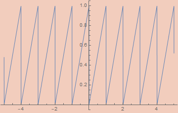
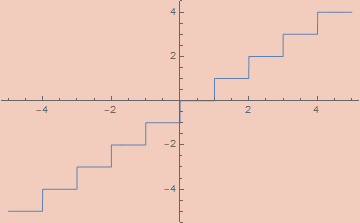



- [Approximate Digital Functions](#headingApp)
- [Continuous Polynomial Endofunctors](#headingConst)
- [Initial Algebras](#headingInitial)
- [Lambda Expressions](#headingLambda)
- [Peano Expressions](#headingPeano)
- [Sorted Trees](#headingSorted)
- [Trees of Bounded Height](#headingHeight)
- [Final Thoughts](#headingFinal)

I've been a bit obsessed with continuous computation. Both in the sense of analog computing and in the sense of coinduction. I want to write a post about the latter eventually, but this post will be focused on analog computation. Specifically, how one might compute digital functions inside a continuous domain. To be more specific, by the end of this post I want to have a function S : ℝ → ℝ who's action is, in some sense, equivalent to that of Quicksort, since that seems like a well-known enough discrete algorithm which also requires all the tequniques I want to talk about.

This post is based heavily on [my last post](http://anthonylorenhart.com/2021-01-08-Basic-Bijective-Godel-Encodings/) on bijective encodings, so you may want to read that first if you haven't.

The ultimate inspiration for this post is this article;

- [Robust Simulations of Turing Machines with Analytic Maps and Flows](http://citeseerx.ist.psu.edu/viewdoc/download?doi=10.1.1.158.5210&rep=rep1&type=pdf) by Daniel S. Graća, Manuel L. Campagnolo, and Jorge Buescu

The ovarall concept is to define, given a turing machine, an ODE who's action corresponds to the evaluation of said machine. Much of the paper pertains to particular, somewhat tedious, numerical functions for various specifics, but the general concept is quite straightforward. They start by encoding the transition of the turing machine as a function ℕ³ → ℕ³, where the three natural numbers encode, respecively, the state, the tape left of the head, and the tape right of the head. They then construct an analytic function ℝ³ → ℝ³ with an error term which, as the error approaches 0, aproaches the discrete function on natural inputs. This is then used to create a function ℝ⁴ → ℝ³, where the extra real is a variable, t, for time, representing the number of times the transition function is iterated. If the function halts, then there exists a well-defined limit as t approaches infinity, defining the output state of the machine on a given input. Ultimately everything is described in terms of solutions to polynomial ODEs, showing that they are turing complete.

I won't go into the specifics of the paper beyond that. In some sense, I could end the post there since we can select a universal turing machine and implement whatever algorithm we want on that machine, and shove it into the equation described in that paper. But that's not very enlightening, and it's even less useful. Instead, I want to take the encodings of the many discrete types described in my last post and use similar techniques to make them continuous. The exercise was, at least to me, somewhat eye-opening and really puts into focus the relation between analog and digital computation.

<a name="headingApp"></a>

Anyone who's done anything with digital circuitry probably won't be too surprised at where we start. I need a library of discrete signals which can be effectively approximated by a continuous analytic function. This means square waves, triangle waves, sawtooth waves, floor functions, absolute value functions, and probably other things that I won't need but which might be needed for a particular purpose. None of these functions are smooth, and most aren't continuous. As a consequence, they can't be derived on the nose by analog methods, but we can define analog functions with an error term which we can control.

These constructions are significant as it pertains to real computability. The original notion of real computability as described by Shannon excludes many basic (`Abs`) and not so basic (`Gamma`) functions from being computed. Essentially, computability in his sense required the existence of an ODE who's solution at t=1 coincides exactly with whatever function we're computing. Contrast this with coninductive/type-2 approaches to real computability where we never have all the data of a function instantaneously and only require the ability to compute more and more exact values with more effort. More recent work changes this definition of computability to the ability to asymptotically approximate a function using an error term. There are a couple of different variations of "real recursive calculi"; variations of μ-recursive calculi which use real numbers instead of natural numbers. Such systems sometimes allow infinite limits to be taken, acting as the continuous analog of the μ-operator/minimization. Much like the μ-operator, the limit's return value is not, in general, well-defined. With that change, the real functions definable in such terms are exactly the computable functions in the coninductive/type-2 sense.

- [A Foundation for Real Recursive Function Theory](https://www.sciencedirect.com/science/article/pii/S0168007209000062) by José Félix Costa, Bruno Loff, and Jerzy Myckac

I don't have much interesting to say about the functions themselves, so I'll just list them and their definitions. For each, the error, `ε`, has been set to 10^-5.

!!!!NOTE: Replace \[CurlyEpsilon] with ε!!!
!!!!NOTE: Replace \[Pi] with π!!!
```mathematica
\[CurlyEpsilon]Abs[\[CurlyEpsilon]_, x_] := x Tanh[x/\[CurlyEpsilon]]
```


```mathematica
\[CurlyEpsilon]SquareWave[\[CurlyEpsilon]_, x_] := 
 (2/\[Pi]) ArcCot[\[CurlyEpsilon] Csc[2 \[Pi] x]]
```


```mathematica
\[CurlyEpsilon]TriangleWave[\[CurlyEpsilon]_, x_] := 
 (2/\[Pi]) ArcSin[(1 - \[CurlyEpsilon]) Cos[2 \[Pi] x]]
```


```mathematica
\[CurlyEpsilon]SawtoothWave[\[CurlyEpsilon]_, x_] := 
 1/2 - ArcTan[(1 - \[CurlyEpsilon]) Cot[\[Pi] x]]/\[Pi]
```



```mathematica
\[CurlyEpsilon]Floor[\[CurlyEpsilon]_, x_] := 
 x - \[CurlyEpsilon]SawtoothWave[\[CurlyEpsilon], x]
```



<a name="headingConst"></a>



