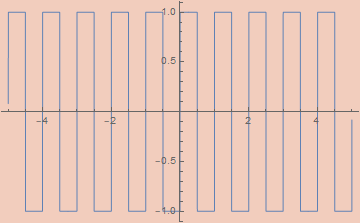
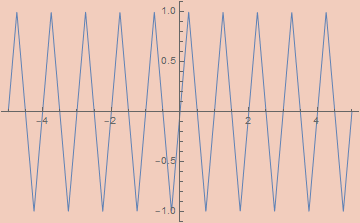
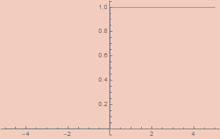
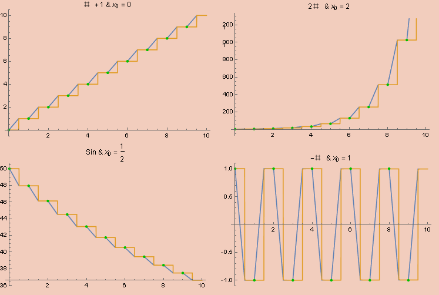
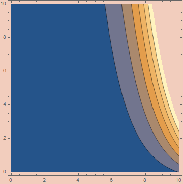



- [Approximating Digital Functions](#headingApp)
- [Iteration](#headingIter)
- [Sums](#headingConst)
- [Products](#headingProd)
- [Recursive Types](#headingRec)
- [Peano Expressions](#headingPeano)
- [Sorted Trees](#headingSorted)
- [Trees of Bounded Height](#headingHeight)
- [Final Thoughts](#headingFinal)

## Introduction

I've been a bit obsessed with continuous computation. Both in the sense of analog computing and in the sense of coinduction. I want to write a post about the latter eventually, but this post will be focused on analog computation. Specifically, how one might compute digital functions inside a continuous domain. To be more specific, by the end of this post I want to have a function S : ℝ → ℝ who's action is, in some sense, equivalent to that of Quicksort, since that seems like a well-known enough discrete algorithm which also requires all the tequniques I want to talk about.

This post is based heavily on [my last post](http://anthonylorenhart.com/2021-01-08-Basic-Bijective-Godel-Encodings/) on bijective encodings, so you may want to read that first if you haven't.

The ultimate inspiration for this post is this article;

- [Robust Simulations of Turing Machines with Analytic Maps and Flows](http://citeseerx.ist.psu.edu/viewdoc/download?doi=10.1.1.158.5210&rep=rep1&type=pdf) by Daniel S. Graća, Manuel L. Campagnolo, and Jorge Buescu

The overall concept is to define, given a turing machine, an ODE who's action corresponds to the evaluation of said machine. Much of the paper pertains to particular, somewhat tedious, numerical functions for various specifics, but the general concept is quite straightforward. They start by encoding the transition of the turing machine as a function ℕ³ → ℕ³, where the three natural numbers encode, respecively, the state, the tape left of the head, and the tape right of the head. They then construct an analytic function ℝ³ → ℝ³ with an error term which, as the error approaches 0, aproaches the discrete function on natural inputs. This is then used to create a function ℝ⁴ → ℝ³, where the extra real is a variable, t, for time, representing the number of times the transition function is iterated. If the function halts, then there exists a well-defined limit as t approaches infinity, defining the output state of the machine on a given input. Ultimately everything is described in terms of solutions to polynomial ODEs, showing that they are turing complete.

I won't go into the specifics of the paper beyond that. In some sense, I could end the post there since we can select a universal turing machine and implement whatever algorithm we want on that machine, and shove it into the equation described in that paper. But that's not very enlightening, and it's even less useful. Instead, I want to take the encodings of the many discrete types described in my last post and use similar techniques to make them continuous. The exercise was, at least to me, somewhat eye-opening and really puts into focus the relation between analog and digital computation.

<a name="headingApp"></a>
## Approximating Digital Functions

Anyone who's done anything with digital circuitry probably won't be too surprised at where we start. I need a library of discrete signals which can be effectively approximated by a continuous analytic function. This means square waves, triangle waves, sawtooth waves, floor functions, absolute value functions, step functions, and probably other things that I won't need but which might be needed for other particular purposes. None of these functions are smooth and most aren't continuous. As a consequence, they can't be derived on the nose by analog methods, but we can define analog functions with an error term which we can control.

These constructions are significant as it pertains to real computability. The original notion of real computability as described by Shannon excludes many basic (`Abs`) and not so basic (`Gamma`) functions from being computed. Essentially, computability in his sense required the existence of an ODE who's solution at t=1 coincides exactly with whatever function we're computing. Contrast this with coninductive/type-2 approaches to real computability where we never have all the data of a function instantaneously and only require the ability to compute more and more exact values with more effort. More recent work changes this definition of computability to allow asymptotically approximating a function using an error term. There are a couple of different variations of "real recursive calculi"; variations of μ-recursive calculi which use real numbers instead of natural numbers. Such systems sometimes allow infinite limits to be taken, acting as the continuous analog of the μ-operator/minimization. Much like the μ-operator, the limit's return value is not, in general, well-defined. With that change, the real functions definable in such terms are exactly the computable functions in the coninductive/type-2 sense.

- [A Foundation for Real Recursive Function Theory](https://www.sciencedirect.com/science/article/pii/S0168007209000062) by José Félix Costa, Bruno Loff, and Jerzy Myckac

I don't have much interesting to say about the functions themselves, so I'll just list them and their definitions. For each, the error, `ε`, has been set to 10^-5 in the graphs.

```mathematica
εAbs[ε_, x_] := x Tanh[x/ε]
```


```mathematica
εSquareWave[ε_, x_] := (2/π) ArcCot[ε Csc[2 π x]]
```



```mathematica
εTriangleWave[ε_, x_] := (2/π) ArcSin[(1 - ε) Cos[2 π x]]
```



```mathematica
εSawtoothWave[ε_, x_] := 
  (εTriangleWave[ε, x/2] εSquareWave[ε, -x/2] + 1)/2
```


Note: A reasonable looking definition for `εSawtoothWave` is `1/2 - ArcTan[(1 - ε) Cot[π x]]/π`, but this doesn't work since `Cot` is undefined on numerous arguments.

```mathematica
εFloor[ε_, x_] := x - εSawtoothWave[ε, x]
```


```mathematica
Round[x_] := Floor[x + 1/2]
Ceiling[x_] := Floor[x + 1]
```

```mathematica
εUnitStep[ε_, x_] := ArcTan[x/ε]/π + 1/2
```




<a name="headingIter"></a>
## Iteration

One of the most basic discrete activities is that of iteration; taking a function `f` and applying it a fixed number of times to define a new function. Defining iteration in a continuous way is the key which unlocks universal computation, so I think it's worth going through up front.

There is no common function which implements what we want; instead we need to set up a simple ODE who's solution is (asymptotically) a step function which takes a step the size of `f` each unit.

The basic idea is simple. We'll end up making an analog, uh, analog of a latch.  We' ll have two variables, `x` and `y`, with `x` being our step function. At each time interval of unit length we'll apply `f` to `y` and store it in `x` while also copying the value of `y` into `x` for the next iteration. To do this using differential equations, we' ll do the first task between `t` and `t + 1/2` and the second task between `t + 1/2` and `t + 1`. To accomplish this, we want `x` to be constant on `[t, t + 1/2]` while `y` is constant on `[t + 1/2, t + 1]`. This requires the derivatives to be 0 within their respective intervals. At the same time, we want the derivative of `y` to be `2 (f[x] - x)` on `[t, t + 1/2]` so that its value reaches `f[x]` within a half unit of time. This means using a square wave to mask out the respective intervals. Note that `y` and `x` should have the same value at the end of each unit interval. We also want the derivative of `x` to be `(2 (y - x))/SawtoothWave[2 t]` on `[t + 1/2, t + 1]` for similar reasons. This derivative will wipe out the entire value of `x` in half an interval while replacing it with the value `y`. The net consequence of this system will be a continuous functional solution to `y` and `x` which simulates the iteration of `f`.

Putting all these ideas together, we end up with the following system of first-order differential equations.

```mathematica
x'[t] == (2 (y[t] - x[t]))/εSawtoothWave[ε, 2 t] * (εSquareWave[ε, t + 1/2] + 1)/2
y'[t] == 2 (f[x[t]] - x[t]) (εSquareWave[ε, t] + 1)/2
x[0] == x0, y[0] == x
```

And shoving this inside of `NDSolve` on a few tests inputs gets us the following graphs, where orange is `x`, blue is `y`, and the green dots are the results of actual iteration.



While we don't get an expression in terms of elementary functions, this is perfectly well-defined as an analog computation. We can define the function `x` limits to as;

```mathematica
cIterate[n_, f_][x0_] := Nest[f, x0, Round@n]
```

<a name="headingConst"></a>
## Sums

Stepping back to the encodings from my last post, something I want to emphasize is that we're sticking exclusively to numbers. For the putposes of this post, trees will be numbers, lists will be numbers, lambda expressions will be numbers, etc. We aren't going to be encoding/decoding into some nice-looking syntax. This has some important consequences. Mainly, we'll be focusing on the functions needed to manipulate already encoded data. The functions I'll be defining are the standard combinators emerging from the universal properties of the types in question. The same ones used in the algebra of programming. See

- [Program Design by Calculation](https://www.di.uminho.pt/~jno/ps/pdbc_part.pdf) by J. N. Oliveira

Since our encodings are bijective, any data can be interpreted as being of any type isomorophic to ℕ. So a function like n² : ℕ → ℕ can be interpreted instead as a function from lists to trees, or lambda expressions to sorted lists, or formulas of some theory to rational numbers, etc. It's not always useful to think in this way, but you'll never get something that's truely nonsensical as all data will encode a valid, and unique, term of any countable type. So, whenever you see me mention ℕ in this post, you can replace it with any countable type in your head, if you want.

In my last post, I started with encoding tuples and sums. Sums are the easier case, so I'll start with them. 

There are two classes of functions we need for sums; constructors and destructors.

In the simple case of ℕ + ℕ, the constructors are often denoted `inl` and `inr` or `Left` and `Right`, etc. In general, we can interpret a sum ℕ + ℕ + ℕ + ... + ℕ as n × ℕ, the product of a finite type of size n with ℕ. We can then describe constructors as pairs, (k, m) where k < n and m ∈ ℕ. We also have the case of summing ℕ with a finite set, n + ℕ. Since any repeated finite sums, n + m + ... + ℕ can be rolled into a single finite set (n + m + ...) + ℕ, we only need to address the binary case for full coverage.

The destructors are characterized by fusion functions. These will have a list of functions, one for each possible entry in a sum. The fusion function figures out which entry in the sum we have and applies the appropriate function. If we have an entry (k, m) ∈ n × ℕ and n functions, `fns`, fuse(`fns`, (k, m)) will return `fns[[k]]`(m), the kth function applied to m.

Starting with the ℕ + ℕ case, the constructors just add a bit to the number, either `0` or `1` depending on the constructor, so that's easy to implement.

```mathematica
inl[x_] := 2 * x
inr[x_] := 2 * x + 1
```

Generalizing to the n × ℕ case is a minor variation of these functions.

```mathematica
in[k_, n_][x_] /; k < n := n * x + k
```

In the case of n + ℕ, we bijectively encode these elements by interpreting all numbers i < n as i (in other words, we do nothing to them) and interpreting all numbers i ≥ n as i-n. The constructors are then very simple.

```mathematica
finInl[n_][k_] /; k < n := k
finInr[n_][k_] := k + n
```

To make the destructors, we need to be able to strip off the constructor to get the data being tagged in the first place. This stripping function is called the "codiagonal". In the ℕ + ℕ case, this simply strips off the least-significant bit. We can accomplish this by dividing by 2 and flooring.

```mathematica
Codiagonal[x_] := Floor[x/2]
```

We can generalize beyond binary coproducts fairly easily by stripping of the least-significant nit from data of type n × ℕ.

```mathematica
NCodiagonal[n_][x_] := Floor[x/n]
```

In the n + ℕ case, we need a to use the step function to clear out whatever value we have up till we run our of entries in n.

```mathematica
FinCodiagonal[x_][n_] := n - x UnitStep[n - x]
```


Now that we have these functions, we can define fusion. In the ℕ + ℕ case, the `fuse` function will, given two functions `f` and `g`, apply `f` in the `inl` case and `g` in the `inr` case. We need a function for detecting the constructor. This is done through modding. As it turns out, modding is a minor variation of the sawtooth function.

```mathematica
εMod2[ε_, x_] := 2 εSawtoothWave[ε, x/2]
```


Of course, this doesn't quite work in general, as one can't reliably assertain the value when the result should be 0. To do this, we merely perturb the input and output by 1/2. We can generalize to arbitrary mods pretty easily;

```mathematica
preεMod[ε_, x_, n_] := n εSawtoothWave[ε, x/n]
εMod[ε_, x_, n_] := preεMod[ε, x + 1/2, n] - 1/2
```


Using this, we can implement an if statement. `Mod[x + 1, 2] a + Mod[x, 2] b` will be `a` when `x` is even and `b` when `x` is odd. We can use this trick to implement `fuse`.

```mathematica
Fuse[f_, g_][x_] := Mod[x + 1, 2] f[Codiagonal[x]] + Mod[x, 2] g[Codiagonal[x]]
```

Fusion in the n + ℕ case requires a similar decision procedure. We need a method we can use to check for relative size of the input. We can to use `UnitStep` to detect the negativity of `n - k` which will indicate if `k` is greater than `n`.

```mathematica
FinFuse[n_, f_, g_][x_] :=  UnitStep[x - n + 1/2] g[x-n] + (1 - UnitStep[x - n + 1/2]) f[x]
```  

We can further generalize to arbitrary n, given a lists of functions.

```mathematica
NFuse[fns_][n_] :=
  With[{l = Length@fns},
    Sum[Mod[n + i, l]*fns[[i]][NCodiagonal[n][l]], {i, 1, l}]
  ]
```

We can now perform all standard manipulations on sums. One of the more helpful utility functions is the sum bimap which leaves the leading constructor of the sum intact while applying either `f` or `g`.

```mathematica
SumBimap[f_, g_][n_] := Fuse[inl@*f, inr@*g][n]
```

In the n + ℕ case, we can use the appropriate fusion function as well.

```mathematica
FinSumMap[n_, f_][x_] := FinFuse[#&, (n + #)& @* f][x]
```

<a name="headingProd"></a>
## Products

The other part of polynomial endofunctors is the product. In my last post, I defined encodings of products ℕ × ℕ × ... × ℕ for arbitrary many ℕs. This is unessessary in theory as we can define them as ℕ × (ℕ × (ℕ × ...)). There are lots and lots of encodings for products.

- [The Rosenberg-Strong Pairing Function](https://arxiv.org/pdf/1706.04129.pdf) by Matthew P. Szudzik

In my last post, I used one based on bit interlacing, but this is hard to make continuous. I'll use two encodings, the O.G. Cantor pairing and Sierpiński pairing. The pairing functions themselves are already analytic for both.

```mathematica
CantorPair[x_, y_] := (x^2 + 2 x y + y^2 + 3 x + y)/2
```


```mathematica
SierpińskiPair[x_, y_] := 2^x (2 y + 1) - 1
```



The reason I highlighted these is their packing characteristics. `CantorPair` packs things fairly, so a random number decoded into a Cantor pair will, on average, have both entries be about the same size. `SierpińskiPair`, on the other hand, packs `y` much more tightly than `x` so that a random number will decode to a pair where `x` is exponentially larger than `y`, on average. Depending on the application, I'll use either one of the functions.

Manipulating products requires constructors and destructors. The destructors are just the projection funcitons which extract the first and second elements. The universal constructor is a fork map which takes an argument, `x`, and two functions, `f` and `g`, and returns a pair (`f[x]`, `g[x]`).

For cantor pairing, extracting the arguments seems at first to be fairly easy, requiring using the floor function. A standard definition is the following;

```mathematica
preFst[z_] := z - (#^2 + #)/2 &[Floor[(Sqrt[8 z + 1] - 1)/2]]
preSnd[z_] := (3 # + #^2)/2 - z &[Floor[(Sqrt[8 z + 1] - 1)/2]]
```

However, this doesn't approach a correct `Fst` function as the error goes to zero. As a specific example, this `Fst` approaches 5/8 on the input `1` when it should approach 0 since `CantorPair[0, 1] == 1`. Since the slope of `Fst` is 1 and that of `Snd` is -1 on all inputs in the limit, we can do a similar trick we already did with `Mod` and perturburb the input and output by 1/2. In the case of `Fst`, they'll cancel out if their signs are opposite while they'll cancel out with the same sign in `Snd`. 

```mathematica
CantorFst[z_] := preFst[z + 1/2] - 1/2
CantorSnd[z_] := preSnd[z + 1/2] + 1/2
```


Projecting out of `SierpińskiPair` is more complicated. Standard implementations of projection functions require inspecting the binary expansion of the numbers. Specifically, the number of 1s in the end of the binary expansion of the number is the first number while the remaining bits (ignoring the last 0) encodes the second number. For example `SierpińskiPair[7, 2345] == 600447` who's binary exansion is

```
10010010100101111111
```

There are 7 1s at the end, so that's our first number. The remaining bits (ignoring the last 0) are `100100101001`, which is the binary representation of 2345; our second entry.

These algorithms are not hard to implement. In fact, one of the projections is even a built-in function in Mathematica.

```
SierpińskiFst[z_] := IntegerExponent[z + 1, 2]
SierpińskiSnd[z_] := ((z + 1) 2^-SierpińskiFst[z] - 1)/2
```

However, these functions are tricky to make continuous. If the first can be made that way, the second comes along for free. The `Fst` function is simply the largest power of 2, `n`, such that `Mod[z + 1, 2^n] == 0`. This is the same as the number of powers of 2 greater than 0 which `z` is divisible by. We can actually calculate this by integration. Consider the graph of `1 - UnitStep[Mod[k, 2^Floor@n]-1/2]`. At each unit interval, if the mod power of 2 is 0, the value will be 1 over that interval; if the mod power of 2 is greater than 0, the interval will be 0. By integrating that function from 1 to `Ceiling[Log[2, z]]`, we'll calculate the first component, adding 1 for every power of 2 which the number is divisible by.

```mathematica
SierpińskiFst[x_] :=
  Integrate[1 - UnitStep[Mod[x + 1, 2^Floor[n]] - 1/2], {n, 1, Ceiling[Log[2, x + 1]]}]
```

Note that this implementation doesn't really work. This is more of a design for a hypothetical analog circuit. If you want to play around with a continuous version of this function, use this, which isn't really the same function, but it should work fine;

```mathematica
SierpińskiFst[z_] := IntegerExponent[Round[z] + 1, 2]
```


That basic trick of integrating sumething sandwiched between a step function and a floor function is a generic method for counting numbers satisfying some property in a continuous way. It's a method for defining discrete sums in terms of continuous ones. Based on that, we can get the following alternative definition;

```mathematica
SierpińskiFst[x_] := Sum[1 - UnitStep[Mod[x + 1, 2^n] - 1/2], {n, 1, Ceiling[Log[2, x + 1]]}]
```

At this point, we can define the universal properties of the product fairly easily. The fork functions can be defined as;

```mathematica
CantorFork[f_, g_][x_] := CantorPair[f[x], g[x]]

SierpińskiFork[f_, g_][x_] := SierpińskiPair[f[x], g[x]]
```

and we can define the product functorial bimap in a similar manner.

```mathematica
CantorBimap[f_, g_] := CantorFork[f @* CantorFst, g @* CantorSnd]

SierpińskiBimap[f_, g_] := SierpińskiFork[f @* SierpińskiFst, g @* SierpińskiSnd]
```

As a nice utility function, we can also define an uncurrying function which feeds a pair of values into a binary function.

```mathematica
CantorUncurry[f_][x_] := f[CantorFst@x, CantorSnd@x]

SierpińskiUncurry[f_][x_] := f[SierpińskiFst@x, SierpińskiSnd@x]
```

<a name="headingRec"></a>
## Recursive Types

Our recursive types will simply be iterated polynomial functors. I explained this in detail in my last post, so I'll be brief here. For example, binary trees are just F = X ↦ 1 + X × X iterated over and over. Since F[ℕ] ≅ ℕ, we can collapse an arbitrary number of itterations so long as the base case is itself isomorphic to ℕ. So BinTree = F[BinTree] ≅ ℕ, and an explicit construction of this and related isomophisms is detailed in my previous post.

The main combinator for manipulating recursive types is the hylomorphism;

```
hylo[fmap_, alg_, coalg_][x_] := alg[fmap[hylo[fmap, alg, coalg], coalg[x]]]
```

where `fmap` is the functorial map for the endofunctor which our recursive type is initial over. In the case of binary trees, it will be a function which, itself, takes a function f : X → Y and turns it into a function F[f] : F[X] → F[Y]. We define such functorial maps by composing the functorial maps already defined for sums and products. In the case of F, its respective Fmap will be;

```mathematica
BinTreeFMap[f_] := FinSumMap[1, CantorBimap[f, f]]
```

Note that, since our encodings are all in ℕ, all functorial maps will turn functions ℕ → ℕ into different functions from ℕ → ℕ.

What the hylomorphism does is unfold and then fold an intermediate datastructure for computing a value. Since F[ℕ] ≅ ℕ, we can pick literally any function ℕ → ℕ as an algebra or coalgebra and it will produce a coherent (though, not neccessarily meaningful) program. For example, the following program

```mathematica
hylo[BinTreeFMap, #^2 &, Floor[Sqrt[#]] &][2532345]
```

returns 1681. Though, what that means, I'll leave up to you. A more practical algorithm is the following simple algorithm which computes the leaves of a tree;

```mathematica
hylo[BinTreeFMap, FinFuse[1, 1 &, CantorUncurry[Plus]], # &][2532345]
```

Which returns 17. We can write some code to print this tree in a more comprehensible form;

```mathematica
TreeUnfoldAlg[0] := {0, 0}
TreeUnfoldAlg[n_] := {1, {CantorFst[n - 1], CantorSnd[n - 1]}}

TreeFmap[f_][{0, 0}] := {0, 0}
TreeFmap[f_][{1, {n_, m_}}] := {1, {f[n], f[m]}}

TreeUnfold[x_] := TreeFmap[TreeUnfold][TreeUnfoldAlg[x]]

TreeForm@toGenericTree@TreeUnfold@2532345
```

where `toGenericTree` came from my previous post. This returns


which does, indeed, have 17 leaves.



