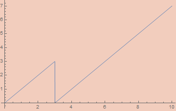
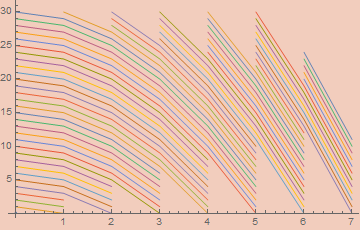


- [Approximating Digital Functions](#headingApp)
- [Iteration](#headingIter)
- [Sums](#headingConst)
- [Products](#headingProd)
- [A Quadratic Product](#headingQProd)
- [Recursive Types and Recursion](#headingRec)
- [Quicksort, First Pass](#headingQ1)
- [Defunctionalization](#headingDefun)
- [Final Quicksort](#headingQ2)
- [Final Thoughts](#headingFinal)

## Introduction

I've been a bit obsessed with continuous computation recently. Both in the sense of analog computing and the sense of coinduction. I want to write a post about the latter eventually, but this post will be focused on analog computation. Specifically, how one might compute digital functions inside a continuous domain. By the end of this post I want to have a function S : ℝ → ℝ whose action is, in some sense, equivalent to that of Quicksort, since that seems like a well-known enough discrete algorithm which also requires all the techniques I want to talk about.

This post is a follow-up to [my last post](http://anthonylorenhart.com/2021-01-08-Basic-Bijective-Godel-Encodings/) on bijective encodings, so you may want to read that first if you haven't.

The ultimate inspiration for this post is this article;

- [Robust Simulations of Turing Machines with Analytic Maps and Flows](http://citeseerx.ist.psu.edu/viewdoc/download?doi=10.1.1.158.5210&rep=rep1&type=pdf) by Daniel S. Graća, Manuel L. Campagnolo, and Jorge Buescu

The overall concept of that paper is to define, given a Turing machine, an ODE whose action corresponds to the evaluation of said machine. Much of the paper pertains to particular, somewhat tedious, numerical functions for various specifics, but the general concept is quite straightforward. They start by encoding the transition of the Turing machine as a function ℕ³ → ℕ³, where the three natural numbers encode, respectively, the state, the tape left of the head, and the tape right of the head. They then construct an analytic function ℝ³ → ℝ³ with an error term which, as the error approaches 0, approaches the discrete function on natural inputs. This is then used to create a function ℝ⁴ → ℝ³, where the extra real is a variable, t, for time, representing the number of times the transition function is iterated. If the function halts, then there exists a well-defined limit as t approaches infinity defining the output state of the machine on a given input. Ultimately everything is described in terms of solutions to polynomial ODEs, showing that they are Turing complete.

I won't go into the specifics of the paper beyond that. In some sense, I could end the post there since we can select a universal Turing machine and implement whatever algorithm we want on that machine, and shove it into the equation described in that paper. But that's not very enlightening, and it's even less useful. Instead, I want to take the encodings of the many discrete types described in my last post and use similar techniques to make them continuous. The exercise was, at least to me, somewhat eye-opening and really puts into focus the relation between analog and digital computation.

<a name="headingApp"></a>
## Approximating Digital Functions

Anyone who's done anything with digital circuitry probably won't be too surprised at where we start. I need a library of discrete signals which can be effectively approximated by a continuous analytic function. This means square waves, triangle waves, sawtooth waves, floor functions, absolute value functions, step functions, and probably other things that I won't need but which might be needed for other particular purposes. None of these functions are smooth and most aren't continuous. As a consequence, they can't be derived on the nose by analog methods, but we can define analog functions with an error term that we can control.

These constructions are significant as it pertains to real computability. The original notion of real computability as described by Shannon excludes many basic (`Abs`) and not so basic (`Gamma`) functions from being computed. Essentially, computability in his sense required the existence of an ODE whose solution at t=1 coincides exactly with whatever function we're computing. Contrast this with coinductive/type-2 approaches to real computability where we never have all the data of a function instantaneously and only require the ability to compute more and more exact values with more effort. More recent work changes this definition of computability to allow asymptotically approximating a function using an error term. There are a couple of different variations of "real recursive calculi"; variations of μ-recursive calculi which use real numbers instead of natural numbers. Such systems sometimes allow infinite limits to be taken, acting as the continuous analog of the μ-operator/minimization/while-loop. Much like the μ-operator, the limit's return value is not, in general, well-defined. With that change, the real functions definable in the presence of a noise floor are exactly the computable functions in the coinductive/type-2 sense.

- [A Foundation for Real Recursive Function Theory](https://www.sciencedirect.com/science/article/pii/S0168007209000062) by José Félix Costa, Bruno Loff, and Jerzy Myckac

I don't have much interesting to say about the functions themselves, so I'll just list them and their definitions. For each, the error, `ε`, has been set to 10^-5 in the graphs.

```mathematica
εAbs[ε_, x_] := x Tanh[x/ε]
```


```mathematica
εSquareWave[ε_, x_] := (2/π) ArcCot[ε Csc[2 π x]]
```


```mathematica
εTriangleWave[ε_, x_] := (2/π) ArcSin[(1 - ε) Cos[2 π x]]
```


```mathematica
εSawtoothWave[ε_, x_] := 
  (εTriangleWave[ε, x/2] εSquareWave[ε, -x/2] + 1)/2
```


Note: A reasonable looking definition for `εSawtoothWave` is `1/2 - ArcTan[(1 - ε) Cot[π x]]/π`, but this doesn't work since `Cot` is undefined on numerous arguments.

```mathematica
εFloor[ε_, x_] := x - εSawtoothWave[ε, x]
```


```mathematica
Round[x_] := Floor[x + 1/2]
Ceiling[x_] := Floor[x + 1]
```

```mathematica
εUnitStep[ε_, x_] := ArcTan[x/ε]/π + 1/2
```


<a name="headingIter"></a>
## Iteration

One of the most basic discrete activities is that of iteration; taking a function `f` and applying it a fixed number of times to define a new function. Defining iteration in a continuous way is the key that unlocks universal computation, so I think it's worth going through upfront.

There is no common function which implements what we want; instead, we need to set up a simple ODE whose solution is (asymptotically) a step function that takes a step the size of `f` each unit.

The basic idea is simple. We'll end up making an analog, uh, analog of a latch.  We'll have two variables, `x` and `y`, with `x` being our step function. At each time interval of unit length, we'll apply `f` to `y` and store it in `x` while also copying the value of `y` into `x` for the next iteration. To do this using differential equations, we'll do the first task between `t` and `t + 1/2` and the second task between `t + 1/2` and `t + 1`. To accomplish this, we want `x` to be constant on `[t, t + 1/2]` while `y` is constant on `[t + 1/2, t + 1]`. This requires the derivatives to be 0 within their respective intervals. At the same time, we want the derivative of `y` to be `2 (f[x] - x)` on `[t, t + 1/2]` so that its value reaches `f[x]` within a half unit of time. This means using a square wave to mask out the respective intervals. Note that `y` and `x` should have the same value at the end of each unit interval. We also want the derivative of `x` to be `(2 (y - x))/SawtoothWave[2 t]` on `[t + 1/2, t + 1]` for similar reasons. This derivative will wipe out the entire value of `x` in half an interval while replacing it with the value `y`. The net consequence of this system will be a continuous functional solution to `y` and `x` which simulates the iteration of `f`.

Putting all these ideas together, we end up with the following system of first-order differential equations.

```mathematica
x'[t] == (2 (y[t] - x[t]))/εSawtoothWave[ε, 2 t] * (εSquareWave[ε, t + 1/2] + 1)/2
y'[t] == 2 (f[x[t]] - x[t]) (εSquareWave[ε, t] + 1)/2
x[0] == x0, y[0] == x
```

And shoving this inside of `NDSolve` on a few test inputs gets us the following graphs, where orange is `x`, blue is `y`, and the green dots are the results of actual iteration.


While we don't get an expression in terms of elementary functions, this is perfectly well-defined as an analog computation. For quicker experimentation, we can define the function `x` limits to as;

```mathematica
cIterate[f_, x0_][n_] := Nest[f, x0, Round@n]
```

<a name="headingConst"></a>
## Sums

Stepping back to the encodings from my last post, something I want to emphasize is that we're sticking exclusively to numbers. For the purposes of this post, trees will be numbers, lists will be numbers, lambda expressions will be numbers, etc. We aren't going to be encoding/decoding into some nice-looking syntax. This has some important consequences. Mainly, we'll be focusing on the functions needed to manipulate already encoded data. The functions I'll be defining are the standard combinators emerging from the universal properties of the types in question. The same ones are used in the algebra of programming. See

- [Program Design by Calculation](https://www.di.uminho.pt/~jno/ps/pdbc_part.pdf) by J. N. Oliveira

Since our encodings are bijective, any data can be interpreted as being of any type isomorphic to ℕ. So a function like n² : ℕ → ℕ can be interpreted instead as a function from lists to trees, or lambda expressions to sorted lists, or formulas of some theory to rational numbers, etc. It's not always useful to think in this way, but you'll never get something that's truly nonsensical as all data will encode a valid, and unique, term of any countable type. So, whenever you see me mention ℕ in this post, you can replace it with any countable type in your head, if you want.

In my last post, I started with encoding tuples and sums. Sums are the easier case, so I'll start with them. 

There are two classes of functions we need for sums; constructors and destructors.

In the simple case of ℕ + ℕ, the constructors are often denoted `inl` and `inr` or `Left` and `Right`, etc. In general, we can interpret a sum ℕ + ℕ + ℕ + ... + ℕ as n × ℕ, the product of a finite type of size n with ℕ. We can then describe constructors as pairs, (k, m) where k < n and m ∈ ℕ. We also have the case of summing ℕ with a finite set, n + ℕ. Since any repeated finite sets sums, n + m + ... + ℕ can be rolled into a single finite set (n + m + ...) + ℕ, we only need to address the binary case for full coverage.

Starting with the ℕ + ℕ case, the constructors just add a bit to the number, either `0` or `1` depending on the constructor, so that's easy to implement.

```mathematica
inl[x_] := 2 * x
inr[x_] := 2 * x + 1
```

Generalizing to the n × ℕ case is a minor variation of these functions.

```mathematica
in[n_, k_][x_] /; k < n := n * x + k
```

In the case of n + ℕ, we bijectively encode these elements by interpreting all numbers i < n as i (in other words, we do nothing to them) and interpreting all numbers i ≥ n as i-n. The constructors are then very simple.

```mathematica
finInl[n_][k_] /; k < n := k
finInr[n_][k_] := k + n
```

To make the destructors, we need to be able to strip off the constructor to get the data being tagged in the first place. This stripping function is called the "codiagonal". In the ℕ + ℕ case, this simply strips off the least significant bit. We can accomplish this by dividing by 2 and flooring.

```mathematica
Codiagonal[x_] := Floor[x/2]
```

We can generalize beyond binary coproducts fairly easily by stripping off the least significant nit from data of type n × ℕ.

```mathematica
NCodiagonal[n_][x_] := Floor[x/n]
```

This is, incidentally, the same thing as the second projection out of the finite product; n × ℕ → ℕ.

The actual constructor, the k in (k, m) ∈ n × ℕ, can be recovered using a simple mod.

```mathematica
NProj[n_][x_] := Mod[x, n]
```

In the n + ℕ case, we can implement the codiagonal like so;

```mathematica
FinCodiagonal[n_][x_] /; x < n := x
FinCodiagonal[n_][x_] := x - n
```

To take this to the continuous setting, we can use the step function to decide if we should subtract n.

```mathematica
FinCodiagonal[n_][x_] := x - n UnitStep[x - n]
```



The destructors for sums are characterized by fusion functions. These will have a list of functions, one for each possible entry in a sum. The fusion function figures out which entry in the sum we have and applies the appropriate function. If we have an entry (k, m) ∈ n × ℕ and a list of n functions, `fns`, fuse(`fns`, (k, m)) will return `fns[[k]]`(m), the kth function applied to m.

In the ℕ + ℕ case, the `fuse` function will, given two functions `f` and `g`, apply `f` in the `inl` case and `g` in the `inr` case. We need a function for detecting the constructor. This is done through modding. As it turns out, modding is a minor variation of the sawtooth function.

```mathematica
εMod2[ε_, x_] := 2 εSawtoothWave[ε, x/2]
```


Of course, this doesn't quite work in general, as one can't reliably ascertain the value when the result should be 0. To do this, we merely perturb the input and output by 1/2. We can generalize to arbitrary mods pretty easily;

```mathematica
preεMod[ε_, x_, n_] := n εSawtoothWave[ε, x/n]
εMod[ε_, x_, n_] := preεMod[ε, x + 1/2, n] - 1/2
```


Using this, we can implement an if statement. `Mod[x + 1, 2] a + Mod[x, 2] b` will be `a` when `x` is even and `b` when `x` is odd. We can use this trick to implement `fuse`.

```mathematica
Fuse[f_, g_][x_] := Mod[x + 1, 2] f[Codiagonal[x]] + Mod[x, 2] g[Codiagonal[x]]
```

We can further generalize to arbitrary n, given a list of functions.

```mathematica
NFuse[fns_][n_] :=
  With[{l = Length@fns},
    Sum[Mod[n + i, l]*fns[[i]][NCodiagonal[n][l]], {i, 1, l}]
  ]
```

Fusion in the n + ℕ case requires a similar decision procedure. 

```mathematica
FinFuse[n_, f_, g_][x_] /; x < n := f[x]
FinFuse[n_, f_, g_][x_] /; x >= n := g[x - n]
```

We need a method to check for the relative size of the input. We can use `UnitStep` to detect the negativity of `n - k` which will indicate if `k` is greater than `n`.

```mathematica
FinFuse[n_, f_, g_][x_] :=  UnitStep[x - n + 1/2] g[x-n] + (1 - UnitStep[x - n + 1/2]) f[x]
```  

We can now perform all standard manipulations on sums. One of the more helpful utility functions is the sum bimap which leaves the leading constructor of the sum intact while applying either `f` or `g`.

```mathematica
SumBimap[f_, g_] := Fuse[inl@*f, inr@*g]
```

In the n + ℕ case, we can use the appropriate fusion function as well.

```mathematica
FinSumMap[n_, f_] := FinFuse[n, # &, (n + #) &@*f]
```

In the n × ℕ case, we can do the following to map onto the second argument.

```mathematica
FinProdMap[n_, f_][x_] := in[n, NProj[n][x]][f[NCodiagonal[n][x]]]
```

<a name="headingProd"></a>
## Products

In my last post, I defined encodings of products ℕ × ℕ × ... × ℕ for arbitrary many ℕs. This is unnecessary in theory as we can define them as ℕ × (ℕ × (ℕ × ...)). There are lots and lots of encodings for products.

- [The Rosenberg-Strong Pairing Function](https://arxiv.org/pdf/1706.04129.pdf) by Matthew P. Szudzik

In my last post, I used one based on bit interlacing, but this is hard to make continuous. I'll start with use two encodings, the O.G. Cantor pairing and Sierpinski pairing. The pairing functions themselves are already analytic.

```mathematica
CantorPair[x_, y_] := (x^2 + 2 x y + y^2 + 3 x + y)/2
```


```mathematica
SierpinskiPair[x_, y_] := 2^x (2 y + 1) - 1
```


The reason I highlighted these is their packing characteristics. `CantorPair` packs things fairly, so a random number decoded into a Cantor pair will, on average, have both entries be about the same size. `SierpinskiPair`, on the other hand, packs `y` much more tightly than `x` so that a random number will decode to a pair where `y` is exponentially larger than `x`, on average. Depending on the application, both functions may have their uses.

The destructors for products are just the projection functions that extract the first and second elements. The universal constructor is a fork map that takes an argument, `x`, and two functions, `f` and `g`, and returns a pair (`f[x]`, `g[x]`).

For cantor pairing, extracting the arguments seems at first to be fairly easy, requiring using the floor function. A standard definition is the following;

```mathematica
preFst[z_] := z - (#^2 + #)/2 &[Floor[(Sqrt[8 z + 1] - 1)/2]]
preSnd[z_] := (3 # + #^2)/2 - z &[Floor[(Sqrt[8 z + 1] - 1)/2]]
```

However, this doesn't approach a correct `Fst` function as the error goes to zero. As a specific example, this `Fst` approaches 5/8 on the input `1` when it should approach 0 since `CantorPair[0, 1] == 1`. Since the slope of `Fst` is 1 and that of `Snd` is -1 on all inputs in the limit, we can do a similar trick we already did with `Mod` and perturb the input and output by 1/2. In the case of `Fst`, they'll cancel out if their signs are opposite while they'll cancel out with the same sign in `Snd`. 

```mathematica
CantorFst[z_] := preFst[z + 1/2] - 1/2
CantorSnd[z_] := preSnd[z + 1/2] + 1/2
```


Projecting out of `SierpinskiPair` is more complicated. Standard implementations of projection functions require inspecting the binary expansion of the numbers. Specifically, the number of 1s at the end of the binary expansion of the number is the first number while the remaining bits (ignoring the last 0) encodes the second number. For example `SierpinskiPair[7, 2345] == 600447` whose binary expansion is

```
10010010100101111111
```

There are 7 1s at the end, so that's our first number. The remaining bits (ignoring the last 0) are `100100101001`, which is the binary representation of 2345; our second entry.

These algorithms are not hard to implement. In fact, one of the projections is even a built-in function in Mathematica.

```mathematica
SierpinskiFst[z_] := IntegerExponent[z + 1, 2]
SierpinskiSnd[z_] := ((z + 1) 2^-SierpinskiFst[z] - 1)/2
```

However, these functions are tricky to make continuous. If the first can be made that way, the second comes along for free. The `Fst` function is simply the largest power of 2, `n`, such that `Mod[z + 1, 2^n] == 0`. This is the same as the number of powers of 2 greater than 0 which `z` is divisible by. We can actually calculate this by integration. Consider the graph of `1 - UnitStep[Mod[k, 2^Floor@n]-1/2]`. At each unit interval, if the mod power of 2 is 0, the value will be 1 over that interval; if the mod power of 2 is greater than 0, the interval will be 0. By integrating that function from 1 to `Ceiling[Log[2, z]]`, we'll calculate the first component, adding 1 for every power of 2 which the number is divisible by.

```mathematica
SierpinskiFst[x_] :=
  Integrate[1 - UnitStep[Mod[x + 1, 2^Floor[n]] - 1/2], {n, 1, Ceiling[Log[2, x + 1]]}]
```

Note that this implementation doesn't really work. This is more of a design for a hypothetical analog circuit. If you want to play around with a continuous version of this function, use this, which isn't really the same function, but it should work fine;

```mathematica
SierpinskiFst[z_] := IntegerExponent[Round[z] + 1, 2]
```


That basic trick of integrating something sandwiched between a step function and a floor function is a generic method for counting numbers satisfying some property in a continuous way. It's a method for defining discrete sums in terms of continuous ones. Based on that, we can get the following alternative definition;

```mathematica
SierpinskiFst[x_] := Sum[1 - UnitStep[Mod[x + 1, 2^n] - 1/2], {n, 1, Ceiling[Log[2, x + 1]]}]
```

At this point, we can define the universal properties of the product fairly easily. The fork functions can be defined as;

```mathematica
CantorFork[f_, g_][x_] := CantorPair[f[x], g[x]]

SierpinskiFork[f_, g_][x_] := SierpinskiPair[f[x], g[x]]
```

and we can similarly define the product functorial bimap.

```mathematica
CantorBimap[f_, g_] := CantorFork[f @* CantorFst, g @* CantorSnd]

SierpinskiBimap[f_, g_] := SierpinskiFork[f @* SierpinskiFst, g @* SierpinskiSnd]
```

As a nice utility function, we can also define an uncurrying function that feeds a pair of values into a binary function.

```mathematica
CantorUncurry[f_][x_] := f[CantorFst@x, CantorSnd@x]

SierpinskiUncurry[f_][x_] := f[SierpinskiFst@x, SierpinskiSnd@x]
```

<a name="headingQProd"></a>
## A Quadratic Product

I want to create a custom pairing function with a packing efficiency between Cantor and Sierpinski. Cantor packs x the same as y; Sierpinski packs y exponentially denser than x; what if we need something that packs one element merely quadratically denser?

This topic is explored in detail in the paper;

- [Efficient Pairing Functions - and Why You Should Care](https://www.researchgate.net/profile/Arnold-Rosenberg/publication/220181086_Efficient_Pairing_Functions_-_and_Why_You_Should_Care/links/54450b110cf2534c766086ff/Efficient-Pairing-Functions-and-Why-You-Should-Care.pdf) by A. Rosenberg

The paper outlines a procedure for creating Cantor-like pairing functions. This excludes something like the bit-manipulation pairing function I presented in my last post, but it offers a lot of flexibility and conceptual clarity. At its core, Cantor-like pairing functions define a series of shells which in total cover the integer parts of the positive plane. In the case of Cantor pairing itself, the shells are made up of relations of the form x + y = s, where s is the shell that contains the point (x, y). Have a look at the paper for some nice illustrations of these shells.

To pack a point quadratically tighter we can use shells of the form x² + y = s. This will create shells of the following shape;



Each one of those lines corresponds to the curve s - x².

To actually define this pairing function, we need to identify the shell, the number of elements that preceded that shell, and how far along in the shell we are. Our shell is just x² + y. We may notice that shell s has `Ceiling[Sqrt[s]]` items in it. So summing that up to our shell and adding x (which tells us how far along the shell we are) gets us our encoding.

```mathematica
QuadPair[x_, y_] := Sum[Ceiling[Sqrt[n]], {n, 0, x^2 + y}] + x
```

This is all well and good, but it's horrendously inefficient to actually carry out this sum. We may notice that 

```mathematica
Sum[Ceiling[Sqrt[n]], {n, 0, s}]
```

is adding up (1² - 0²) 1s, (2² - 1²) 2s, (3² - 2²) 3s, etc. Based on that, we can get something close via;

```mathematica
Sum[n*(n^2 - (n - 1)^2), {n, 1, Ceiling[Sqrt[s]]}]
```

The error of this term is of order `Ceiling[Sqrt[s]]` and is proportional to the difference between `Ceiling[Sqrt[s]]^2` and `s`. So, with some additional sum algebra, we can observe that

```mathematica
Sum[Ceiling[Sqrt[n]], {n, 0, s}]
== Sum[n*(n^2 - (n - 1)^2), {n, 1, Ceiling[Sqrt[s]]}]
   - Ceiling[Sqrt[s]]*(Ceiling[Sqrt[s]]^2 - s)
== (-(1/6) + s) Ceiling[Sqrt[s]] + 1/2 Ceiling[Sqrt[s]]^2 - 1/3 Ceiling[Sqrt[s]]^3
== (s - 1/6) # + 1/2 #^2 - 1/3 #^3 &[Ceiling[Sqrt[s]]]
```

allowing us to rewrite the pairing function as

```mathematica
CeilingSqrtSum[s_] := (s - 1/6) # + 1/2 #^2 - 1/3 #^3 &[Ceiling[Sqrt[s]]]
QuadPair[x_, y_] := CeilingSqrtSum[x^2 + y] + x
```

which is clearly efficient to evaluate. Of course, a pairing function isn't so useful if it can't be unpaired. The unpairing functions are conceptually simple. There's a straightforward, if not so efficient, method for finding the shell of an encoded pair by simply finding the largest shell whose `CeilingSqrtSum` is below the input.

```mathematica
QuadShell[n_] :=
 Block[{s},
  s = 0;
  While[n - CeilingSqrtSum[s] ≥ 0, s++];
  s - 1]
```

With the shell in hand, the exact coordinates of an encoded pair, `n`, can be easily calculated.

```mathematica
QuadUnpair[n_] :=
  Block[{s, x, y},
    s = QuadShell@n;
    x = n - CeilingSqrtSum@s;
    y = s - x^2;
    {x, y}]
QuadFst[n_] := QuadUnpair[n][[1]]
QuadSnd[n_] := QuadUnpair[n][[2]]
```

However, that `QuadShell` implementation is clearly too slow for our purposes. There is an easy way to make it faster. We can remove the ceiling function from the `CeilingSqrtSum` function and calculate its inverse as the root of a particular polynomial. Taking the floor of that yields;

```mathematica
PreQuadShell[n_] := Floor@Root[-36 n^2 + (1 + 36 n) # - 17 #^2 + 16 #^3 &, 1]
```

Which is quite nice, I think, but is subject to periodic off-by-one errors. We can use this as a first pass estimate and adjust accordingly;

```mathematica
QuadShell[n_] :=
 Block[{s},
  s = PreQuadShell[n];
  If[n - CeilingSqrtSum[s] < 0, s--];
  s]
```

We can then get the same structural functions we had for the other pairing functions;

```mathematica
QuadFork[f_, g_][x_] := QuadPair[f[x], g[x]]
QuadBimap[f_, g_] := QuadFork[f@*QuadFst, g@*QuadSnd]
QuadUncurry[f_][x_] := f[QuadFst@x, QuadSnd@x]
```

This pairing function ended up not being useful for this post, but I made it as part of this project and its relevant and interesting, so I decided to keep it anyway. However, it won't be appearing beyond this point.

<a name="headingRec"></a>
## Recursive Types and Recursion

Our recursive types will simply be iterated polynomial functors. I explained this in detail in my last post, so I'll be brief here. As an example, binary trees are just F = X ↦ 1 + X × X iterated over and over. Since F[ℕ] ≅ ℕ, we can collapse an arbitrary number of iterations so long as the base case is itself isomorphic to ℕ. So BinTree = F[BinTree] ≅ ℕ, and an explicit construction of this and related isomorphisms is detailed in my previous post. Here are some basic combinators for manipulating ℕ as a binary tree;

```mathematica
branch[l_, r_] := CantorPair[l, r] + 1

treeLeft[t_] /; l > 0 := CantorFst[t - 1]
treeRight[t_] /; l > 0 := CantorSnd[t - 1]
```

The main combinator for manipulating recursive types is the hylomorphism;

```mathematica
hylo[fmap_, alg_, coalg_][x_] := alg[fmap[hylo[fmap, alg, coalg]][coalg[x]]]
```

where `fmap` is the functorial map for the endofunctor which our recursive type is initial over. In the case of binary trees, it will be a function which, itself, takes a function f : X → Y and turns it into a function F[f] : F[X] → F[Y]. We define such functorial maps by composing the functorial maps already defined for sums and products. In the case of F, its respective Fmap will be;

```mathematica
BinTreeFMap[f_] := FinSumMap[1, CantorBimap[f, f]]
```

Note that, since our encodings are all in ℕ, all functorial maps will turn functions ℕ → ℕ into different functions from ℕ → ℕ.

What the hylomorphism does is unfold and then fold an intermediate data structure for computing a value. Since F[ℕ] ≅ ℕ, we can pick literally any function ℕ → ℕ as an algebra or coalgebra and it will produce a coherent (though, not necessarily useful) program. For example, the following program

```mathematica
hylo[BinTreeFMap, #^2 &, Floor[Sqrt[#]] &][2532345]
```

returns 1681. Though, what that means, I'll leave it up to you. A more practical algorithm is the following simple algorithm which computes the number of leaves in a tree;

```mathematica
hylo[BinTreeFMap, FinFuse[1, 1 &, CantorUncurry[Plus]], # &][2532345]
```

Which returns 17. We can write some code to print this tree in a more comprehensible form;

```mathematica
TreeUnfoldAlg[0] := {0, 0}
TreeUnfoldAlg[n_] := {1, {treeLeft[n], treeRight[n]}}

TreeFmap[f_][{0, 0}] := {0, 0}
TreeFmap[f_][{1, {n_, m_}}] := {1, {f[n], f[m]}}

TreeUnfold[x_] := TreeFmap[TreeUnfold][TreeUnfoldAlg[x]]
```

```mathematica
TreeForm@toGenericTree@TreeUnfold@2532345
```

where `toGenericTree` came from my previous post. This returns


which does, indeed, have 17 leaves.

<a name="headingQ1"></a>
## Quicksort, First Pass

At this point, I can start constructing my purely numeric quicksort function. The basic action of quicksort is to unfold a list into a sorted tree that stores data on its branches before collapsing the tree into a sorted list. At each step, the element in the front of the list is popped off and stored on a tree branch. All the elements in the list which are less than that element are placed in the left branch and all the elements in the list which is greater than that element is stored in the right branch. This makes it a hylomorphism over this kind of tree.

Before getting into the details of the algorithm, we need encodings for all the involved data types. We need basic functions for manipulating;

- Lists
- Lists with a designated minimal and maximal element
- Sorted lists
- Sorted Trees

Since I want everything to be absolutely perfect, I want to bijectively encode all these types, which requires a bit more care.

Lists are the easiest. This will be the initial algebra over X ↦ 1 + ℕ × X. This is a key application for Sierpinski pairing. With Cantor pairing, a random list would tend to have larger elements toward the beginning of the list while Sierpinski pairing will generate random lists with elements closer to the same size. This also means that permutations of the same list will be of more similar size, which won't hold at all if we used Cantor pairing. I'll need four combinators to start;

```mathematica
cons[n_, l_] := SierpinskiPair[n, l]+1
head[l_] /; l > 0 := SierpinskiFst[l-1]
tail[l_] /; l > 0 := SierpinskiSnd[l-1]
listFMap[f_] := FinSumMap[1, SierpinskiBimap[#&, f]]
```

for testing purposes, we can define a few functions to translate back and forth between lists and ℕ.

```mathematica
ListFmap[f_][{0, 0}] := {0, 0}
ListFmap[f_][{1, {n_, m_}}] := {1, {n, f[m]}}

ListUnfoldCoalg[0] := {0, 0}
ListUnfoldCoalg[l_] := {1, {head[l], tail[l]}}
ListUnfold[x_] := ListFmap[ListUnfold][ListUnfoldCoalg[x]]
NatToSList := ListToMList@*ListUnfold

ListFoldAlg[{0, 0}] := 0
ListFoldAlg[{1, {n_, l_}}] := cons[n, l]
ListFold[x_] := ListFoldAlg[ListFmap[ListFold][x]]
SListToNat := ListFold@*MListToList
```

`MListToList` comes from my last post. Some tests:

```mathematica
In  := Table[NatToSList[x], {x, 0, 20}]
Out :=
 {{}, {0}, {1}, {0, 0}, {2}, {0, 1}, {1, 0}, {0, 0, 0}, {3},
  {0, 2}, {1, 1}, {0, 0, 1}, {2, 0}, {0, 1, 0}, {1, 0, 0},
  {0, 0, 0, 0}, {4}, {0, 3}, {1, 2}, {0, 0, 2}, {2, 1}}

In  := SListToNat /@ %
Out := {0, 1, 2, 3, 4, 5, 6, 7, 8, 9, 10,
        11, 12, 13, 14, 15, 16, 17, 18, 19, 20}

In  := NatToSList@cons[1, SListToNat@{2, 3, 4}]
Out := {1, 2, 3, 4}

In  := NatToSList@tail[SListToNat@{1, 2, 3, 4}]
Out := {2, 3, 4}

In  := head[SListToNat@{22, 2, 3, 4}]
Out := 22
```

The other data types are dependent types. This means our operations may vary their behavior depending on a given piece of data which is carried around signifying some structural constraint. The result of a list where all elements are filtered to be more or less than an element will be a list with a structural constraint reflecting that fact. The "fiber" of such a list will be a pair, (m, n), where m is a natural number and n is either a natural number or ∞, the latter signifying no maximal element. We can make functions analogous to those for ordinary lists. The main catch is the situation where the upper limit isn't ∞. In that case, we're encoding a list of elements pulled from a finite set, which requires iterating constructors for 1 + n × ℕ instead of 1 + ℕ × ℕ.

```mathematica
boundCons[{b_, ∞}, n_, l_] /; n ≥ b := SierpinskiPair[n - b, l] + 1
boundCons[{b_, t_}, n_, l_] /; b ≤ n ≤ t := in[t - b + 1, n - b][l] + 1

boundHead[{b_, ∞}, l_] /; l > 0 := SierpinskiFst[l - 1] + b
boundHead[{b_, t_}, l_] /; l > 0 := NProj[t - b + 1][l - 1] + b

boundTail[{b_, ∞}, l_] /; l > 0 := SierpinskiSnd[l - 1]
boundTail[{b_, t_}, l_] /; l > 0 := NCodiagonal[t - b + 1][l - 1]

boundListFMap[{b_, ∞}, f_] := FinSumMap[1, SierpinskiBimap[# &, f[{b, ∞}, #]&]]
boundListFMap[{b_, t_}, f_] := FinSumMap[1, FinProdMap[t - b + 1, f[{b, t}, #]&]]
``` 

Once these are established, other functions can be defined similarly. We just need to appropriately deliver the fiber to the functions that need it.

```mathematica
BoundListFmap[k_, f_][{0, 0}] := {0, 0}
BoundListFmap[k_, f_][{1, {n_, m_}}] := {1, {n, f[k, m]}}

BoundListUnfoldCoalg[k_, 0] := {0, 0}
BoundListUnfoldCoalg[k_, l_] := {1, {boundHead[k, l], boundTail[k, l]}}
BoundListUnfold[k_, x_] := BoundListFmap[k, BoundListUnfold][BoundListUnfoldCoalg[k, x]]
NatToBoundList[k_, x_] := ListToMList[BoundListUnfold[k, x]]

BoundListFoldAlg[k_, {0, 0}] := 0
BoundListFoldAlg[k_, {1, {n_, l_}}] := boundCons[k, n, l]

BoundListFold[k_, x_] := BoundListFoldAlg[k, BoundListFmap[k, BoundListFold][x]]
BoundListToNat[k_, x_] := BoundListFold[k, MListToList[x]]
```

Some tests:

```mathematica
In  := Table[NatToBoundList[{0, ∞}, x], {x, 0, 20}]
Out :=
 {{}, {0}, {1}, {0, 0}, {2}, {0, 1}, {1, 0}, {0, 0, 0}, {3},
  {0, 2}, {1, 1}, {0, 0, 1}, {2, 0}, {0, 1, 0}, {1, 0, 0},
  {0, 0, 0, 0}, {4}, {0, 3}, {1, 2}, {0, 0, 2}, {2, 1}}

In  := BoundListToNat[{0, ∞}, #] & /@ %
Out := {0, 1, 2, 3, 4, 5, 6, 7, 8, 9, 10,
        11, 12, 13, 14, 15, 16, 17, 18, 19, 20}

In  := Table[NatToBoundList[{5, 8}, x], {x, 0, 20}]
Out :=
 {{}, {5}, {6}, {7}, {8}, {5, 5}, {6, 5}, {7, 5}, {8, 5}, {5, 6},
  {6, 6}, {7, 6}, {8, 6}, {5, 7}, {6, 7}, {7, 7}, {8, 7}, {5, 8},
  {6, 8}, {7, 8}, {8, 8}}

In  := BoundListToNat[{5, 8}, #] & /@ %
Out := {0, 1, 2, 3, 4, 5, 6, 7, 8, 9, 10,
        11, 12, 13, 14, 15, 16, 17, 18, 19, 20}
```

```mathematica
In  := NatToBoundList[{0, ∞}, boundCons[{0, ∞}, 1, BoundListToNat[{0, ∞}, {2, 3, 4}]]]
Out := {1, 2, 3, 4}

In  := NatToBoundList[{4, 6}, boundCons[{4, 6}, 5, BoundListToNat[{4, 6}, {4, 5, 6}]]]
Out := {5, 4, 5, 6}
```

```mathematica
In  := boundHead[{80, ∞}, BoundListToNat[{80, ∞}, {101, 99, 88}]]
Out := 101

In  := NatToBoundList[{80, ∞}, boundTail[{80, ∞}, BoundListToNat[{80, ∞}, {101, 99, 88}]]]
Out := {99, 88}

In  := boundHead[{27, 33}, BoundListToNat[{27, 33}, {30, 31, 32, 33}]]
Out := 30

In  := NatToBoundList[{27, 33}, boundTail[{27, 33}, BoundListToNat[{27, 33}, {30, 31, 32, 33}]]]
Out := {31, 32, 33}
```

Sorted lists carry around a fiber denoting what the largest element so far is. This guarantees that whatever element is newly added won't be smaller than the largest element so far. Sorted lists are only more complicated than the last example in the sense that this fiber varies based on the layer of the list (and this is handled entirely by the functorial map); in all other respects sorted lists are simpler.

```mathematica
sortCons[k_, n_, l_] /; n ≥ k := SierpinskiPair[n - k, l] + 1

sortHead[k_, l_] /; l > 0 := SierpinskiFst[l - 1] + k

sortTail[k_, l_] /; l > 0 := SierpinskiSnd[l - 1]

sortListFMap[k_, f_][l_] :=
  FinSumMap[1, SierpinskiBimap[# &, f[sortHead[k, l], #]&]][l]
``` 

```mathematica
SortListFmap[k_, f_][{0, 0}] := {0, 0}
SortListFmap[k_, f_][{1, {n_, m_}}] := {1, {n, f[n, m]}}

SortListUnfoldCoalg[k_, 0] := {0, 0}
SortListUnfoldCoalg[k_, l_] := {1, {sortHead[k, l], sortTail[k, l]}}
SortListUnfold[k_, x_] := SortListFmap[k, SortListUnfold][SortListUnfoldCoalg[k, x]]
NatToSortList[k_, x_] := ListToMList[SortListUnfold[k, x]]

SortListFoldAlg[k_, {0, 0}] := 0
SortListFoldAlg[k_, {1, {n_, l_}}] := sortCons[k, n, l]
SortListFold[k_, x_] := SortListFoldAlg[k, SortListFmap[k, SortListFold][x]]
SortListToNat[k_, x_] := SortListFold[k, MListToList[x]]
```

Some tests:

```mathematica
In  := Table[NatToSortList[0, x], {x, 0, 20}]
Out :=
 {{}, {0}, {1}, {0, 0}, {2}, {0, 1}, {1, 1}, {0, 0, 0}, {3},
  {0, 2}, {1, 2}, {0, 0, 1}, {2, 2}, {0, 1, 1}, {1, 1, 1},
  {0, 0, 0, 0}, {4}, {0, 3}, {1, 3}, {0, 0, 2}, {2, 3}}

In  := SortListToNat[0, #] & /@ %
Out := {0, 1, 2, 3, 4, 5, 6, 7, 8, 9, 10,
        11, 12, 13, 14, 15, 16, 17, 18, 19, 20}
```

```mathematica
In  := NatToSortList[0, sortCons[0, 1, SortListToNat[1, {2, 3, 4}]]]
Out := {1, 2, 3, 4}
```

Note that the encoding for `{2, 3, 4}` has to assume it's at the end of a list that already had a `1` for the `cons` to be valid.

```mathematica
In  := sortHead[0, SortListToNat[0, {88, 99, 101}]]
Out := 88

In  := NatToSortList[88, sortTail[0, SortListToNat[0, {88, 99, 101}]]]
Out := {99, 101}
```

Note that the decoding of the tail has to acknowledge the fact that 88 came before the tail for the decoding to be valid.

Sorted trees were already described in detail in my last post, so I don't discuss them at length here; I'll just present my code for them.

```mathematica
sortBranch[{b_, ∞}, n_, t1_, t2_] /; n ≥ b := SierpinskiPair[n - b, CantorPair[t1, t2]] + 1
sortBranch[{b_, t_}, n_, t1_, t2_] /; n ≥ b := in[t - b + 1, n - b][CantorPair[t1, t2]] + 1

sortTreeElem[{b_, ∞}, l_] := SierpinskiFst[l - 1] + b
sortTreeElem[{b_, t_}, l_] := NProj[t - b + 1][l - 1] + b

sortLeft[{b_, ∞}, l_] /; l > 0 := CantorFst[SierpinskiSnd[l - 1]]
sortLeft[{b_, t_}, l_] /; l > 0 := CantorFst[NCodiagonal[t - b + 1][l - 1]]

sortRight[{b_, ∞}, l_] /; l > 0 := CantorSnd[SierpinskiSnd[l - 1]]
sortRight[{b_, t_}, l_] /; l > 0 := CantorSnd[NCodiagonal[t - b + 1][l - 1]]

sortTreeFMap[{b_, ∞}, f_][tr_] := 
  FinSumMap[1,
    SierpinskiBimap[#&, 
      CantorBimap[f[{b, sortTreeElem[{b, ∞}, tr]}, #]&,
                  f[{sortTreeElem[{b, ∞}, tr], ∞}, #]&
  ]]][tr]
sortTreeFMap[{b_, t_}, f_][tr_] :=
  FinSumMap[1, 
    FinProdMap[t-b+1, 
      CantorBimap[f[{b, sortTreeElem[{b, t}, tr]}, #]&,
                  f[{sortTreeElem[{b, t}, tr], t}, #]&
  ]]][tr]
```

```mathematica
SortTreeFmap[{b_, t_}, f_][L] := L
SortTreeFmap[{b_, t_}, f_][e_[n_, m_]] := e[f[{b, e}, n], f[{e, t}, m]]

SortTreeUnfoldCoalg[k_, 0] := L
SortTreeUnfoldCoalg[k_, l_] := sortTreeElem[k, l][sortLeft[k, l], sortRight[k, l]]
NatToSortTree[k_, x_] := SortTreeFmap[k, NatToSortTree][SortTreeUnfoldCoalg[k, x]]

SortTreeFoldAlg[k_, L] := 0
SortTreeFoldAlg[k_, e_[l_, r_]] := sortBranch[k, e, l, r]
SortTreeToNat[k_, x_] := SortTreeFoldAlg[k, SortTreeFmap[k, SortTreeToNat][x]]
```

Some tests:

```mathematica
In  := Table[NatToSortTree[{0, ∞}, x], {x, 0, 20}]
Out :=
 {L, 0[L, L], 1[L, L], 0[L, 0[L, L]], 2[L, L], 
  0[0[L, L], L], 1[L, 1[L, L]], 0[L, 1[L, L]], 
  3[L, L], 0[0[L, L], 0[L, L]], 1[0[L, L], L], 
  0[0[L, 0[L, L]], L], 2[L, 2[L, L]], 
  0[L, 0[L, 0[L, L]]], 1[L, 2[L, L]], 
  0[0[L, L], 1[L, L]], 4[L, L], 0[0[L, 0[L, L]],
  0[L, L]], 1[0[L, L], 1[L, L]], 
  0[0[0[L, L], L], L], 2[0[L, L], L]}

In  := SortTreeToNat[{0, ∞}, #] & /@ %
Out := {0, 1, 2, 3, 4, 5, 6, 7, 8, 9, 10,
        11, 12, 13, 14, 15, 16, 17, 18, 19, 20}

In  := Table[NatToSortTree[{5, 9}, x], {x, 0, 20}]
Out :=
 {L, 5[L, L], 6[L, L], 7[L, L], 8[L, L], 9[L, L],
  5[L, 5[L, L]], 6[L, 6[L, L]], 7[L, 7[L, L]], 
  8[L, 8[L, L]], 9[L, 9[L, L]], 5[5[L, L], L], 
  6[5[L, L], L], 7[5[L, L], L], 8[5[L, L], L], 
  9[5[L, L], L], 5[L, 6[L, L]], 6[L, 7[L, L]], 
  7[L, 8[L, L]], 8[L, 9[L, L]], 9[L, 9[L, 9[L, L]]]}

In  := SortTreeToNat[{5, 9}, #] & /@ %
Out := {0, 1, 2, 3, 4, 5, 6, 7, 8, 9, 10,
        11, 12, 13, 14, 15, 16, 17, 18, 19, 20}
```

With that setup, we can actually start implementing quicksort. There are two recursive algorithms we need beforehand. Firstly, we need a program that takes an element `e` and a list `l` with min element `b` and max element `t` and returns a pair of lists, the first with min element `b` and max element `e` and the second with min element `e` and max element `t`. This will be applied each time we want to construct a single layer of our sorted tree.

This algorithm can be implemented as a simple fold. We just recurse over the list, shoving an element into either of the two lists based on its comparison to `e` (starting with two empty lists) until we run out of elements.

```mathematica
fhylo[fmap_, alg_, coalg_][k_, x_] := 
  alg[k, fmap[k, fhylo[fmap, alg, coalg]][coalg[k, x]]]

bifilterPreAlg[{b_, t_}, e_, h_, lisPair_] :=
  If[h ≤ e,
     CantorBimap[boundCons[{b, e}, h, #]&, #&][lisPair],
     CantorBimap[#&, boundCons[{e, t}, h, #]&][lisPair]
  ]

bifilterAlg[e_][{b_, t_}, l_] /; b ≤ e ≤ t :=
  If[l == 0, 0, 
    bifilterPreAlg[{b, t}, e, boundHead[{b, t}, l], boundTail[{b, t}, l]]
  ]

bifilter[{b_, t_}, e_, l_] := fhylo[{b, t}, boundListFMap, bifilterAlg[e], #2&][l]
```

Here's a test;

```mathematica
In  := bifilter[{1, 10}, 5, BoundListToNat[{1, 10}, {4, 2, 7, 5, 10, 9, 6, 8, 3, 1}]]
Out := 24322964

In  := NatToBoundList[{1, 5}, CantorFst@%]
Out := {4, 2, 5, 3, 1}

In  := NatToBoundList[{5, 10}, CantorSnd@%%]
Out := {7, 10, 9, 6, 8}
```

So we have successfully made a filtering function. The second step of quicksort requires collapsing our sorted tree into a sorted list. To do this, we need a function that can append a sorted list to the end of another sorted list. The exact encoding of an element varies based on the previous elements. However, the additional data carried by the sorted tree means we don't need to do anything fiddly to get the encodings to line up. All sorted lists on the right will be encoded to assume the branching element came beforehand. Additionally, we can look up the largest element on any left branch in the fiber of the sorted list and use that while concatenating the branching elements to the right list. All we need, then, is a function that can recursively append the right-list plus branching element to the end of the left list; the procedure we'll apply at each layer.

```mathematica
sortedConcatAlg[e_, r_][k_, l_] := If[l == 0, sortCons[k, e, r], l]

sortedConcat[k_, l_, e_, r_] := 
  fhylo[sortListFMap, sortedConcatAlg[e, r], #2 &][k, l]
```

Testing:

```mathematica
In  := NatToSortList[2, 334]
Out := {3, 3, 3, 5, 6}

In  := NatToSortList[8, 1432]
Out := {11, 11, 13, 13, 14}

In  := NatToSortList[6, sortCons[6, 8, 1432]]
Out := {8, 11, 11, 13, 13, 14}

In  := sortedConcat[2, 334, 8, 1432]
Out := 5867854

In  := NatToSortList[2, 733518]
Out := {3, 3, 3, 5, 6, 8, 11, 11, 13, 13, 14}
```

We can now complete our quicksort implementation.

```mathematica
quickSortCoalg[k_, l_] := 
  If[l == 0, 0,
    bifilter[k, boundHead[k, l], boundTail[k, l]] + 1
  ]

quickSortAlg[{b_, t_}, l_] :=
  If[l == 0, 0,
    sortedConcat[b, sortLeft[{b, t}, l], sortTreeElem[{b, t}, l], sortRight[{b, t}, l]]
  ]

quickSort[l_] = fhylo[sortTreeFMap, quickSortAlg, quickSortCoalg][{0, ∞}, l]
```

and a final test

```mathematica
In  := SListToNat@{9, 2, 4, 7, 3, 8, 1, 6, 5}
Out := 9149311703192064

In  := quickSort@%
Out := 174762

In  := NatToSortList[0, %]
Out := {1, 2, 3, 4, 5, 6, 7, 8, 9}
```

And we now have a quicksort implementation that operates solely on natural numbers, never seeing any other data structure. We're not quite at the point where we can implement this on an analog computer, but we're close.

There's something difficult to articulate which I really, really like about this code. There's an elegant beauty to its overall design; the same beauty in any recursive scheme implementation. Tied to that is a delicate sophistication to its precise bit manipulations.


<a name="headingDefun"></a>
## Defunctionalization

With the tools used so far, we're almost able to turn this into a fully analytic function. But recursion is standing in our way. While `hylo` and `fhylo` are simple and elegant, they do perform non-trivial combinatorial manipulations on functions themselves, which don't exist at first-order. The generic technique for rendering higher-order functions into first-order functions is called "defunctionalization".

- [Defunctionalization at Work](https://www.cs.cornell.edu/courses/cs6110/2012sp/Defunctionalization-at-work-Danvy.pdf) by Olivier Danvy, Lasse R. Nielsen

Defunctionalization covers a broad set of techniques; for my purposes, I will cover the case of converting recursive hylomorphisms into a stack-based alternative. Here's a rough outline of the algorithm;

- We'll have two stacks.
  - The first will have a stack of natural numbers, initialized with only our input number.
  - The second will have a stack of characters collectively describing, in reverse polish notation, the syntax of the intermediate data structure
- Each recursive call can then be converted into an appropriate stack operation.
  - There will be two phases
    - an "anamorphic" phase which constructs the intermediate data structure in the second stack
      - At each step, a symbol for the constructor will be generated and added to the second stack as appropriate.
      - This phase ends when the first stack is empty
    - a "catamorphic" phase which constructs the output
      - At each step, a character is popped off the second stack and parsed into the appropriate data structure.
      - This phase ends when the second stack is empty.
      - The full output is the first thing in the first stack.

The full recursion is then an iteration of these operations. Since stacks, and pairs of stacks, can be encoded, we can perform the same operation as a hylomorphism only using first-order functions.

The first stack will just be a list of natural numbers which we feed into a coalgebra and receive from and algebra. Since I'm using bijective encodings, it does not matter at all what functions are used for the (co)algebra; anything will work. What does matter is appropriate manipulation of the second stack. We will have to vary how its interpreted based on the intermediate type of our hylomorphism. In general, it will be initial over some endofunctor

```
F[X] = c0 + c1 X + c2 X² + ...
```

Where `c0`, `c1`, ... are either finite sets or ℕ. The symbols for our reverse polish notation will then be

```
RPN[F] = c0 + c1 + c2 + ...
```

Merely removing the recursive cases.

Using binary trees (the ones that store no data) as an example, let's say we had a number, say 53, in the first stack. In the anamorphism stage, we'd apply the coalgebra repeatedly to build up an intermediate tree. Applying the coalgebra might yield 234. This would encode a branch layer with 2 and 19 on the branches. We'd push these numbers onto the first stack, while pushing a token representing the branch state, say the symbol "B", onto the second stack. We'd then apply the coalgebra to 2. If that yielded a 0 it would represent a leaf, so we'd push an "L" onto the second stack. If the coalgebra also returned 0 on 19, we'd end up with an empty first stack, and a second stack of the form `{L, L, B}`, representing the binary tree `B[L, L]` in reverse polish notation. In the catamorphism stage, we'd apply our algebra first to "L", yielding, say, 23, and we'd push that onto the first stack. Repeating that, we'd have two 23s on the first stack and a B left in the second. When the B is received, two elements would be popped off the first stack, combined into a number representing a branch layer with two 23s on both branches (1105), and fed into the algebra. Whatever that output would be pushed onto the first stack. We'd be left with one number in the first stack and nothing in the second, so whatever's in that first stack would be our ultimate return value.

Let me code up an explicit example using binary trees before I convert quicksort into this format.

```mathematica
treeAnaStep[coalg_, {{}, {s___}}] := {{}, {s}}
treeAnaStep[coalg_, {{n_, ns___}, {s___}}] :=
 With[{l = coalg@n},
  If[
   l == 0,
   {{ns}, {L, s}},
   {{treeLeft[l], treeRight[l], ns}, {B, s}}
   ]]

treeCataStep[alg_, {{n___}, {}}] := {{n}, {}}
treeCataStep[alg_, {{ns___}, {L, s___}}] := {{alg[0], ns}, {s}}
treeCataStep[alg_, {{l_, r_, ns___}, {B, s___}}] :=
  {{alg[branch[l, r]], ns}, {s}}
```

We can repeatedly iterate these functions to manipulate the stack. It may be helpful to see an example evaluated over time. I'll calculate the number of leaves in an input tree. Since the input is being interpreted as a tree, we can use the identity function as our coalgebra so it doesn't affect its structure. The algebra will simply return 1 on a leaf and add the two branches together on anything else.

```mathematica
In  := NestList[treeAnaStep[# &, #] &, {{5}, {}}, 7]
Out := {
  {{5}, {}},
  {{1, 1}, {B}},
  {{0, 0, 1}, {B, B}},
  {{0, 1}, {L, B, B}},
  {{1}, {L, L, B, B}},
  {{0, 0}, {B, L, L, B, B}},
  {{0}, {L, B, L, L, B, B}}, 
  {{}, {L, L, B, L, L, B, B}}
}

In  := NestList[
         treeCataStep[If[# == 0, 1, treeLeft[#] + treeRight[#]] &, #] &,
         {{}, {L, L, B, L, L, B, B}},
         7]
Out := {
  {{}, {L, L, B, L, L, B, B}},
  {{1}, {L, B, L, L, B, B}},
  {{1, 1}, {B, L, L, B, B}},
  {{2}, {L, L, B, B}},
  {{1, 2}, {L, B, B}},
  {{1, 1, 2}, {B, B}},
  {{2, 2}, {B}},
  {{4}, {}}
}
```

So our final answer is 4. We have successfully described a recursive algorithm in purely iterative terms. But we need to convert this into a format that only uses ℕ. This means writing `treeAnaStep` and `treeCataStep` as functions which manipulate encodings of List[ℕ] × List[2]. We need a few combinators for manipulating lists from a finite set, `n`, encoded as ℕs.

```mathematica
finCons[n_, e_, l_] /; n > e := in[n, e][l] + 1

finHead[n_, l_] /; l > 0 := NProj[n][l-1]

finTail[n_, l_] /; l > 0 := NCodiagonal[n][l-1]
```

```mathematica
treeAnaStepN[coalg_, s_] := 
  With[{s1 = CantorFst@s, s2 = CantorSnd@s},
    If[s1 == 0, s,
      With[{l = coalg@head@s1},
        If[
         l == 0,
         CantorPair[tail@s1, finCons[2, 0, s]],
         CantorPair[
            cons[treeLeft@l, cons[treeRight@l, ns]], 
            finCons[2, 1, s]]
        ]
      ]
    ]
  ]

treeCataStepN[alg_, s_] :=
  With[{s1 = CantorFst@s, s2 = CantorSnd@s},
    If[s2 == 0, s,
      With[{c = finHead[2, s2]},
        Which[
          c == 0, CantorPair[cons[alg@0, s1], finTail[2, s2]],
          c == 1, CantorPair[cons[alg@branch[head@s1, head@tail@s1],
                                  tail@tail@s1],
                             finTail[2, s2]]
        ]
      ]
    ]
  ]
```

And we can run these functions much like the previous versions, getting the same answer as before;

```mathematica
In  := Nest[treeAnaStepN[# &, #] &, CantorPair[cons[5, 0], 0], 7]
Out := 25878

In  := Nest[
         treeCataStepN[If[# == 0, 1, treeLeft[#] + treeRight[#]] &, #] &,
         %, 7]
Out := 152

In  := head@CantorFst@%
Out := 4
```

This construction could be made more efficient by treating the second stack as a dependent type. The index is a number signifying how many characters are needed to make a well-formed expression. We start with 1 for an empty list, we add 2 and subtract 1 for each branch, and we subtract 1 for each leaf. We could define it as something like;

```
BinTreeRPN : ℕ → Type where
  nil : BinTreeRPN 1
  leaf : BinTreeRPN (1 + n) → BinTreeRPN n
  branch : BinTreeRPN (1 + n) → BinTreeRPN (2 + n)
```

and using the techniques explained in my last post, we can make a bijective encoding of this type for all indices. Using this would make the construction slightly more complicated and we'd need to store the index alongside both stacks, so I decided not to incorporate it, but it might be worth exploring in future iterations of this idea as it would make the stack representations more data-efficient.

<a name="headingQ2"></a>
## Final Quicksort

There are three recursive functions in our previous quicksort implementation and they must all be turned into purely numeric iterative versions.

The first is the filter function. Our secondary stack will represent the syntax of the bounded list. It's essentially just a regular bounded list but reversed. Additionally, since the first stack never has more than one element, we don't actually need a stack in the first place. Instead, we'll use 1 + ℕ, with the left-hand case marking an empty stack, the halting state. The second stack will be a regular list of elements taken from 1 + ℕ, standing for the nil and cons constructors. The main fly in the ointment is the fiber; something we'll have to deal with for all three of our functions. In the filter function, we need to know the upper and lower bounds of our list. Thankfully, since that fiber doesn't vary based on where we are in the structure, we can just issue it as an argument to our recursion scheme.

```mathematica
boundAnaStep[k_, coalg_, {L, {s___}}] := {L, {s}}
boundAnaStep[k_, coalg_, {R[n_], {s___}}] :=
 With[{l = coalg[k, n]},
  If[l == 0,
    {L, {Nil, s}},
    If[
     boundTail[k, l] == 0,
     {L, {Nil, Cons[boundHead[k, l]], s}},
     {R[boundTail[k, l]], {Cons[boundHead[k, l]], s}}
     ]]]

boundCataStep[k_, alg_, {n_, {}}] := {n, {}}
boundCataStep[k_, alg_, {_, {Nil, s___}}] := {R[alg[k, 0]], {s}}
boundCataStep[k_, alg_, {R[n_], {Cons[a_], s___}}] :=
  {R[alg[k, boundCons[k, a, n]]], {s}}
```

we can easily run it on the same calculations as before to verify it has similar behaviors.

```mathematica
In  := Nest[
 boundAnaStep[{1, 10}, #2 &, #] &,
 {R[FilListToNat[{1, 10}, {4, 2, 7, 5, 10, 9, 6, 8, 3, 1}]], {}},
 10]
Out :=
  {L, {Nil, Cons[1], Cons[3], Cons[8], Cons[6], Cons[9], Cons[10], 
  Cons[5], Cons[7], Cons[2], Cons[4]}}

In  := Nest[
   boundCataStep[{1, 10}, bifilterAlg[5], #] &,
   %,
   11]
Out := {R[24322964], {}}

In  := NatToBoundList[{1, 5}, CantorFst@%[[1, 1]]]
Out := {4, 2, 5, 3, 1}

In  := NatToBoundList[{5, 10}, CantorSnd@%%[[1, 1]]]
Out := {7, 10, 9, 6, 8}
```

And converting this into a completely numerical function is fairly straightforward.

```mathematica
boundAnaStepN[k_, coalg_, stk_] :=
  With[{fst = CantorFst@stk, snd = CantorSnd@stk},
   If[fst == 0, stk,
    With[{l = coalg[k, fst - 1]},
     If[l == 0,
      CantorPair[0, cons[0, snd]],
      If[boundTail[k, l] == 0,
       CantorPair[0, cons[0, cons[boundHead[k, l] + 1, snd]]],
       CantorPair[boundTail[k, l] + 1, cons[boundHead[k, l] + 1, snd]]
       ]]]]]

boundCataStepN[k_, alg_, stk_] :=
 With[{fst = CantorFst@stk, snd = CantorSnd@stk},
  If[snd == 0, stk,
   With[{h = head@snd},
    If[h == 0,
     CantorPair[alg[k, 0] + 1, tail@snd],
     CantorPair[alg[k, boundCons[k, h - 1, fst - 1]] + 1, tail@snd]
     ]]]]

boundHyloN[k_, alg_, coalg_, l_] :=
 CantorFst@
   NestWhile[boundCataStepN[k, alg, #] &,
    NestWhile[boundAnaStepN[k, coalg, #] &, CantorPair[l + 1, 0], 
     CantorFst@# != 0 &],
    CantorSnd@# != 0 &] - 1

bifilterN[k_, e_, l_] := boundHyloN[k, bifilterAlg[e], #2 &, l]
```

```mathematica
In  := CantorPair[BoundListToNat[{1, 10}, {4, 2, 7, 5, 10, 9, 6, 8, 3, 1}], 0]
Out := 961892441284890674

In  := bifilterN[{1, 10}, 5, %]
Out := 24322964
```

Our second recursive function is the sorted list concatenation function. The fiber is a bit more complex to deal with, but we can simply look ahead in the (now reversed) list to figure out what the correct fiber should be at any given step. The only exception is the empty list, for which we need to issue an additional argument which I'll call `zk`. Similar to the last function, since the first stack will only ever have one thing in it, we can simply use a 1 + ℕ instead.

```mathematica
sortAnaStep[zk_, coalg_, {L, {s___}}] := {L, {s}}
sortAnaStep[zk_, coalg_, {R[n_], {Cons[k_], s___}}] :=
 With[{l = coalg[k, n]},
  If[l == 0,
   {L, {Nil, Cons[k], s}},
   If[
    sortTail[k, l] == 0,
    {L, {Nil, Cons[sortHead[k, l]], Cons[k], s}},
    {R[sortTail[k, l]], {Cons[sortHead[k, l]], Cons[k], s}}
    ]]]
sortAnaStep[zk_, coalg_, {R[n_], {}}] :=
 With[{l = coalg[zk, n]},
  If[l == 0,
   {L, {Nil}},
   If[
    sortTail[zk, l] == 0,
    {L, {Nil, Cons[sortHead[zk, l]]}},
    {R[sortTail[zk, l]], {Cons[sortHead[zk, l]]}}
    ]]]

sortCataStep[zk_, alg_, {n_, {}}] := {n, {}}
sortCataStep[zk_, 
  alg_, {_, {Nil, Cons[k_], s___}}] := {R[alg[k, 0]], {Cons[k], s}}
sortCataStep[zk_, 
  alg_, {R[n_], {Cons[a_], Cons[k_], s___}}] := {R[
   alg[k, sortCons[k, a, n]]], {Cons[k], s}}
sortCataStep[zk_, alg_, {_, {Nil}}] := {R[alg[zk, 0]], {}}
sortCataStep[zk_, 
  alg_, {R[n_], {Cons[a_]}}] := {R[alg[zk, sortCons[zk, a, n]]], {}}
```

```mathematica
In  := Nest[sortAnaStep[2, #2 &, #] &, {R[334], {}}, 5]
Out := {L, {Nil, Cons[6], Cons[5], Cons[3], Cons[3], Cons[3]}}

In  := Nest[sortCataStep[2, sortedConcatAlg[8, 1432], #] &, %, 6]
Out := {R[5867854], {}}
```

There's nothing special about turning these into purely numeric equivalents.

```mathematica
sortAnaStepN[zk_, coalg_, stk_] :=
  With[{fst = CantorFst@stk, snd = CantorSnd@stk},
   If[fst == 0, stk,
    Block[{k},
     If[snd == 0, k = zk,
      If[head@snd == 0, k = zk,
       k = head@snd - 1
       ]];
     With[{l = coalg[k, fst - 1]},
      If[l == 0,
       CantorPair[0, cons[0, snd]],
       If[
        sortTail[k, l] == 0,
        CantorPair[0, cons[0, cons[sortHead[k, l] + 1, snd]]],
        CantorPair[sortTail[k, l] + 1, cons[sortHead[k, l] + 1, snd]]
        ]]]]]]

sortCataStepN[zk_, alg_, stk_] :=
 With[{fst = CantorFst@stk, snd = CantorSnd@stk},
  If[snd == 0, stk,
   With[{h = head@snd, t = tail@snd},
    Block[{k},
     If[t == 0, k = zk, k = head@t - 1];
     If[h == 0,
      CantorPair[alg[k, 0] + 1, t],
      CantorPair[alg[k, sortCons[k, h - 1, fst - 1]] + 1, t]
      ]]]]]

sortHyloN[zk_, alg_, coalg_, l_] :=
 CantorFst@
   NestWhile[sortCataStepN[zk, alg, #] &,
    NestWhile[sortAnaStepN[zk, coalg, #] &, CantorPair[l + 1, 0], 
     CantorFst@# != 0 &],
    CantorSnd@# != 0 &] - 1

sortConcatN[zk_, l_, e_, r_] := 
 sortHyloN[zk, sortedConcatAlg[e, r], #2 &, l]
```

```mathematica
In  := sortConcatN[2, 334, 8, 1432]
Out := 5867854
```

The final thing we need is the quicksort function itself to be purely numeric. We first need to make our algebra and coalgebra purely numeric by replacing the non-numeric functions with the numeric ones I just defined;

```mathematica
quickSortCoalgN[k_, l_] :=
 If[l == 0, 0,
  With[{h = boundHead[k, l]},
   sortBranch[k, h, CantorFst@#, CantorSnd@#] &@
    bifilterN[k, h, boundTail[k, l]]
   ]]

quickSortAlgN[{b_, t_}, l_] := 
 If[l == 0, 0, 
  sortConcatN[b, sortLeft[{b, t}, l], sortTreeElem[{b, t}, l], 
   sortRight[{b, t}, l]]]
```

We then need a way to keep track of the fiber in the stack. I don't know what the best thing to do is, but something which will work is to simply store the fiber along with the encoded item within each stack. The leaves in the second stack (but not the branches) will also need to store their fiber. With these sorted, making a defunctionalized quicksort is straightforward;

```mathematica
sortTreeAnaStep[coalg_, {{}, {s___}}] := {{}, {s}}
sortTreeAnaStep[coalg_, {{{n_, {b_, t_}}, ns___}, {s___}}] :=
 With[{l = coalg[{b, t}, n]},
  If[
   l == 0,
   {{ns}, {L[{b, t}], s}},
   {{{sortLeft[{b, t}, l], {b, #}}, {sortRight[{b, t}, l], {#, t}}, 
       ns}, {B[#], s}} &[sortTreeElem[{b, t}, l]]
   ]]

sortTreeCataStep[alg_, {{n___}, {}}] := {{n}, {}}
sortTreeCataStep[
  alg_, {{ns___}, {L[k_], s___}}] := {{{alg[k, 0], k}, ns}, {s}}
sortTreeCataStep[
  alg_, {{{l_, {bl_, tl_}}, {r_, {br_, tr_}}, ns___}, {B[h_], 
    s___}}] :=
 {{{alg[{bl, tr}, sortBranch[{bl, tr}, h, l, r]], {bl, tr}}, ns}, {s}}
```

```mathematica
In  := SListToNat@{9, 2, 4, 7, 3, 8, 1, 6, 5}
Out := 9149311703192064

In  := Nest[
         sortTreeAnaStep[quickSortCoalgN, #] &,
         {{{%, {0, ∞}}}, {}},
         19]
Out := {{}, {L[{9, ∞}], L[{8, 9}], L[{7, 8}], B[8], L[{6, 7}], 
  L[{5, 6}], L[{4, 5}], B[5], B[6], B[7], L[{3, 4}], L[{2, 3}], B[3], 
  B[4], L[{1, 2}], L[{0, 1}], B[1], B[2], B[9]}}

In  := Nest[
         sortTreeCataStep[quickSortAlgN, #] &,
         %,
         19]
Out := {{{174762, {0, ∞}}}, {}}

In  := NatToSortList[0, %[[1, 1, 1]]]
Out := {1, 2, 3, 4, 5, 6, 7, 8, 9}
```

Translating this into a purely numeric function requires encoding the fiber. This can simply be done by encoding ∞ ∈ ℕ∞ as 0 and all other x ∈ ℕ∞ as x + 1. We can then encode the fiber as a simple pair.

Unfortunately, this is the part where I'll have to end things prematurely. No matter what I did at this point, my programs kept running into precision errors centered around calculating the square roots of large numbers. As a consequence, I wasn't able to test the following code;

```mathematica
sortTreeAnaStepN[coalg_, stk_] :=
 With[{fst = CantorFst@stk, snd = CantorSnd@stk},
  If[fst == 0, stk,
   Block[{h, n, k, b, tp, t, ns},
    ns = tail@fst;
    h = head@fst;
    n = CantorSnd@h;
    k = CantorFst@h;
    b = CantorFst@k;
    tp = CantorSnd@k;
    If[tp == 0, t = ∞, t = tp - 1];
    With[{l = coalg[{b, t}, n]},
     If[l == 0,
      CantorPair[ns, cons[inl[k], snd]],
      With[{e = sortTreeElem[{b, t}, l]},
       CantorPair[
        cons[
         CantorPair[CantorPair[b, e], sortLeft[{b, t}, l]],
         cons[
          CantorPair[CantorPair[e, tp], sortRight[{b, t}, l]],
          ns]],
        cons[inr[e], snd]]
       ]]]]]]

sortTreeCataStepN[alg_, stk_] :=
 With[{fst = CantorFst@stk, snd = CantorSnd@stk},
  If[snd == 0, stk,
   Fuse[
     Function[k,
      Block[{b, t},
       b = CantorFst@k;
       t = CantorSnd@k;
       If[t == 0, t = ∞, t = t - 1];
       CantorPair[cons[CantorPair[alg[{b, t}, 0], k], fst], tail@snd]
       ]],
     Function[h,
      Block[{l, r, bl, trp, tr, ns},
       l = CantorFst@head@fst;
       bl = CantorFst@CantorSnd@head@fst;
       r = CantorFst@head@tail@fst;
       trp = CantorSnd@CantorSnd@head@tail@fst;
       If[trp == 0, tr = ∞, tr = trp - 1];
       ns = tail@tail@fst;
       CantorPair[
        cons[
         CantorPair[CantorPair[bl, trp], 
          alg[{bl, tr}, sortBranch[{bl, tr}, h, l, r]]], ns],
        tail@snd]
       ]
      ]][head@snd]
   ]]

sortTreeHyloN[k_, alg_, coalg_, l_] :=
 CantorFst@head@CantorFst@
    NestWhile[sortTreeCataStepN[alg, #] &,
     NestWhile[sortTreeAnaStepN[coalg, #] &, 
      CantorPair[cons[CantorPair[k, l], 0], 0], CantorFst@# != 0 &],
     CantorSnd@# != 0 &]

quicksortN[l_] := sortTreeHyloN[0, quickSortAlgN, quickSortCoalgN, l]
```

However, all the concepts are there. I tried Varying the particular pair encodings but nothing worked. The best encoding for lists I know of is to encode them as a Sierpinski pair with the first element decoding to the length and the second decoding to a fair tupiling of that length. Such an encoding doesn't have the immediately nice recursive structure I've emphasized in the past, but I believe it's an optimal way of encoding lists, in some sense. I doubt such a representation would effect this project, but it's worth noting here.

Similar to the previous tree algorithm, we can make the representation of the second stack more efficient by formalizing the reverse polish notation representation of sorted lists, trees, and bounded lists as dependent types.

```
BoundListRPN ((n, m) : ℕ × ℕ∞) : Bool → Type
  nil : BoundListRPN 1
  nilNil : BoundListRPN 1 → 
           BoundListRPN 0
  cons : {x : ℕ∞ | n ≤ x ≤ m} → 
         BoundListRPN 1 → 
         BoundListRPN 1
```

```
SortListRPN : ℕ → Type
  nil : SortListRPN zk
  cons1 : {n : ℕ | n ≤ k} → 
          SortTreeRPN k → 
          SortTreeRPN n
```

```
SortTreeRPN : List[ℕ × ℕ∞] → Type
  nil : SortTreeRPN [(0, ∞)]
  leaf : (x : ℕ × ℕ∞) → 
         SortTreeRPN (x :: xs) → 
         SortTreeRPN xs
  branch : {x : ℕ∞ | n ≤ x ≤ m} → 
           SortTreeRPN ((x, y) :: xs) → 
           SortTreeRPN ((x, n) :: (n, y) :: xs)
```

This would help things, but I think something more custom is necessary to give all these concepts more room to breathe.

<a name="headingFinal"></a>
## Final Thoughts

Some of the constructs here could certainly be improved. The key adjective in the paper on simulating Turing machines is "Robust". It's extremely important in analog computation to be able to account for and handle error accumulation. A lot of the fiddliness with the constructions in that paper stem from such concerns. As I honestly don't know much about the topic, and I also didn't want to make this post any more confusing than it already is, I ignored the concern, but such things can't be ignored in any concrete implementation in an actual analog medium.

The same line of research as the Turing machine simulating ODE led to this paper on a universal ODE;

- [A Universal Ordinary Differential Equation](https://arxiv.org/pdf/1702.08328.pdf) by Olivier Bournez and Amaury Pouly

The premise of the paper is to present an ODE with about 300 parameters such that the adjustment of said parameters can cause the solution of the ODE to asymptotically approximate the solution of any other ODE. Pretty cool, but the construction is quite involved and there is ongoing research into improving it. I think what I presented here might allow a much simpler presentation of such a thing. Encoding polynomials isn't hard. Given a list [a1, a2, a3...], we can interpret these as the coefficients of x^0, x^1, x^2, or as the coefficients of x^0 y^0, x^1 y^0, x^0 y^1, x^1 y^1, etc. Using this, giving an encoding of a polynomial initial value ODE system is fairly easy. We can define a function f(n, t) where n decodes to a polynomial ODE system and t is fed into the first function in the solution of said system. By creating an analytic approximation for f we could define a universal ODE in a way that is, perhaps, conceptually simpler than what's in that paper. 

Of course, the analog aspects of this post could be ignored, and one can appreciate the calculations using only ℕ. This whole idea of "everything is everything", as [Paul Tarau put it](https://content.wolfram.com/uploads/sites/13/2019/03/18-4-6.pdf), is quite interesting and I think has much potential.

I don't have an analog computer to try implementing this, but I think the perspective offered to hear points to clearer paths for implementing essentially arbitrary computations put in the format of a functional program on potentially very esoteric hardware. I've been obsessed with mechanical and analog computers over the last few weeks. I think some of the algorithms here could be implemented in a way similar to old mechanical calculators such as the [CURTA](https://www.youtube.com/watch?v=loI1Kwed8Pk&list=UUyx5AKwWRJHT6Z-G_JawKGQ&index=9).

Since everything is essentially an incremental manipulation of natural numbers with few memory requirements, I think this could be turned into an extension of existing [mental arithmetic](https://worldmentalcalculation.com/learning-training/) techniques allowing for an elegant system of arbitrary mental computation. At the very least, these can be modified into operations that one could perform on an abacus; perhaps a large one.

Also, as a loose thought, since all data can be interpreted as an ordered pair, and all functions ℕ → ℕ can be interpreted as ℕ × ℕ → ℕ, we can treat all functions as an evaluation function, seeing the first number as a program and the second as the argument to that program. This should connect to notions of [higher-order computability](https://www.springer.com/gp/book/9783662479919).

There are also a few loose ends. The treatment of dependent types is not as systematic as I'd hope. In general, a systematic treatment of dependent types can't be given in the first place, but I think much more could be done since we're assuming the fiber is always a countable type. I think the only thing which might be needed in general is some notion of quotienting, which is mostly a bureaucratic mechanism anyway. The problem comes in with quotients by undecidable relations, which works fine but doesn't allow bijective encodings. Even when the relation is decidable, I don't actually know how (or if it's possible in general) to create a bijective encoding. Maybe with some form of Knuth-Bendix completion? It's clear to me that there are so many benefits to using dependent types in this format, but I really won't be satisfied until many of those can be described systematically. Maybe using some form of ornamentation a la. [algebraic ornements](https://www.cs.ox.ac.uk/people/hsiang-shang.ko/algOrn/algOrn.pdf) could work as a systematic account of all the pragmatic cases. This is probably the loosest end which is partially solved.

Another loose end I have is graphs with structure. Graphs with little structure (e.g. arbitrary graphs, digraphs, with no structural requirements) can be encoded quite easily, but what about, say, a graph where each node has at most three edges, but no more? Even basic structural requirements like that elude me. There are nice notions of hylomorphisms for graphs via so-called [inductive graphs](https://web.engr.oregonstate.edu/~erwig/papers/InductiveGraphs_JFP01.pdf), but I don't think they give the same guarantees as ordinary cata/ana/hylomorphisms. More importantly, I don't know how such constructs could be placed in a dependently typed setting. I assume someone's already worked on that problem and I just haven't found their papers, but it seems like obvious low-hanging fruit to me, even outside of the nitch of this post.

The fact that I know very little about enumerative combinatorics might be holding me back. I'll look into that soon. 


