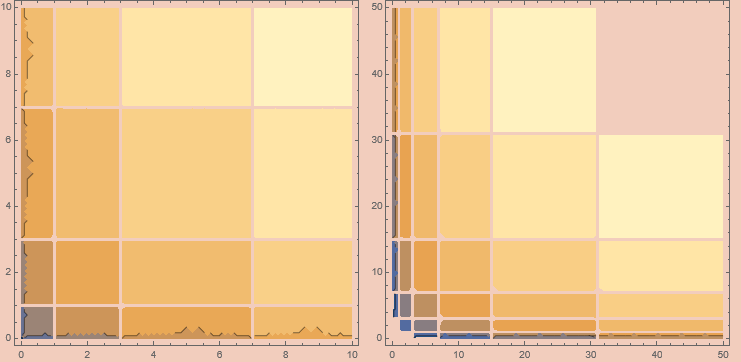
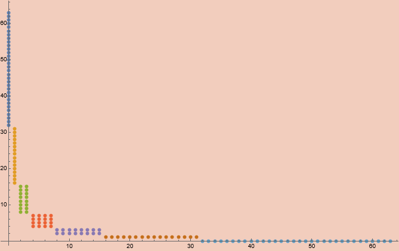


I've talked a lot about pairing functions on this blog. I've tried using them in a bunch of different projects, but I've frequently made the observation that they are often unexpectedly inefficient. As an example, the simplest paring function is just the bit-interleaving function which pairs two numbers by interleaving their bits. Algorithmically, you can't get much simpler, and the pairing also seems fair in that it packs both numbers equally tightly. For a long time, I thought that was enough, but I've come to realize it isn't. Consider the case of paring a large number with a small one, say 1,000,000 with 1. The binary for both is 11110100001001000000 and 1, respectively. The paired number will be 101010100010000000001000001000000000010, or 365,340,921,858 in decimal. Notice what happened to the size; it's nearly double that of 1,000,000 despite 1 not having nearly that much information.

This becomes a big problem with iterated products. In recursive data types, it's often the case that pairings are made between very lop-sided numbers. In such a case, these inefficiencies compound creating encodings for recursive data types which are often much, much larger than expected.

I mentioned the following paper before;

- [Efficient Pairing Functions - and Why You Should Care](https://www.researchgate.net/publication/220181086_Efficient_Pairing_Functions_-_and_Why_You_Should_Care) by Arnold Rosenberg

In section 3.2.3 an optimal pairing function is given. Essentially, we just make shells out of equations of the form `x * y = s`. It's quite elegant, but it's not feasible since decoding requires integer factorization. My goal in this short post is to describe a new pairing function that is both optimal and feasible.

To begin with, the information held between two numbers is simply the sum of the bits in both of those numbers. Ideally, a pairing will add a minimal amount of information over that. To that end, an optimal pairing function should send any pair of numbers with the same number of bits to an encoding with a similar number of bits. We can use this to define our shells.

As a bit length function, I'll use the following;

```mathematica
length[x_] := Ceiling@Log[2, x+1]
```

Our shells will be made of numbers `x` and `y` which satisfy

```mathematica
length@x + length@y == s 
```

for some shell `s`. We can plot these shells using a contour plot;



While these shells may seem a bit intimidating at first, they are actually quite tame. The `s`th shell has `2^(s - 2) (3 + s)` members. This immediately gives us part of the necessary puzzle for our implementation. Given two numbers, `x` and `y`, their shell will be

```
Ceiling@Log[2, x + 1] + Ceiling@Log[2, y + 1]
```

and, assuming we have some function `encodeShell` which can encode a pair into some canonical position within a shell, we can slide over that position by the sum of all smaller shells to get the final encoded number. Note that;

```
Σ(i=1; s) 2^(i - 2) (3 + i) = 2^(s - 1) (2 + s) - 1
```

so we can implement our encoder as

```mathematica
encodeOpt[{0, 0}] := 0
encodeOpt[{x_, y_}] :=
 Block[{s},
  s = Ceiling@Log[2, x + 1] + Ceiling@Log[2, y + 1];
  encodeShell[s, {x, y}] + 2^(s - 2) (1 + s)
  ]
```

Note that the `s`s are adjusted to refer to all the previous shells rather than the current one.

In the other direction, if we have a number, `n`, which we want to decode as a pair, we can figure out which shell it's in by repeatedly subtracting shell sizes from `n` until `n` is smaller than a given shell. To compute this more efficiently, we can note that the inverse of the above sum function is

```
W(8 (1 + x) ln(2))/ln(2) - 2
```

where `W` is the [Lambert W function](https://en.wikipedia.org/wiki/Lambert_W_function), called `ProductLog` in Mathematica. Using the ceiling of this, we can immediately figure out the shell any given input is in.

```mathematica
decodeOpt[0] := {0, 0}
decodeOpt[x_] :=
 Block[{s, xp},
  s = Ceiling[FullSimplify[ProductLog[8 (1 + x) Log[2]]/Log[2]]] - 2;
  xp = x - 2^(s - 2) (1 + s);
  decodeShell[s, xp]
  ]
```

the `decodeShell` function will decode a shell given some canonical position within that shell.

The shells themselves are where things get complicated, though thankfully not too complicated. If we look at an example shell (s = 7), we can note a few things;



Firstly, we can see two outlying groups of points which have twice as many points as any other group. All other groups have the same number of points. These facts can be expressed by noting the shell size can be reexpressed as;

```
2^(s - 2) (3 + s) = (s - 1) 2^(s - 2) + 2 2^(s - 1)
```

This shows that the outer two groups are of size `2^(s - 1)` while all the remaining `s-1` groups are of size `2^(s - 2)`. Motivated by this, we can split our encoding and decoding tasks into two different tasks, one which deals with the inner groups and the other which deals with the outer groups. Based on this, I've decided that the initial numbers in any given shell will be mapped to the outer groups.

The outer group condition triggers when either of the numbers is `0`. If it's in the group which is encoded first in the shell we need to lower the actual coordinate into a canonical coordinate. The outermost families are `2^(s-1)` units from `0` so we must subtract that out from the nonzero coordinate to get the position within the shell.

The second outermost group will have the same displacement, but it will also occupy the positions immediately after the first outermost group. Since the first outermost group is of size `2^(s-1)`, this will be added to the coordinate to get the position within the shell. However, that same number is also subtracted, for the same reason it was for the first group. Since these cancel, we can return the nonzero coordinate immediately in this case.

If we are dealing with the innermost families, we need to identify the inner group, identify the canonical coordinates within that group, the position within that group, and then finally use that to get the position within the shell as a whole.

The group can always be identified by the length of the `x` coordinate. This is because each inner group is twice the height of the next inner group. This leads to a clean way of identifying the group based on the ceiling-log-base-2 of `x`.

Our goal is to place the coordinate somewhere within a linear ordering of the points within the group. To do this, we can slide all the coordinates down so the group hugs zero. We can do this by subtracting `2^g`, which is also the height of the group, from `x` and `2^(s - 2 - g)`, the width of the group, from `y`. If `x` and `y` are in the bottom-left corner of the group, this will reduce both to `0`. If they are in the top-right, they will be one less than the width and height of the group. We can then represent the linear position within the group as the linear combination `2^g y + x`. The position within the shell is then the sum of this with `g 2^(s - 2)` (the number of inner-group positions before the current group) and `2^s`, the size of the outer groups.

Despite all this explanation, the actual implementation is quite simple;

```mathematica
encodeShell[s_, {x_, y_}] :=
 Block[{g, p, xp, yp},
  Which[
   x == 0, y - 2^(s - 1),
   y == 0, x,
   
   True,
   g = Ceiling@Log[2, x + 1] - 1;
   xp = x - 2^g;
   yp = y - 2^(s - 2 - g);
   p = 2^g yp + xp;
   g 2^(s - 2) + p + 2^s
   ]]
```

Going the other direction is fairly straightforward;

```mathematica
decodeShell[s_, p_] :=
 Block[{t, g, pp},
  If[p < 2^s,
   t = 2^(s - 1) + Mod[p, 2^(s - 1)];
   If[p >= 2^(s - 1), {t, 0}, {0, t}],
   
   t = p - 2^s;
   g = Floor[t/2^(s - 2)];
   pp = Mod[t, 2^(s - 2)];
   {2^g + Mod[pp, 2^g], 2^(s - 2 - g) + Floor[pp/2^g]}
   ]]
```

we can test these functions with a battery of inputs. For example;

```mathematica
In > n = 3;
In > Range[0, 2^(-2 + n) (3 + n) - 1];
In > Table[decodeShell[n, %[[x]]], {x, 2^(-2 + n) (3 + n)}]
Out>
 {{0, 4}, {0, 5}, {0, 6}, {0, 7}, {4, 0}, {5, 0}, {6, 0},
  {7, 0}, {1, 2}, {1, 3}, {2, 1}, {3, 1}}

In > Table[encodeShell[n, %[[x]]], {x, 2^(-2 + n) (3 + n)}]
Out> {0, 1, 2, 3, 4, 5, 6, 7, 8, 9, 10, 11}

In > % == %%%
Out> True
```

and

```mathematica
In > Range[0, 20];
In > Table[decodeOpt[%[[x]]], {x, 20}]
Out>
 {{0, 0}, {0, 1}, {1, 0}, {0, 2}, {0, 3}, {2, 0}, {3, 0}, 
  {1, 1}, {0, 4}, {0, 5}, {0, 6}, {0, 7}, {4, 0}, {5, 0},
  {6, 0}, {7, 0}, {1, 2}, {1, 3}, {2, 1}, {3, 1}}

In > Table[encodeOpt[%[[x]]], {x, 20}]
Out> {0, 1, 2, 3, 4, 5, 6, 7, 8, 9, 10, 11, 12, 13, 14, 15, 16, 17, 18, 19}

In > % == %%%
Out> True
```

This specific implementation isn't actually that efficient, mainly due to how I used `ProductLog`. Mathematica evaluates it purely symbolically, but I only need its ceiling, which I suspect is theoretically efficient to calculate, though I haven't researched that yet. Beyond that, I'm pretty satisfied with this and will take it into future projects with confidence.

To wrap back to the example at the begining of this post, pairing 1,000,000 and 1 now produces 24,068,672, which is much more reasonable.

...

There is a further simplification we could make. Noting that the outer families only exist because we're directly considering 0, we could remove them from the encoding by only considering numbers greater than 0. This means we only need the code for the inner families. Doing this yields;

```mathematica
encodeOpt[{x_, y_}] :=
 Block[{s, g, xp, yp, p},
  g = Ceiling@Log[2, x + 1] - 1;
  s = g + Ceiling@Log[2, y + 1];
  xp = x - 2^g;
  yp = y - 2^(s - 1 - g);
  p = 2^g yp + xp;
  g 2^(s - 1) + p + 2^(s - 1) (s - 2) + 1]
decodeOpt[x_] :=
 Block[{s, t, g, pp},
  s = Ceiling[FullSimplify[ProductLog[Log[2]x/2]/Log[2]]] + 1;
  t = x - 2^(s - 1) (s - 2) - 1;
  g = Floor[t/2^(s - 1)];
  pp = Mod[t, 2^(s - 1)];
  {2^g + Mod[pp, 2^g], 2^(s - 1 - g) + Floor[pp/2^g]}
  ]
```

we can then get codings that cover 0 by pre and post composing with successor and predecessor functions;

```mathematica
encodeOpt0[p_] := encodeOpt[p + 1]
decodeOpt0[x_] := decodeOpt[x] - 1
```


