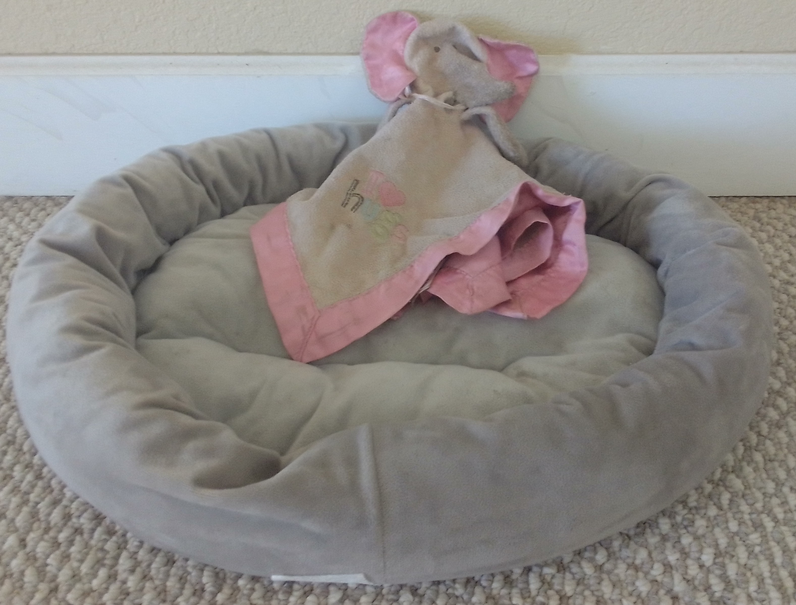
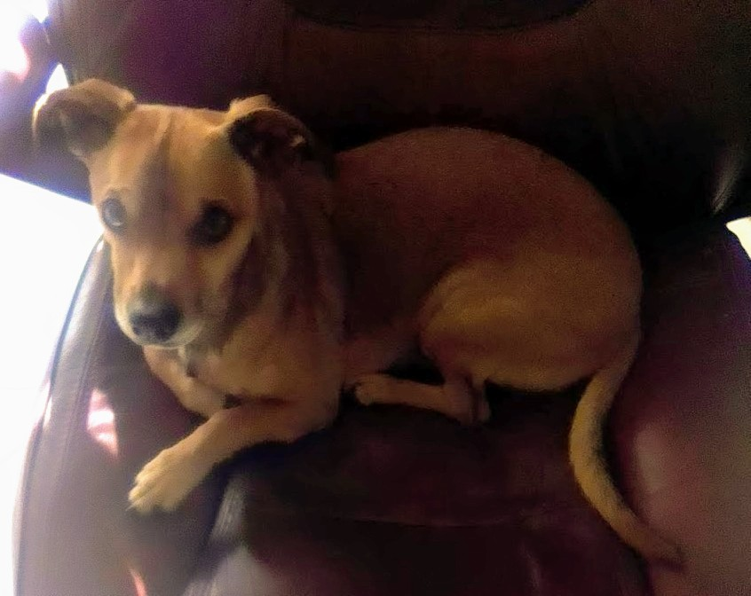
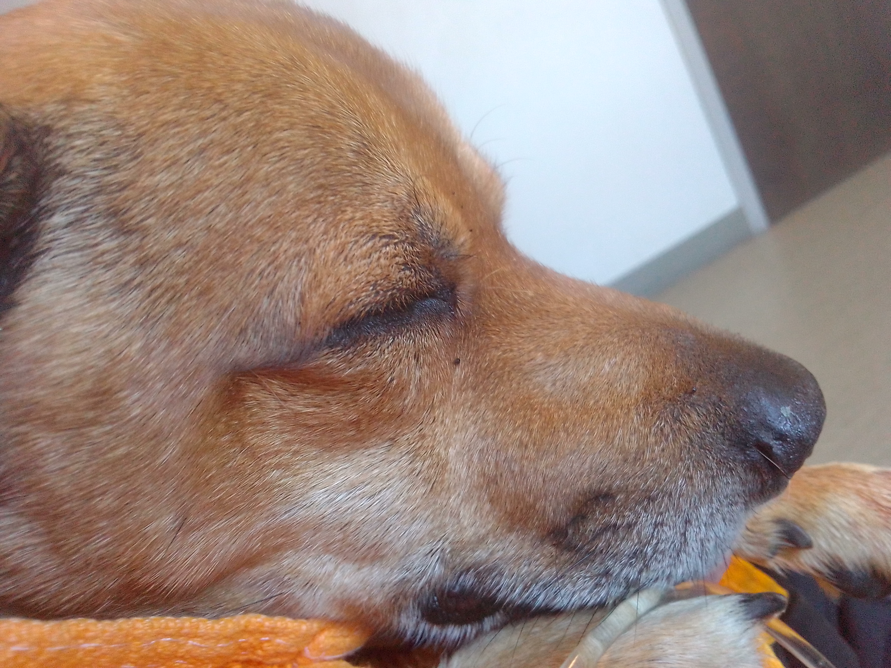

 

About four months ago, my dad came to my home with a dog in tow. I had met the dog before, when it was a young puppy, but not for over a year. He had a beautiful, iridescent, brown and gray coat that looked a bit purplish in the right light. He had distinct, pale yellow eyes, allowing you to easily tell what he was looking at. I think he was a pointer, but that was honestly just a guess. He was medium sized; small enough to carry if you had to, but not comfortably. That dog belonged to my step-mother's mother. She has a babysitting business, and apparently the dog had bitten one of the children, although it apparently didn't draw blood and my dad thought the woman was overreacting. She'd asked him to get the dog put down, but instead he gave it to me. That dog's name was Thor.

At first I was honestly rather annoyed. I'm a loner by nature. Outside of obligation, I rarely go out of my way to talk or interact with anyone. My aunt once described me as the ideal person to give secrets as I had noone to tell them to. I like my routine, I like being alone, and Thor was a needy dog, and not one quick to trust.

Thor was suspicious of everyone in the house, me especially as he clearly didn't remember me. I tried making him as comfortable as I could to smooth out the transition, but he wasn't having it. For the first week, he wouldn't interact with anyone. He had a shock collar on when he came. Early on, I used it's screeching sound, but never its shock, to get him to behave. I didn't like the collar, but he wouldn't let anyone close enough to take it off. A few days after he arrived, I tried doing it quickly, and that was the first time he bit me. I didn't blame him; he was scared and everything was new, but I had the mark of that encounter for months. Even now, there’s a dent in my fingernail from that bite mark. I also wasn’t able to get the collar off.

After about a week, he started approaching me. He really wanted to sleep next to someone. When my dad would come over and take a nap, Thor would often lay next to him, but ran away when my dad turned to him. Eventually he did that to me. I was sleeping in bed, and he jumped up. I found this surprising, and when I looked at him, he became startled and jumped back down, staring me down from my bedroom doorway. I deliberately ignored him, and he eventually jumped up again. He didn’t cuddle that time, but he wanted to know that someone was next to him as he slept.

He was much more comfortable with me after sleeping the whole night next to me. He started jumping into my office chair. He didn’t want too much contact. If I tried petting him, he'd immediately jump out, and eye me suspiciously. After a few days of this, I tried my hand at removing the shock collar again, and succeeded without incident. He sniffed the thing after it was off, but I don’t know if he understood the significance.

I have another dog in the house, a chihuahua-terrier mix named Bender. Bender was all over Thor when they first met. Bender kept trying to hump him, for over two weeks. Eventually he gave up, but I don’t think Thor had a very positive opinion of Bender after that.

One day, both Bender and Thor were following me around the kitchen as I prepared food. Bender started to beg, and Thor just attacked him. Bender was not seriously hurt, but his mouth was bleeding afterward. My dad freaked out at this, and locked Thor in a large dog cage we already had. He was huffing and puffing about getting rid of him, about putting him down, etc. I thought he was overreacting. Thor was young, still learning, and he’s only a dog, anyway. The next day, after my dad had an opportunity to cool down, he agreed.

This was the start of a trend with Thor. He became very jealous and protective of me. All his worst moments came from him attacking others who were approaching me. This happened two or three other times with Bender. The worst was when Bender approached me as we were going to bed. Unlike Thor, Bender’s too small to jump onto my bed, so he comes to me every night so I can pick him up. One night, Thor freaked out and gnawed Bender’s thigh. Bender, again, wasn’t seriously injured, but in the moment it looked like a mauling. I distinctly remember shouting “Oh my god!” at the top of my lungs as I tried separating them. I did and Bender ran into the backyard and I put Thor in the cage. That was one of only two times I kept him in that cage overnight. The thing he liked least was sleeping alone; he learned quickly and never attacked Bender again after that. But Bender was mentally scarred. I had to track him down, hiding in the yard. From that day forward, Bender refused to approach Thor, and I even had to make separate bowls of food and water for Bender since he wouldn’t go near Thor’s food. Bender would often refuse to come indoors, wanting to be as far from Thor as possible. It wasn’t good.

In his more positive moments, Thor was extremely playful. He always wanted attention; he wanted to run. I have a big backyard and indulged him on a few occasions. He'd always stare at me in my office chair in an extremely polite-looking expression of desire until I'd finally stand up. He’d then run at top speed away from me, looking behind periodically to see if I was still there. He almost never had anything to show me, he just wanted someone he liked to be at his back.

By far the most fun he had was when I’d chase him. He’d always love getting chased around the house, which was shaped somewhat like a doughnut, allowing for us to just run in a circle if we wanted to. Of course, I’d often trick him, going backwards to see his surprised reaction when he found himself running at me instead of away. I can see him now, waving his front paw in the air with a goofy, excited doggy smile, standing on his hind legs, waving his muzzle through the air, giving off an adorable, playful ruff. I cherish those moments so, so much.

He had a few toys he played with to death. One of his favorites was a little blanket with an elephant-doll stitched onto it. Inside of it was a jingly toy. Thor loved playing tug of war with it, and he loved trying to tear it up. I tried playing fetch with it, which worked to some extent. It was a blanket, so it wasn’t the most aerodynamic thing ever. But Thor would run the little distance it made and bring it back to me all the same. Eventually, Thor tore the elephant part open, revealing the plastic puck with metal beads that made a jingling sound. I found out about this when he brought me the puck, expecting to play fetch with it. I had to connect the dots to see it was from the blanket. The puck was definitely better for throwing, but it didn’t last long before Thor shattered the plastic. For two weeks, I found plastic chunks all over the place, and I still find small metal beads to this day. Even after that, we still played tug-a-war with the blanket.

Another dog which frequently stays at my home is a little chihuahua named Lola. She’s a super playful and high-energy dog. Thor would sort of play with her, but it didn’t go much beyond chasing her around a bit. He did not like playing with other dogs, generally. One day, while playing tug-o-war with the blanket, Lola tried joining in. Thor glowered at her, and I tapped him on the head to get him to stop. Eventually he had enough, and bit Lola, but I was able to separate the two before anything really happened. After putting him in a cage he finally learned to stop biting the other dogs and he never did again.

Over the next few months he started getting alongish with Bender. Bender loves my dad and would follow at his feet wherever he went when he was over. My dad didn’t care if Thor followed him around, and Bender gained confidence around my dad, and eventually noticed that nothing bad was happening when he was near Thor. Eventually he tried to eat from Thor’s bowl and noticed that nothing bad happened either. I don’t think Bender ever really liked Thor; he’d still growl at Thor if he ever tried laying next to Bender when he was trying to sleep, but they grew to tolerate each-other. Both became fixtures in each other's lives. Bender never had any qualms about following Thor into "battle" if he ever started barking and chasing after something.

His favorite toy was a green ball. He absolutely loved that thing, and it was the perfect thing to play fetch with, which is why I suppose it's a classic. Unfortunately, it ended up going everywhere, and frequently got lost, requiring me to track it down. I often found it floating in the pool. I know that Thor can swim since, one night while he was following me but it was too dark to see clearly, he tripped and fell in the pool only to quickly swim out. He didn't seem scared or anything, but he never went into water if he didn't have to. Instead, if he noticed the ball was in the pool, he'd stand on the edge and bark until he got my attention. Whenever he got that ball back he had the happiest face you can imagine on a dog. Oddly, it seemed like it was hard for him to see. If I threw it and it landed in clear view, thor was rarely able to track it down. Maybe the colors blended into the rocks in dog vision, or maybe he just had really bad eyes, but I don't know. I often would have to walk to get the ball myself whenever I'd throw it. Even pointing directly to it didn't help him as he'd just sniff around it until I kicked it and he could finally see it rolling. Maybe it's not surprising how often he lost it.

He was still uncertain around strangers. He’d bark endlessly at anyone new who’d enter our house. Usually I’d lead him outside and just run in circles with him. With that, he had something more important to do than worry about a house guest. But some people he had to be good around. The last new person he ever met was my grandmother. I held him up to her, trying to get him comfortable. It worked, mostly. He eventually was okay with her being nearby, but he never understood her place when she was in the household. The last time she visited, Thor bit her leg; not as a sign of aggression, but as a dominance display. She did bleed a little, but clearly Thor wasn’t intending on real damage. Still, he was punished and put in his cage for a few hours. That was the last time I ever punished him for anything, and I never got to know if he learned the lesson I was trying to teach.

One time, when Thor was following Dad into the warehouse on our property, my dad accidentally shut the door on him. Eventually I started wondering where he went and investigated the warehouse only to find Thor chewing through the wall. The wall was mostly insulation, so I think he honestly might have gotten through, eventually, but he made a big mess for me to clean. Dad forgot Thor there a couple of times. Whenever it happened, Thor would come by my side and wouldn’t leave it for anything. He desperately wanted to know he wasn’t alone. I certainly never forgot him.

Thor had a rather humorous disposition against small animals. Whenever a rabbit would chew on the fern outside one of our windows, he’d make sure to start barking so everyone would know of this gross violation. The rabbits never cared, though. Thor would also chase any rabbits, quails, or whatever he found into a hidyhole or off the property.

On two separate occasions, he actually chased some birds into the house. The first time, the bird perched on a kitchen window, and I had to simply open the window to let it out. On the second occasion, it was two birds who landed on windows which couldn’t be opened. One of the birds quickly wizened up and flew out an open door, but the other stayed. I had to get the bird myself, but it was a trial, as every time I was close to getting it, Thor would scare it off to one of the other windows. When my dad finally stomped out of his room, woken from a nap by the noise, he looked at the scene, initially angry, only to laugh at the absurdity of the situation.

On another occasion, he became obsessed with a rat which has been living in different parts of our yard for months. When Thor smelled that rat he went crazy. On several occasions, he coaxed me to follow him to a wood pile that the rat was living in. There wasn’t much I could do, as I cared more about keeping the wood pile in order than getting rid of the rat. So all I could do was pat him as he paced around the pile, barking and whining.

My dad saw an opportunity to catch the mouse when we were getting rid of an old hot tub. The rat had been living there, among other places. My dad replaced the tub with a wood pallet, set a mouse trap underneath, put cheese on the trap, and surrounded the pallet with rubber fencing to prevent the dogs from getting at it. Unfortunately, Thor could smell the cheese, and he decided to pull out one of the rubber fences, dig under the pallet, and get the cheese. He got it alright, along with a mouse trap to the face. He was fine, but it did draw blood and gave him a squint in one of his eyes for a few days. The rat remains at large.

Despite all of that, Thor never actually killed another animal. He only chased, but he never caught anything. The closest was a time he brought in a quail egg. I tried getting the egg from his mouth, but instead he threw the egg on the ground, splattering the yolk. Thor then proceeded to lap up the yolk and shell, swallowing all.

Thor had an interesting relationship with food, as most dogs do. He tried to eat anything he could. One of the very first things I put him in his cage for was him swiping some chicken wings right off my plate when I got up from my desk. He chewed through the whole thing, bones and all. After that, he became more obedient, patiently waiting for me to give him some food. For anything that didn’t have onions or something else bad for dogs, I would let him lick my plate.

I would often go for walks, sometimes picking up something along the way. Every time I’d arrive home, he'd be at the window, barking excitedly, as if I hadn’t seen him in a week even if it’d been less than an hour. A few times, I picked up chicken or ribs, and I gave the bones to Thor to chew on. Oddly, he’s the only one of the dogs to like chewing on bones, and he destroyed them completely.

Most of the time we’d simply sit together. He’d always be with me, laying either across my lap or along the back of my chair, forcing me to only use the edge. I always worried that this might cause back problems from the awkward posture, but I rarely did anything about it. On the few occasions that I simply swapped to a different chair, still within arms reach, Thor was not long to follow.

Whenever things would get late. He’d come up to me, sticking his front paw on me for support as he stood up, expecting to go to bed. I can feel his paws on my thigh right now. I can see his face, yawning up at me with an "eee-yaho!", wondering what we’ll be doing for the rest of the night. Whatever it was, me working, us playing, watching a movie, going to bed early; he’d be right next to me, as if there was nothing more to do in his world. I felt his warmth more than any other being in my life. He was a persistent partner, in life, in rest, and in sleep.

One night while laying in bed, Thor went outside, like he usually does every night, typically to go to the bathroom and make sure there aren't any late-night visitors. When he returned, around 3:30 AM, I patted his side like I usually do. This time I felt something slimy on his fur. I had no idea what it could be, maybe quail egg yolk. At the same time, the other two dogs in bed with me started barking desperately. I also didn’t want him getting my bed dirty, so I got up and turned on the lights. All I saw was pink across Thor’s right side. I already knew what that meant, but I had to put in contacts to see it more clearly. He didn’t have skin on his right side. I was feeling the muscle and fat that was supposed to be under his skin. It was the most fucked up thing I’ve had happen in my life. At the moment I think that an attack from some kind of bird of prey is most likely, but I'll never be sure.

I don’t want to get into the details after that, but it was gory. It was so damned hard seeing him like that. I eventually got him to an animal hospital where they were able to stabilize his vitals. But I didn’t know what would happen. A nurse informed me that “he wasn’t bleeding anymore” which wasn’t really encouraging considering the nature of his injury.

I went home and tried sleeping after that. When I woke up, I called the hospital and got feedback moving forward. There was no way surgery could close up the hole, it was simply too big, but Thor could, in theory, heal his skin back with months of very hard recovery. The doctor never mentioned euthanasia explicitly, but it was an obvious answer. This was the first time I started crying over him; it was here that I started to believe he wouldn’t make it, even if the doctor didn’t say so explicitly.

I called the rest of my family to get some feedback on what to do. I had a hard time describing the extent of his injury. I don’t think any of them had seen an animal hurt as bad as Thor was, and I had to step them through what I saw to get them to understand the extent of the trauma. After that, all of them suggested euthanasia, but for reasons which sounded selfish to me. We had plans moving forward, for the next few months. Obviously, taking care of a seriously injured dog for months, while moving, on top of everything else was too much to justify. My dad pointed out that that all would be hard on Thor, which was true, but sounded like a rationalization to me.

I wasn’t sure what I was going to do. I felt, in my heart of hearts, that euthanasia was the wrong choice. Thinking about what I’d think of myself moving forward, I knew that future me would think of euthanasia as a reasonable choice, but not the right choice. I knew I’d live to regret it, even if it made my life and my family’s better in the long run.

Dogs are bred to give humans an almost unconditional loyalty. Taking advantage of that morally obligates us to respond with kindness and support. Would I be doing that if I didn’t try healing him, despite the difficulty on my end? Duty is supposed to be heavy, after all. I wasn’t completely decided, even as I went to the animal hospital for what might be my last time with Thor.

I never take pictures. Not of me, nor almost anything around me. As someone who doesn't really use social media, my life’s fairly undocumented. A result of this is that I had no pictures of Thor. I needed to take one, while he was still alive. I imagined taking a picture, one of his smile, one of him playing tug-o-war with that elephant blanket (which I brought in my pocket) one last time. After his death, I did eventually find one other photo I took of him to send to my grandmother, back when he first started sitting in my chair with me, but I didn't remember it at the time.

While riding, I started regretting not finding his green ball, which was still lost from wherever he put it last. I also remembered I had fried chicken in the fridge, and I suddenly wanted to give it to him so badly.

In the few minutes I was in transit, Thor’s condition had gotten much worse. Apparently his trachea was punctured, but that wasn’t clear up to that point. According to the vet, his prognoses looked much, much worse and she recommended euthanasia as the best option.

I was convinced. I know that euthanasia was the right choice, but in the back of my mind I still feel like I might have been thinking more of me and my future plans; that I might have made the right choice, but for the wrong reasons. At the very least, I don’t regret the choice itself.

As he was put in my arms, it was clear that what I imagined was never going to happen. He was too sedated and too injured. When he was put in my hand, he stared at me with the widest eyes he could muster. It’s hard to read a dog’s emotions, but I like to think he found contentment in my arms, as he closed his eyes and relaxed.

The picture I took was him with his eyes peacefully closed, alive but never to open again. That was his face at the end, but that’s not the face I remember. I remember his eyes open and attentive, smiling, excited, curious. He was ready to see it with the widest eyes you’ve ever seen on a dog, ready to be surprised by all the world had to show. But that wasn’t possible anymore. The last thing he saw was me, my face. Like any loyal dog, it’s not an exaggeration to say I became his whole world; I just wish there was more I could give him. My one regret near the end is not rubbing my cheek against his head before he passed, but at least I held him and kissed him. He knew I was there, and from what I know of him, that’s all he ever truly wanted.

The doctor euthanized him as he was still in my arms. When I heard those words, “he’s gone”, I began uncontrollably sobbing. I already cried so much, knowing this moment would come, but this was it, at last. I haven’t cried that hard since I was a child. She left, apologizing that I had this happen to me, but I was too incoherent to respond.

After I calmed down, his body was still in my arms. I’ve heard from people that rigor mortis sets in very quickly, but that didn’t happen. His body was still soft and flexible for several minutes. When I patted his head, it was colder than I’d ever felt it. Despite that, I foolishly saw and heard things which might indicate life, but the apparent breathing I heard was just distorted birds from out the window, and the apparent heartbeat I saw was my own heart beat shaking his body. Eventually I accepted it, and gave his body to be cremated.

I brought home the carrier that he was in and set it where the other dogs could see it. I couldn’t smell Thor, but I’m sure the other dogs could tell it smelled like Thor and blood. I don’t know if dogs have any understanding of grief and mortality. I don’t think they’re feeling the loss of Thor like I am. Lola began barking for several minutes after smelling the carrier. Obviously, I don’t know what was running through her head, but I picked her up and hugged her close, which made things a bit better. They do understand that I’m not in a great state. They’re both sitting next to me as I type and work. They aren’t cuddling as long or as much as Thor did, but it’s more than usual. It doesn’t make anything alright, but things are better, and I love them and appreciate them all dearly.

It hurts, writing all of this. But I need this down. I need to put this down. It’s hard to believe he’s gone. He came into my life, unwanted and resented; but he became a part of me. I want to remember him, warts and all. He was still young and learning. He wasn’t a perfect dog, but he was a good dog, getting better every day and I miss him more than I could possibly express in words. I find myself instinctively calling out his name when I’m talking to a different dog. Every time I get up from my chair, I sit back down on its edge to make room for Thor.

 

 

To Thor: 2018—May, 5th. 2022

I love you, my sweet, beautiful boy.
