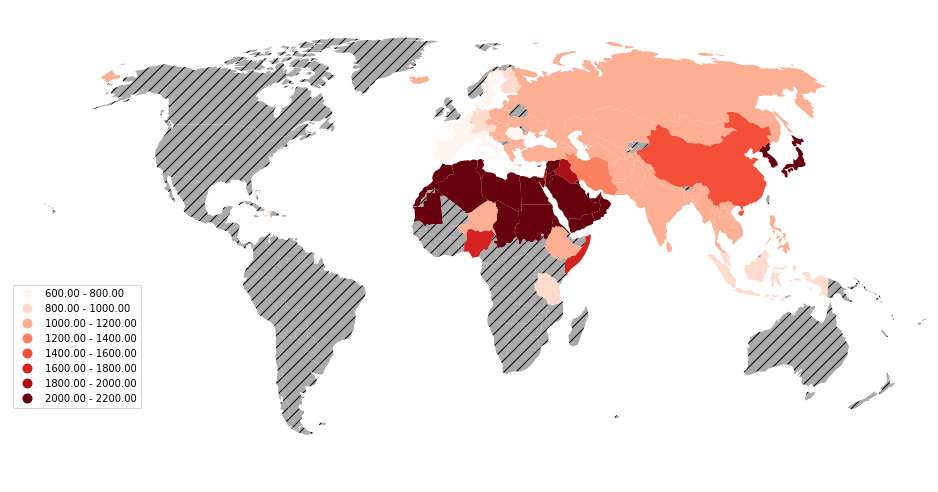

What's the most difficult language to learn? The answer will depend on what languages you know already, but since I'm writing this in English, let's assume that's all you know. In that case, there's a handy database maintained by the [Foreign Service Institute](https://www.atlasandboots.com/foreign-service-institute-language-difficulty/) which tells you how long it takes for an English speaker to learn a variety of languages. It's hardly exhaustive, bit it includes just about every languages that can be considered "major".

The answer to the initial question is Japanese, for the record; restricted to the languages within that database, of course. But, why? There are lots of things we could point to; its morphology, it's grammar, it's semantics. But there are other hard languages as well; Arabic is notoriously hard to learn, and yet it's very different from either Japanese or English. What things, truly, make a language hard to learn? That's what this post is going to explore.

- [Boilerplate](#heading)
- [The World](#heading-1)
- [Subjects, Objects, Verbs](#heading-2)
- [Gender](#heading-3)
- [Goodbye!](#heading-4)

## Boilerplate

Throughout this post, I will be making use of two datasets. Firstly, [this](https://data.world/dataremixed/language-difficulty-ranking) version of the FSI data put into a nice csv file, and secondly, [this](https://wals.info/download) database version of the Atlas of Language Structures. With these, we might be able to draw conclusions about what makes languages more or less difficult to learn.

Firstly, some housekeeping! For reference, I will be using [python](https://www.python.org/), [pandas](https://pandas.pydata.org/), [geopandas](http://geopandas.org/), [matplotlib](https://matplotlib.org/), and [scipy](https://www.scipy.org/) for my analysis here.

```python
import matplotlib.pyplot as plt
import pandas as pd
import geopandas as gpd
import scipy.stats as stats
```

The two datasets aren't completely compatible, and, as such, some changes need to be made to combine them. I will call the initial difficulty `diffDf`, rename it's language name column, and rename a few entries so that it can be combined with the ALS database.

```python
# Import and clean database of language difficulties.
diffDf = pd.read_csv("3r.csv")
diffDf = diffDf.drop(['category', 'title', 'description'], axis=1).rename(columns={'language':'Name'})
# Fix the two oddly formated entries
diffDf.loc[65,'Name'] = 'Cantonese'
diffDf.loc[66,'Name'] = 'Mandarin'
# Fix languages with different names between databases
diffDf.loc[24,'Name'] = 'Persian' # Was Farsi
# Note: Kyrgyz is on the diff list but not the lang list [37]
diffDf.loc[42,'Name'] = 'Khalkha' # Was Mongolian; Khalkha is the only dialect of Mongolian on the lang list.
diffDf.loc[47,'Name'] = 'Serbian-Croatian' # was 'Serbo-Croatian'
diffDf.loc[50,'Name'] = 'Slovene' # was 'Slovenian'
diffDf.loc[53,'Name'] = 'Tajik' # was 'Tajiki'
diffDf.loc[60,'Name'] = 'Ukrainian' # was 'Ukranian'
```

I will then load the ALS dataset into a dataframe calle `landDf`.

```python
langDf = pd.read_csv("language.csv")
```

The ALS dataset includes many languages; many of which are dialects of other languages. Whenever a language is a dialect of another language, it's denoted "Language (Dialect)". For instance, Egyptian is listed as "Arabic (Egyptian)". The difficulty dataset isn't as granular. I decided to assign each dialect the difficulty of the language proper listed in the FSI dataset.

Now, is it a principaled to assume that every dialect of a language has equal difficulty of learning? No, probably not...

In order to pull off this merge, I wrote a function to detect if a language from the ALS database appears in the FSI database.

```python
# If a language is in the difficulty table, say where
def present(x):
  result = -1
  for i in diffDf.T:
    if x.startswith(diffDf['Name'][i]):
      result = i
  return result
```

I then systematically filter the ALS database, removing languages that don't have difficulties, and adding columns for learning times for everything else.

```python
# Fill in the time, accounting for dialects
for i in langDf.T:
  checkPresence = present(langDf['Name'][i])
  if checkPresence == -1:
    langDf = langDf.drop(i)
  else:
    langDf.loc[i, 'weeks_to_achieve_goal'] = diffDf['weeks_to_achieve_goal'][checkPresence]
    langDf.loc[i, 'class_hours'] = diffDf['class_hours'][checkPresence]

langDf = langDf.reset_index()
```

Note that this also gets rid of English as a column, so before running that, I took out the English row for later reference.

```python
english = langDf[langDf['Name'] == "English"].copy()
```

## The World

Well, now that we have a dataset, let's do the most obvious thing. Plot the world! The ALS dataset contains country codes for where its languages come from. We can use those to see where the most difficult languages come from. However, they aren't in the right format. Some of the languages list multiply country codes. To fix this, I must create a new dataset with the individual country codes connected to the difficulties.

I start out with a dictionary that I can use to map the country codes to the difficulty of its languages. For each listed language and for each country code listed for each lanugage, if the country isn't already in the dictionary, add it along with its difficulty; if it is then update the mean difficulty using the new refference.

```
count_dict = {}

for i in langDf.T:
  newKeys = langDf['countrycodes'][i].split()
  newHours = langDf['class_hours'][i]
  for key in newKeys:
    if key in count_dict.keys():
      count_dict[key] = ((count_dict[key][0]*count_dict[key][1]+newHours)/(count_dict[key][1]+1), count_dict[key][1]+1)
    else:
      count_dict[key] = (newHours, 1)
```

Now we convert the dictionary into a new dataframe by first converting it into an array, then casting it.

```
newDF = []

i=0
for key in count_dict.keys():
  newDF.append([key,count_dict[key][0]])
  i+=1

count_hours = pd.DataFrame(newDF,  columns=['countrycodes','class_hours'])
```

A bit annoying, but not too hard. But now I need to plot this out. I need a shape file for the earth. A good source is [naturalearthdata.com](aturalearthdata.com). In particular, the [100m data](https://www.naturalearthdata.com/downloads/110m-cultural-vectors/) will work fine for my purposes. This data can be loaded using geopandas.


```
shapefile = 'ne_110m_admin_0_countries.shp'

gdf = gpd.read_file(shapefile)[['ISO_A2', 'geometry']].to_crs('+proj=robin')
#Fix France
gdf['ISO_A2'][43]='FR'
```

This will give us a large database with lots of entries. One of them, the main geometric data, is a polygon describing the geometry of the country. The other column we're interested in is the `ISO_A2` column, being one of several columns giving country codes. That one contains the ISO alpha-2 country codes, the same codes that the ALS database uses. We can easily merge these together using that column.


```
merged = gdf.merge(count_hours, left_on='ISO_A2', right_on='countrycodes', how = 'left').drop(159)
```

Row 159 contains Antarctica. Since it just takes up space on our map, I decided to simply drop it.

At this point, we can get on with out plotting. In particular, we'll be plotting two layers. The first layer will plot our data, the second will plot any country who's data is missing.


```
ax = merged.dropna().plot(column='class_hours', cmap='Reds', figsize=(16, 10), scheme='equal_interval', k=9, legend=True)

merged[merged.isna().any(axis=1)].plot(ax=ax, color='#aaaaaa', hatch='//')

ax.set_title('Hours Needed to Learn Language by Country of Origin (Averaged)', fontdict={'fontsize': 20}, loc='left')

ax.set_axis_off()
ax.set_xlim([-1.5e7, 1.7e7])
ax.get_legend().set_bbox_to_anchor((.12, .4))
ax.get_figure();
```




Shoutout to Ramiro Gómez and his [helpful tutorial](https://ramiro.org/notebook/geopandas-choropleth/). So many choropleth guides overcomplicate things with interactivity and way too many extranious libraries, but I found this one to be just right.

Now that we have this plot, we can notice a few things. The hardest languages are concentrated in two places; firstly in the far east within Japan and Korea, and secondly spread throughout northern Africa and the Middle East. That second area is so dark mostly due to different dialects of Arabic. We can also note that the easiest languages tend to group in europe, close to England. Not surprising, as these are where the languages most similar to English are concentrates.

We can also notice that there's lots of missing data. Few major languages come from the Americas, Australia, or southern Africa, and, as a result, information on the difficulty of languages from there isn't as easy to find. Or, at the very least, the FSI didn't bother to find it. 

## Subjects, Objects, Verbs


## Gender


## Goodbye!


Well, we certainly learned a lot today. I mean, nothing that we learned was definitely true, but we *did* learn a lot, regardless.

... Bye!
